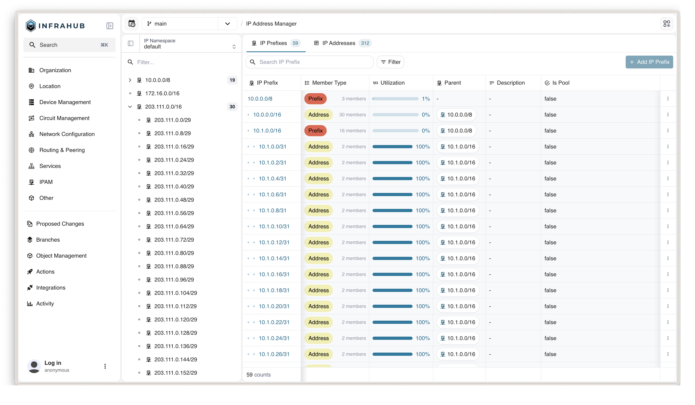

import VideoPlayer from '../../src/components/VideoPlayer';

IP address management (IPAM) in Infrahub gives you a structured, version-controlled capability to manage your IP resources. IP Prefixes and IP Addresses are first-class objects in Infrahub — they form hierarchies, track utilization automatically, and integrate with the rest of your infrastructure data. Both IPv4 and IPv6 are supported.

## IPAM generics

Infrahub ships three built-in generics that you inherit from when building your IPAM schema:

- `BuiltinIPNamespace` — schema node to isolate IP resources (analogous to a VRF or routing instance)
- `BuiltinIPPrefix` — schema node to model a network (supernet, subnet)
- `BuiltinIPAddress` — schema node to model a single IP address

By default, Infrahub includes a schema node called `IpamNamespace` that inherits from `BuiltinIPNamespace`, and a "default" namespace object is created automatically on first start.

:::info

Building an IPAM with these generics serves a different purpose from using `IPHost` or `IPNetwork` attribute kinds on other nodes. The IPAM feature leverages those attribute kinds under the hood.

:::

## How IPAM hierarchy works

IPAM generics and schema nodes that inherit from them have relationships and a hierarchy. An IP prefix can be related to other prefixes (as a parent or a child), an IP address can be related to an IP prefix, and both are related to an IP namespace.

To simplify day-to-day usage, relationships for IP prefixes and IP addresses are **automatically managed**. When an IP prefix is created or updated, relations with a parent prefix, children prefixes, and IP addresses that belong to it are discovered automatically. The same applies when an IP address is created — the most specific containing prefix is found automatically. This results in trees of IP prefixes and IP addresses being built without manual intervention.

These hierarchies allow Infrahub to determine how IP prefixes and IP addresses are nested, and to compute utilization of recorded IP spaces.

## Prefix utilization

IP prefixes have a read-only `utilization` field computed on the fly based on the `member_type` field. Member type refers to the kind of objects that an IP prefix contains — either other prefixes or IP addresses.

When `member_type` is set to `prefix`, utilization is computed using the children prefixes and their sizes. For example, if `192.0.2.0/24` has one subnet `192.0.2.0/26`, its utilization reports 25%.

When `member_type` is set to `address`, utilization is computed using the number of IP addresses the prefix contains. For example, `192.0.2.0/26` can hold up to 62 IP addresses (excluding network and broadcast). With 20 addresses assigned, its utilization reports 32%. Broadcast and network addresses can be included for IPv4 prefixes if `is_pool` is set to `true`, or if the prefix length is 31 as defined in [RFC 3021](https://datatracker.ietf.org/doc/html/rfc3021).

## In this section

- [IP Namespaces](./ip-namespaces.mdx) — Understand namespace isolation, when to use multiple namespaces, and multi-tenant patterns
- [Building your IPAM schema](./building-your-schema.mdx) — Define your IPAM nodes, load the schema, and query IP resources via GraphQL
- [Automate with Resource Manager](./automate-with-resource-manager.mdx) — Use IPAM prefixes as pool sources for automated IP allocation
