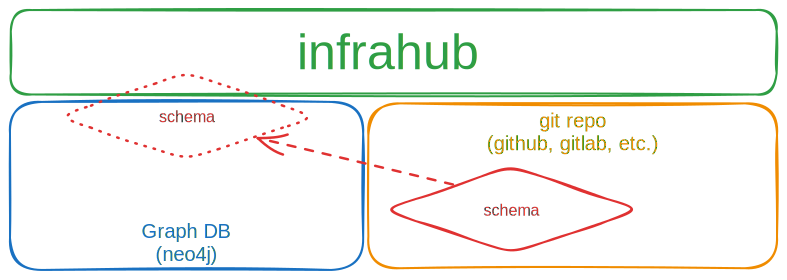
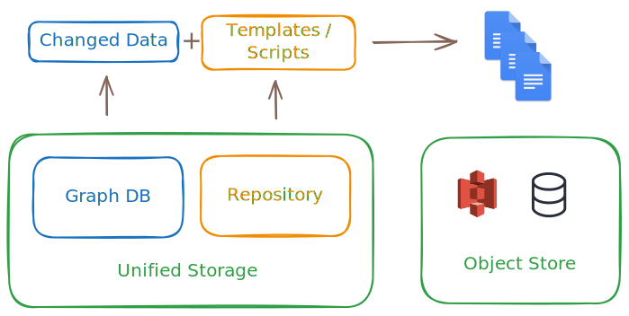

import ReferenceLink from "../../src/components/Card";

## Flexible schema

A core feature of Infrahub is the ability to define a relational model to describe the infrastructure, design and business logic in a way that's specific to each organization's needs, while allowing for the model to be changed via version control over time.

The schema provides an abstraction layer to the graph database, and as such no knowledge of database administration is needed for daily Infrahub usage.

The schema is described in YAML format, and consists of nodes, attributes, relationships, and other descriptors. A new deployment of Infrahub will have no schema by default — it is up to the administrator to define and load the initial schema.

Example schemas can be found in the [Schema Library](https://github.com/opsmill/schema-library), the most comprehensive collection currently maintained by the community and OpsMill.

The schema can be loaded using the [`infrahubctl schema load`]($(base_url)infrahubctl/infrahubctl-load) command for development, or via Infrahub Git integration for production deployments. Once loaded, it's stored and version controlled in the graph database. Changes to the schema can be made at any time, and it's best practice to make schema changes in a branch to allow for testing before implementation.

<ReferenceLink title="Learn more about schema" url="../guides/create-schema" />

## Transformations

Transformations allow users to extract and export infrastructure data in a structured and repeatable way. They convert data retrieved via GraphQL queries into a desired format, using either Jinja2 templates or Python code.

These Transformations allow for flexible and powerful data manipulation, making it easier to integrate and utilize data in various applications and workflows — from generating device configurations to producing documentation or compliance reports.

<ReferenceLink title="Learn more about Transformations" url="../topics/transformation" />

## Generators

Generators automatically create infrastructure objects based on predefined templates and user inputs. They streamline the setup of complex infrastructure stacks while allowing for customization.

Generators use templates as a starting point and prompt users for specific information to customize the output. This automates repetitive tasks, reduces manual effort, and ensures consistent infrastructure setups across projects and environments. Generator outputs are versioned, enabling users to track changes over time.

Advanced users can create custom Generators to suit their organization's specific needs and integrate them into workflows and CI/CD pipelines for automated infrastructure provisioning.

<ReferenceLink title="Learn more about Generators" url="../topics/generator" />

## Version control

Infrahub integrates version control directly into its graph database, providing robust capabilities for managing changes to infrastructure data.

### Branching and merging

Infrahub allows you to create branches from the main data state. Each branch can contain modifications and is isolated from the main branch until changes are reviewed and merged. Branches can be created through the UI, CLI (`infrahubctl`), or GraphQL mutations.

Changes from branches can be merged back into the main branch after review. Infrahub provides tools for viewing differences (diffs) between branches, running tests, and resolving conflicts before merging.

### Proposed changes

A proposed change is similar to a pull request in Git. It allows users to review and discuss changes between branches. Reviewers can leave comments, request changes, and approve the proposed change before merging. This process ensures that changes are thoroughly vetted before integration into the main branch.

### Immutable graph and historical data

Infrahub's storage engine is immutable, meaning past states of the data graph are preserved. Users can query historical data to view the state of the infrastructure at any point in time. This feature is crucial for auditing and understanding the evolution of infrastructure over time.

### Integration with Git

Infrahub combines its graph database with Git for version control. This integration allows for synchronization between Infrahub branches and Git repositories. Users can perform typical Git operations such as commit, push, and pull within Infrahub, ensuring that data and code are versioned together.

### Continuous integration (CI)

Infrahub supports CI processes by running checks on proposed changes during the review process. These checks ensure data integrity and help identify potential issues before merging. Custom checks can be implemented to enforce specific business logic or operational requirements.

<ReferenceLink title="Learn more about version control" url="../topics/version-control" />

## Putting it together

These concepts are tightly integrated and work together to address a wide range of use cases in infrastructure management.

### Design-driven automation and service catalog

Having a flexible schema opens up new possibilities not previously available. Infrahub allows a business workflow or service to be implemented in the [schema](../topics/schema.mdx) and instantiated by a Generator.

Downstream objects are linked to the Generator. If a business service needs updating or expansion, all needed changes can be generated to keep the infrastructure consistent and validated.

For example, when deploying a new service:

- A branch is created to stage the changes
- A Generator runs and creates the needed objects according to the business logic
- A Transformation runs to create the needed configuration files
- The changes are reviewed and eventually merged in a proposed change

:::success

- This sets up a robust data structure that will allow lifecycle management of the service, including updates, decommissioning, and more.
- Capturing business logic in the Generator enables consistent and repeatable deployments, reducing the risk of human error.

:::

<ReferenceLink title="How Infrahub can be used to create a service catalog" url="https://www.opsmill.com/how-to-turn-your-source-of-truth-into-a-service-factory/" />

### Agility in infrastructure management

Some changes in the infrastructure can be complex and require careful planning and testing. Infrahub's version control capabilities allow for these changes to be staged and tested in isolation before being applied to the production environment.

For example, during a large network software upgrade:
    - A branch is created to stage the changes
    - Any changes to the schema can be made in the branch, such as adding a new attribute
    - Transformations and templates are updated to use the new attribute
    - Data is populated in the branch
    - Artifacts are generated to reflect the new state of the infrastructure
    - Tests are run to ensure the changes work as expected
    - The changes are collaboratively reviewed in a proposed change
    - During the maintenance window, the branch is merged and the changes are applied to the production environment

:::success

- Branching allows for complex changes to be prepared in advance without holding back your production, reducing the risk of downtime or errors.
- The proposed change process enables collaboration and review, while the integrated CI pipeline ensures that changes are tested and artifacts are generated.

:::
