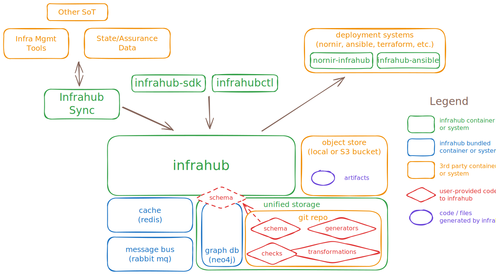
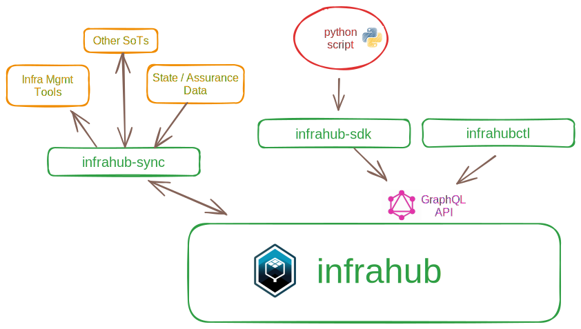

Infrahub is a graph-based data management platform with built-in version control, CI workflows, peer review, and API access. It's purpose-built to power network, data center, and cloud automation.

Infrahub provides a single platform that unifies infrastructure data with business logic, enforces consistency, and integrates with automation tools and AI workflows. With Infrahub as the data foundation in your automation stack, you can move faster, reduce risk, and deliver infrastructure as a reliable service.

## Top ways to use Infrahub

### Unify infrastructure data

Sync network and infrastructure device, service, and policy data into a unified source of truth, with rich metadata and robust UI and API access.

### Automate at scale

Generate, validate, and deploy configurations with unified data. Support full lifecycle management — provisioning, upgrades, decommissioning — across vendors and sites.

### Enable self-service

Expose automation through catalogs and APIs so application, platform, and ops teams can request infrastructure directly. Speed time to delivery, reduce errors, and make infrastructure more responsive to the business.

### Build an AIOps knowledge graph

Model dependencies and relationships across infrastructure. Provide the data foundation for AI-driven reasoning, troubleshooting, and predictive operations.

## Core pillars

At its heart, Infrahub is built on 3 fundamental pillars:

- **A Flexible Schema**: A model of the infrastructure and the relation between the objects in the model, that is easily extensible.
- **Version Control**: Natively integrated into the graph database, enabling capabilities such as branching, diffing, and merging data directly in the database.
- **Unified Storage**: By combining a graph database and Git, Infrahub stores data and code needed to manage the infrastructure.

## Interfaces

Managing infrastructure at scale often means many people, teams, workflows and other systems must interact with the platform. Infrahub provides multiple methods to interact:

| Interface | Description |
|---|---|
| **WebUI** | Browser-based interface on port `8000` with built-in documentation, global search, a GraphQL sandbox, and Swagger docs. |
| **GraphQL API** | Primary data API for everything defined by the schema. The Frontend and [Python SDK]($(base_url)python-sdk/introduction) are built on top of it. Endpoint: `/graphql` |
| **REST API** | Used for schema loading, artifact retrieval, object storage, and executing saved GraphQL queries. Endpoint: `/api` |
| **infrahubctl** | CLI tool for day-to-day management of an Infrahub installation. Runs on any machine and communicates with a remote server. [Reference]($(base_url)infrahubctl/infrahubctl) |
| **Python SDK** | Programmatic access to Infrahub for scripts, integrations, and automation. [Documentation]($(base_url)python-sdk/introduction) |
| **Git** | Native integration with Git repositories. The Task worker keeps both systems in sync — changes to branches or files in a Git repository are synced to Infrahub automatically. [Guide](../guides/repository.mdx) |

## Data input and sync

Once a schema is loaded, data can be populated or synced through multiple methods: the WebUI, [infrahub-sync]($(base_url)sync) for integration with external systems (Netbox, Nautobot, IP Fabric, and more), YAML-based [object files]($(base_url)python-sdk/topics/object_file), the [Python SDK]($(base_url)python-sdk/introduction), or the GraphQL/REST APIs directly.

Infrahub provides [data lineage and metadata](../topics/metadata.mdx) for tracking the origin and ownership of data, and how it changes over time. When data comes from external systems, those objects carry attributes such as their source and whether they are read-only, enabling unidirectional sync from other sources of truth.

## Deployment

While Infrahub stores data and uses Transformations to generate configuration artifacts, it does not directly deploy configurations to devices. Instead, it integrates with tools like [Ansible]($(base_url)ansible/), [Nornir]($(base_url)nornir/), or triggers external orchestration platforms via [webhooks](../topics/webhooks.mdx) for event-driven workflows.

These integrations transform Infrahub into a centralized source of truth for infrastructure data, leveraging existing automation tools to streamline management and ensure consistency across the infrastructure.
