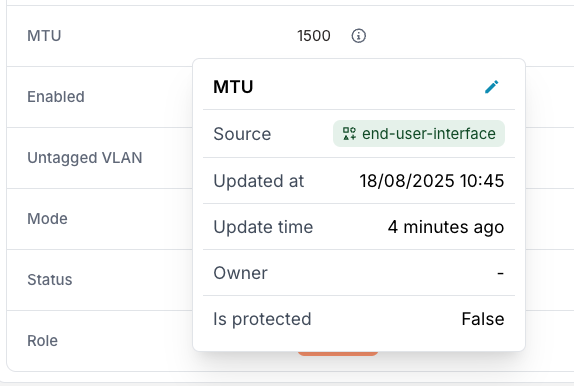

import Tabs from '@theme/Tabs';
import TabItem from '@theme/TabItem';

When creating or updating an object, reference a Profile by HFID. The object inherits the Profile's values for any attributes you don't set explicitly.

## Prerequisites

- An existing Profile (see [Create a Profile](./create.mdx))
- Permission to create or update the target object on its branch

## Assign on object creation

<Tabs groupId="method" queryString>
<TabItem value="web" label="Web interface">

1. Navigate to the object list for your node kind
2. Click **Add \<Kind\>**
3. In the **Profile** field, select the Profile by name

:::note
When you select the Profile, attribute fields are automatically populated with the Profile's values.
:::

4. Fill in any required fields that the Profile does not set (such as `name`)
5. Click **Save**

</TabItem>
<TabItem value="graphql" label="GraphQL">

Pass the Profile's HFID in the `profiles` array:

```graphql
mutation {
  <Kind>Create(
    data: {
      name: { value: "<object-name>" }
      profiles: [{ hfid: ["<profile-name>"] }]
    }
  ) {
    ok
    object { id }
  }
}
```

</TabItem>
</Tabs>

The new object inherits all Profile-defined values that you didn't set explicitly.

## Inspect what the object inherited

<Tabs groupId="method" queryString>
<TabItem value="web" label="Web interface">

1. Open the object you created
2. Click the **info** icon next to any attribute to view its metadata

:::success

You should see that the attribute value is inherited from the Profile.



:::

</TabItem>
<TabItem value="graphql" label="GraphQL">

Query the `is_from_profile` and `source` metadata to confirm which values came from the Profile and which were set directly:

```graphql
query {
  <Kind>(name__value: "<object-name>") {
    edges {
      node {
        <attribute> {
          value
          is_from_profile
          source { hfid display_label }
        }
      }
    }
  }
}
```

`is_from_profile: true` indicates the value was inherited; `source` identifies which Profile provided it.

</TabItem>
</Tabs>

See [Priority and inheritance](./priority-and-inheritance.mdx) for the full resolution logic.

## Next

- [Override specific Profile values](./override-values.mdx) when an object needs to differ for one or more attributes
- [Use multiple Profiles](./use-multiple.mdx) to combine multiple sets of Profile values on one object
