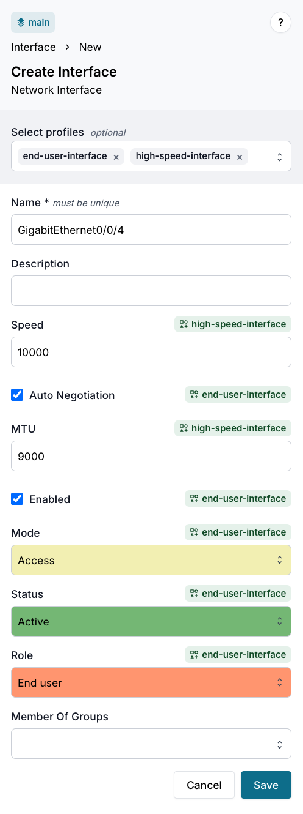

import Tabs from '@theme/Tabs';
import TabItem from '@theme/TabItem';

A single object can be assigned multiple Profiles. When multiple Profiles define the same attribute, the `profile_priority` value (lower number = higher priority) determines which Profile's value wins.

## Assign multiple Profiles

<Tabs groupId="method" queryString>
<TabItem value="web" label="Web interface">

1. Navigate to the object list for your node kind
2. Click **Add \<Kind\>** or open an existing object and click **Edit**
3. In the **Profile** field, select all the Profiles to assign



:::note
When you select the Profiles, attribute fields are automatically populated. Where Profiles conflict, the highest-priority Profile (lowest `profile_priority` number) wins.
:::

4. Click **Save**

</TabItem>
<TabItem value="graphql" label="GraphQL">

Add multiple HFIDs to the `profiles` array:

```graphql
mutation {
  <Kind>Create(
    data: {
      name: { value: "<object-name>" }
      profiles: [
        { hfid: ["<lower-priority-profile>"] }
        { hfid: ["<higher-priority-profile>"] }
      ]
    }
  ) {
    ok
    object { id }
  }
}
```

</TabItem>
</Tabs>

The order in the `profiles:` array doesn't determine precedence — `profile_priority` does. A Profile with `profile_priority: 500` wins over one with `profile_priority: 1000`, regardless of array position.

## Verify which Profile won for each attribute

<Tabs groupId="method" queryString>
<TabItem value="web" label="Web interface">

1. Open the object
2. Click the **info** icon next to any attribute to see its metadata, including which Profile provided the value

</TabItem>
<TabItem value="graphql" label="GraphQL">

Query each attribute's `source` field to see which Profile provided its value:

```graphql
query {
  <Kind>(name__value: "<object-name>") {
    edges {
      node {
        <attribute-1> {
          value
          is_from_profile
          source { hfid display_label }
        }
        <attribute-2> {
          value
          is_from_profile
          source { hfid display_label }
        }
      }
    }
  }
}
```

</TabItem>
</Tabs>

For each attribute, `source.hfid` identifies the winning Profile. Different attributes on the same object can come from different Profiles depending on which Profiles define them and at what priority.

Learn more about combining Profiles in the [Common composition patterns](./overview.mdx#common-composition-patterns) section.

## Related

- [Priority and inheritance](./priority-and-inheritance.mdx) — full resolution rules and design rationale
- [Override specific Profile values](./override-values.mdx) — bypass all Profiles for a specific attribute on a specific object
