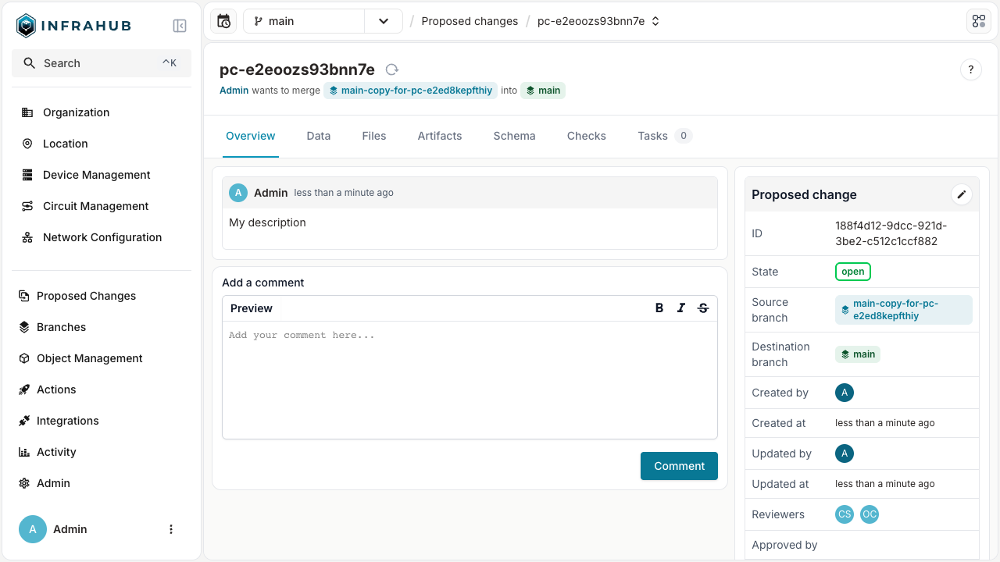
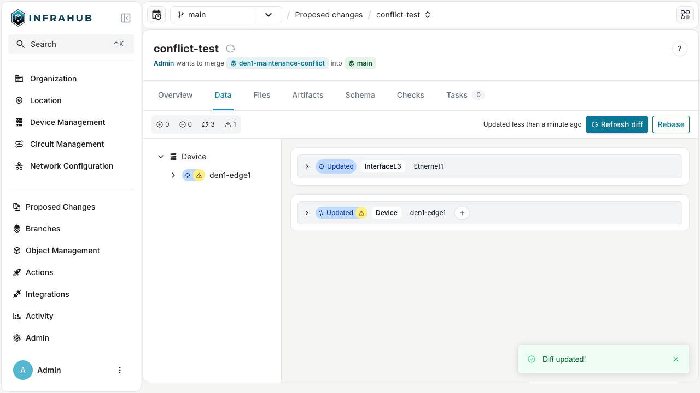
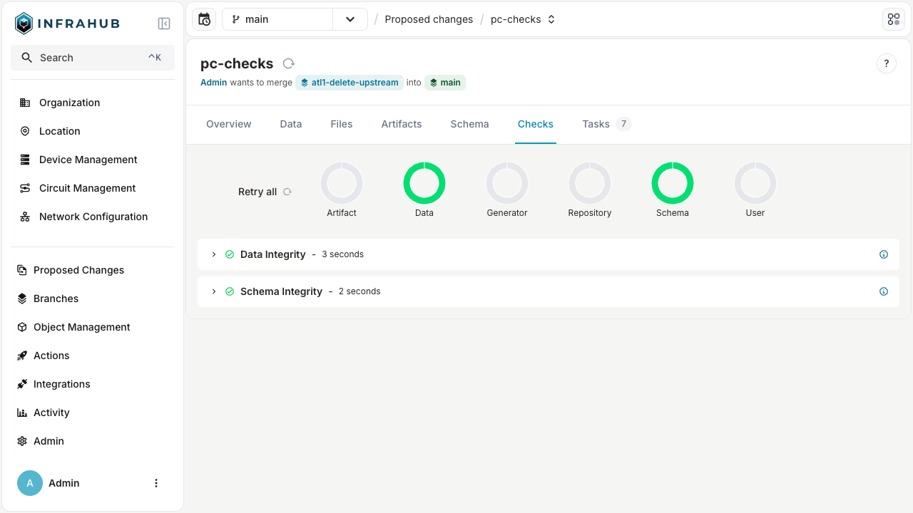

import VideoPlayer from '../../src/components/VideoPlayer';
import EnterpriseBadge from "../../src/components/EnterpriseBadge";

A proposed change in Infrahub is a structured workflow mechanism that enables teams to review, discuss, and merge changes in a controlled and collaborative manner. It serves as the primary method for implementing infrastructure changes safely while maintaining proper oversight and governance.

For people with a software development background, proposed changes function similarly to pull requests in GitHub or merge requests in GitLab.

  <VideoPlayer url='https://www.youtube.com/watch?v=OAXk3dKKgf0' light />

## Why use proposed changes?

Proposed changes address several crucial needs in infrastructure management:

- **Controlled collaboration**: Enable multiple team members to work on infrastructure changes without directly affecting production.
- **Accountability**: Establish a clear record of who proposed, reviewed, and approved changes.
- **Quality assurance**: Provide a systematic approach to reviewing changes before implementation.
- **Compliance**: Support regulatory requirements through documented approval processes.
- **Knowledge sharing**: Create opportunities for team members to learn from each other's changes.
- **Continuous integration**: Ensure that changes meet quality standards through automated validation checks.

## Multi-dimensional diffing

A proposed change in Infrahub offers a more sophisticated approach by integrating both data-level and code-level differences in a unified interface:

- **Data differences**: See precisely what objects were added, modified, or deleted, along with the specific attribute changes.
- **Schema differences**: Identify changes to the underlying data models that define your infrastructure.
- **File differences**: Track modifications to implementation files like Transformations, Generators, and templates.
- **Artifact differences**: Compare the [artifacts](../artifacts/overview) generated to understand output changes.

This multi-dimensional diffing provides a "single pane of glass" view, enabling reviewers to fully understand the scope and impact of changes before approval. This comprehensive visibility is especially valuable for complex infrastructure changes.

## Automated pipeline with continuous integration

Infrahub integrates robust validation capabilities within the proposed change workflow to ensure changes meet quality and policy requirements before implementation. These automated checks provide confidence that modifications won't introduce issues when deployed.

:::important
Any failing checks will block the merge process, ensuring only validated changes are applied.
:::

### Built-in checks

Infrahub runs several types of automated validations during the review process:

- **Data integrity checks**: Validates that the database remains consistent between branches and that all referential integrity constraints are satisfied.
- **Merge conflict detection**: Identifies and reports any conflicting changes between the source and target branches that would prevent a clean merge.
- **Git repository integration**: Displays merge conflicts for connected Git repositories, ensuring alignment between infrastructure code and configuration.
- **Schema validation**: Verifies potential changes made to the schema.

### Custom checks

Organizations can extend the validation framework with custom checks to enforce specific business rules and operational constraints.

Learn more about [Checks & Validation](../checks/overview.mdx) and how to implement custom validation logic.

### Artifact generation

Infrahub will automatically run Transformations and generate artifacts as part of the proposed change workflow.

Learn more about [Transformations](../transformations/overview) and [Artifacts](../artifacts/overview).

### Generator integration

Infrahub will automatically run Generators as part of the proposed change workflow.

Learn more about [Generators](../generators/overview).

## Conflict management

In Infrahub, conflicts occur when the same infrastructure object is modified differently in both the source and target branches. Unlike traditional text-based version control systems, Infrahub's conflict detection operates at the data level, identifying specific attribute conflicts within objects.

Common conflict scenarios include:

- The same attribute of an object (for example, a router's hostname) is changed to different values in each branch.
- An object is modified in one branch but deleted in another.
- Relationship conflicts where the same object is linked to different entities in each branch.

Infrahub prevents merging a proposed change when data conflicts exist between branches to protect the integrity of your infrastructure data. For step-by-step resolution mechanics during review, see [Resolve a proposed-change conflict](./resolve-conflict.mdx).

## Lifecycle and collaborative review

Proposed changes follow a workflow with specific states that track progression from initial creation to final resolution. The review and approval process is central, providing a structured framework for evaluating proposed infrastructure changes before implementation.

For the full state machine, see [Lifecycle and state transitions](./lifecycle.mdx). For how reviewers engage and how a proposed change becomes approved, see [Review and stamp](./review-and-stamp.mdx).

## Comprehensive audit and traceability

The proposed change system provides robust audit capabilities that are critical for regulated environments and operational excellence:

### Audit capabilities

- **Approval records**: Captures who approved each change, when, and with what justification.
- **Complete discussion history**: Preserves all comments, questions, and responses throughout the review process.
- **Change documentation**: Maintains a record of what was modified and the rationale behind changes.
- **System-generated events**: Automatically logs all significant actions like state changes and merge operations.
- **Tamper-evident history**: Ensures the integrity of the audit trail through cryptographic verification.

### Business benefits of strong traceability

This comprehensive traceability delivers multiple benefits:

- **Regulatory compliance**: Satisfies documentation requirements for regulated industries.
- **Problem resolution**: Provides context when troubleshooting issues that might stem from recent changes.
- **Knowledge preservation**: Captures institutional knowledge about why specific changes were made.
- **Process improvement**: Enables analysis of the change management process to identify optimization opportunities.

The audit capabilities are particularly valuable for infrastructure changes that might impact production environments or require compliance documentation, providing peace of mind that all modifications are properly documented and justified.

## Related resources

The proposed change functionality interconnects with several other key concepts in Infrahub:

- [Branches](../branches/overview.mdx) — the underlying mechanism for change isolation
- [Immutable history](../immutable-history/overview.mdx) — the foundation of proposed changes
- [Schema](../schema/overview) — the data models reviewed in proposed changes
- [Artifacts](../artifacts/overview) — outputs that are regenerated as part of proposed changes
- [Checks & Validation](../checks/overview.mdx) — validation checks that gate merges
- [Transformations](../transformations/overview) — how Transformations are reviewed in proposed changes
- [Generators](../generators/overview) — Generators that may run in the proposed change pipeline
- [Permissions and roles](../deploy-manage/user-management/permissions-roles/overview) — access controls for proposing, reviewing, and merging
- [Change Management Workflow Blog Post](https://opsmill.com/blog/infrastructure-change-management-workflow/)
