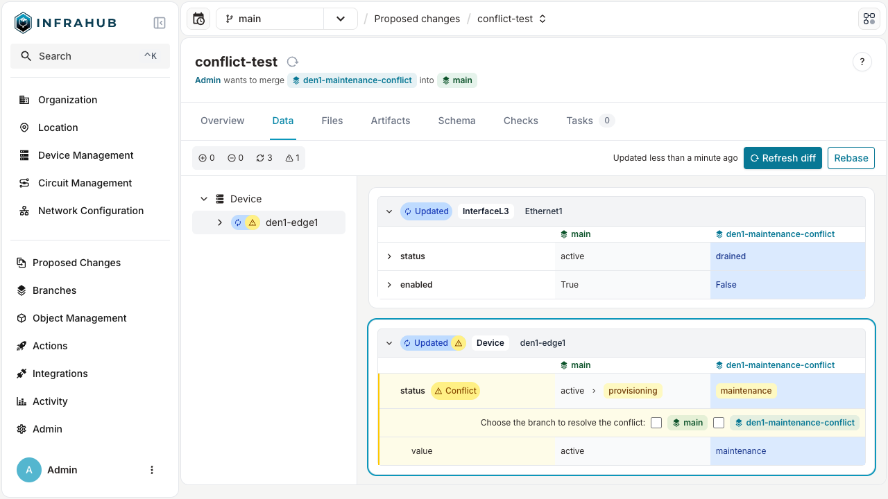

When a proposed change has data conflicts between its source and target branches, Infrahub blocks the merge to protect the integrity of your infrastructure data. Conflicts are resolved during the review process, before the change can be approved and merged.

## When conflicts are detected

When the system detects conflicts:

1. The proposed change displays a conflict warning with details about affected objects.
2. Reviewers can examine each conflict to understand the specific differences.
3. For each conflict, users must explicitly choose which version to keep (source or target).
4. Conflict resolutions are recorded as part of the change history for audit purposes.

## Resolution steps

To resolve conflicts on a proposed change:

1. Review the data integrity check results in the proposed change interface.
2. For each conflict, choose which branch's version to keep.
3. Apply the resolution in the change checks section.
4. Re-run validation to confirm all conflicts have been addressed.

This structured conflict management ensures that merges maintain data integrity and prevent unintended overwrites of important changes, while providing a clear audit trail of resolution decisions.

## Related

- [Proposed Changes](./overview.mdx) — concepts and conflict types
- [Lifecycle and state transitions](./lifecycle.mdx) — where conflict resolution sits in the workflow
- [Review and stamp](./review-and-stamp.mdx) — the broader review process
- [Resolve conflicts](../branches/resolve-conflicts.mdx) — branch-level conflicts (different entry point, similar mechanics)
