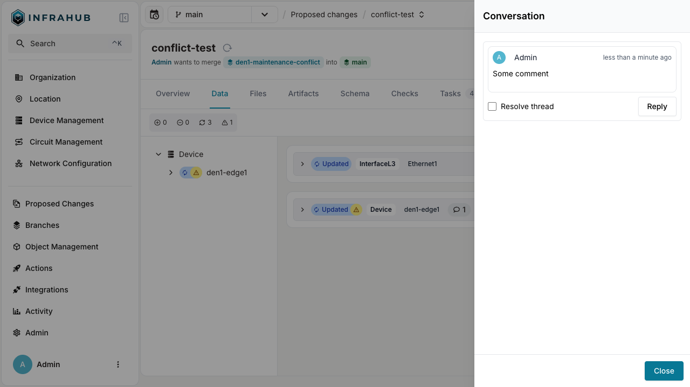

import EnterpriseBadge from "../../src/components/EnterpriseBadge";

The review process gives team members structured ways to evaluate a proposed change, comment on specific elements, and ultimately stamp it as approved or rejected.

## Review mechanics

Multiple reviewers can be assigned to a given proposed change. During the review process, participants have multiple ways to engage with the proposed change:

- **Inline comments**: Reviewers can comment directly on specific elements of the changes, creating focused discussions about particular modifications.
- **General feedback**: Team members can provide overall commentary on the proposed change.
- **Threaded discussions**: Comments support threaded replies, enabling detailed conversations about implementation choices.

This collaborative environment promotes knowledge sharing and improves the overall quality of infrastructure changes through peer review.

## Stamping a proposed change

At the end of the review process, reviewers can "stamp" the proposed change to indicate their approval or rejection.

- **Approve**: Indicates that the reviewer is satisfied with the changes and believes they are ready to be merged.
- **Reject**: Indicates that the reviewer has identified issues or concerns with the proposed change that need to be addressed before it can be merged.

## Advanced approval workflows <EnterpriseBadge />

Enterprise customers benefit from enhanced approval capabilities designed for complex organizations with strict governance requirements:

- **Enforced approval gates**: Prevent merging without the required number of approvals.
- **Approval thresholds**: Configure minimum number of approvals needed before a change can be merged.
- **Auto-revocation**: Automatically revoke approvals when changes are made after initial approval.

For an organizational walkthrough of setting up multi-stage approval, see the [Change Approval Workflow](../change-approval/change-approval-workflow.mdx) guide.

## Related

- [Proposed Changes](./overview.mdx) — overview and concepts
- [Lifecycle and state transitions](./lifecycle.mdx) — how a stamped change transitions to merged
- [Resolve a proposed-change conflict](./resolve-conflict.mdx) — when conflicts must be resolved before approval
