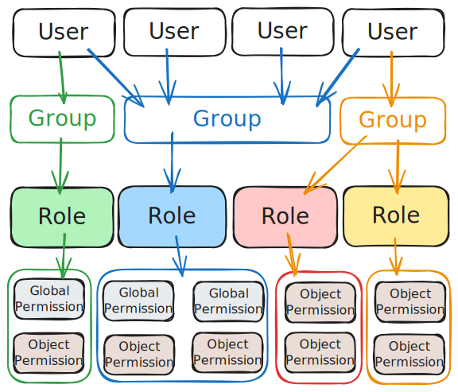
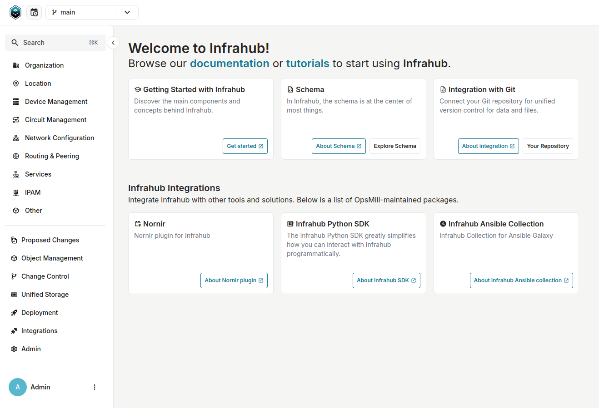

import VideoPlayer from '../../../src/components/VideoPlayer';

<table>
  <tbody>
    <tr>
      <th>Release Number</th>
      <td>1.0.0</td>
    </tr>
    <tr>
      <th>Release Date</th>
      <td>October 30th, 2024</td>
    </tr>
    <tr>
      <th>Release Codename</th>
      <td>Stockholm</td>
    </tr>
    <tr>
      <th>Tag</th>
      <td>[infrahub-v1.0.0](https://github.com/opsmill/infrahub/releases/tag/infrahub-v1.0.0)</td>
    </tr>
  </tbody>
</table>

# Release 1.0

We are thrilled to announce the general availability release of Infrahub, version *1.0*!

We greatly appreciate all the time and efforts of our dedicated community of developers and beta testers!

<center>
  <VideoPlayer url='https://www.youtube.com/watch?v=BR9yZzC9CVg' light />
</center>

## Main changes

Infrahub 1.0 is focused on bringing Infrahub to even more organizations and equipping them with a
production-ready solution to their infrastructure automation challenges.

There are four key features and changes in Infrahub version 1.0 as outlined below:

- SSO login capabilities (OIDC/OUATH2)
- A new permission framework
- Performance enhancements to version control actions (diff/merge/rebase)
- An exciting UI and navigation redesign

In addition to these, there have been many bug-fixes and quality-of-life enhancements shown in the detailed changelog.

### Single sign-on and user permissions

Early in the development of Infrahub, we consciously decided to focus on the groundbreaking and critical features that make
Infrahub a uniquely world-class Source of Truth.
As a result, we set aside some standard enterprise features, such as Single Sign-On, until later,
knowing that they would be straightforward to implement in the system.

As we enter a new era with Infrahub 1.0, we have focused on rounding out the enterprise-grade features
that our customers require.
For example, we added Single Sign-On (SSO) integrations for OIDC/Oauth 2.0 and implemented a robust and granular permissions system.
These two features combine to give organizations a level of control that allows them to trust their mission-critical
data in Infrahub and bring even closer integration with existing enterprise systems and workflows.

#### SSO

The new OIDC/OAuth2 capabilities, tested and functioning in the field with many Identity Providers
such as Keycloak, Authentik, and Google Auth, allow organizations to manage their users and groups centrally
instead of in the Infrahub UI.
Subsequent releases of Infrahub will soon include validated support for additional Identity Providers
and other authentication methods (such as LDAP).

This functionality goes hand in hand with the feature we will discuss next: our new User Permissions structure.

##### Documentation

- [SSO Guide](../../guides/sso.mdx)

#### User permissions

As users store more data in Infrahub and more teams interact with that data, it becomes crucial to protect it
from accidental changes.
By implementing a granular role-based permission system, Infrahub allows organizations to prevent unauthorized changes
to the data behind critical infrastructure automation efforts.

In the permission structure introduced in Infrahub 1.0, Users are added to Groups, Groups are given Roles,
and Permissions are finally allocated to those Roles.
Permissions come in two fundamental varieties: Global Permissions and Object Permissions.

The below diagram lays out the relationship between each of these entities.
A User can belong to one or more Groups, a Group can have multiple Roles assigned to it, and each Role can be granted one
or more Global or Object Permissions.



##### Global vs. object permissions

It is also worth mentioning the difference between Global Permissions and Object Permissions.

- Global Permissions are specific permission sets that can give users system-wide rights to perform particular actions, for example:
  - Editing the default Branch
  - Editing Permissions
  - Allowing the merging of proposed changes
  - Account management
- Object Permissions are tied to individual objects within Infrahub and control what actions users can take on those objects; examples could include:
  - Allow read-only access to all objects
  - Deny the ability to update Tags
  - Allow editing on any object type that starts with `DataCenter`

For either style, Permissions are structured to be robust and granular by allowing complete control over
the Action, Decision, and Role of a given Permission set (plus the Object Type for Object Permissions).

##### Documentation

This is a significant topic on a new feature that enables complex workflows to meet organizational needs. Because of this, we strongly recommend diving into the documentation links below.

- [Account Permissions Guide](../../guides/accounts-permissions.mdx)
- [Permissions Roles Topic](../../topics/permissions-roles.mdx)
- [Permissions Reference](../../reference/permissions.mdx)

### Performance improvements

Our design philosophy at OpsMill has always been driven by long experience as network practitioners or admins
in Unix-like systems: “Make it work, make it right, make it fast.”

In Infrahub 1.0, we focused on the last part, “Make it fast.”

As our early beta testers began to utilize Infrahub in increasingly large infrastructures (greater than 50,000 nodes),
we expected (and found) opportunities for performance improvements.
This was especially true when performing Version Control actions on large data sets.
As a result of the intensive testing, we made dramatic improvements to branch change management.
Infrahub 1.0 has improved how Infrahub computes a difference between two branches, re-bases a branch,
and handles the merge.
For example, in the “diff” generation for a proposed change, we have seen a 30% increase in performance over earlier versions.
As a result, the proposed change functionality can now reliably handle much larger data sets for comparison.

These performance improvements are only the beginning of our optimization efforts, but they have already improved
the experience of Infrahub users of all infrastructure sizes.

### UI redesign

While the UI in Infrahub before 1.0 served its purpose well, there was room for improvement.
A corollary fourth phrase to our design philosophy might be, “Now, make it pretty!”

We didn’t just change around some colors or styles; we worked closely with our beta testers and a dedicated
User Experience professional to ensure that using Infrahub 1.0 would be an experience that our users enjoyed.



We also provided capabilities for complete customization of the navigation menu.
We continue to emphasize that Infrahub is a powerful, fully customizable system that meets your
organization where it needs to be.

#### Documentation

- [Menu Guide](../../guides/menu.mdx)
- [Menu Reference](../../reference/menu.mdx)

## Other

### New task-manager component

A new component called `Task Manager` has been introduced within Infrahub, and along with this change the Git-Agent has been renamed to `Task Worker`.
The task manager is based on Prefect, a popular workflow orchestration system.

The Task Manager is used internally to improve the execution and the visibility of all background tasks.
In future releases, we are planning to bring these additional information within Infrahub itself.
Stay tuned for more information and more exciting features around task management in upcoming releases.

### Removed

- Remove previously deprecated GET API endpoint "/api/schema/" ([#3884](https://github.com/opsmill/infrahub/issues/3884))

### Deprecated

- Marked CoreAccount.role as deprecated
  Due to the new permissions framework the account roles "admin" / "read-only" / "read-write" are deprecated and will be removed in Infrahub 1.1

### Added

- Reworked branch selector:
  - Redesigned the UI
  - Added filter for branch
  - Improved accessibility & keyboard navigation
  - Improved UX on new branch form
  - Added quick link to view all branches
- Add support to sign in with OAuth2 and Open ID Connect (OIDC) ([#1568](https://github.com/opsmill/infrahub/issues/1568))
- Add internal HTTP adapter to allow for generic access from Infrahub ([#3302](https://github.com/opsmill/infrahub/issues/3302))
- Add support to search a node by human friendly ID within a GraphQL query ([#3908](https://github.com/opsmill/infrahub/issues/3908))
- Added link to our Discord server in the account menu
- Added permissions framework for global and object kind level permissions

  In this first iteration the object permissions are applied to nodes as a whole, in upcoming versions it will be possible to define attribute level permissions as well.
- New permissions system in UI:
  - Implemented CRUD views for managing accounts, groups, roles, and permissions
  - Updated all components to support new permission system
  - Added dynamic message display according to user access levels

### Fixed

- The `infrahub-git` agent service has been renamed to `task-worker` in Docker Compose and the command to start it has been updated as well ([#1075](https://github.com/opsmill/infrahub/issues/1075))
- Add ability to import repositories with default branch other than 'main' ([#3435](https://github.com/opsmill/infrahub/issues/3435))
- Disable approve/merge/close buttons for merged Proposed Changes ([#3495](https://github.com/opsmill/infrahub/issues/3495))
- Fixed regex validation for List type attributes ([#3929](https://github.com/opsmill/infrahub/issues/3929))
- Allow users to run artifacts and generators on nodes without name attribute ([#4062](https://github.com/opsmill/infrahub/issues/4062))
- In the schema, properly delete inherited attribute and relationship on Node when the original attribute or relationship are being deleted on the Generic ([#4301](https://github.com/opsmill/infrahub/issues/4301))
- "Retry All" button for checks is bigger ([#4315](https://github.com/opsmill/infrahub/issues/4315))
- Add a size restriction on common attribute kinds. Only TextArea and JSON support large values ([#4432](https://github.com/opsmill/infrahub/issues/4432))
- The HFID of a related node is properly returned via GraphQL in all scenarios ([#4482](https://github.com/opsmill/infrahub/issues/4482))
- Add full validation to BranchMerge and BranchRebase mutations ([#4595](https://github.com/opsmill/infrahub/issues/4595))
- Report user-friendly error for invalid uniqueness_constraints when loading schemas ([#4677](https://github.com/opsmill/infrahub/issues/4677))
- Fixed pagination query for nodes with order_by clause using non unique attributes ([#4700](https://github.com/opsmill/infrahub/issues/4700))
- Fixed schema migration when an attribute previously present on a node is added back ([#4727](https://github.com/opsmill/infrahub/issues/4727))
- Add order_weight property to multiple attributes and relationships in the demo schema to improve how some models are displayed in the list views
- Changed the Python SDK connection timeout to 60s
- Fix metric missing the query name in Prometheus data
- Fixes an issue where Docker Compose would output ANSI control characters that don't support it
- Prevent temporary directories generated by Docusaurus to be imported by Docker

## Migration guide

The process to migrate your instance of Infrahub to the latest version may vary depending on your deployment of Infrahub.
However, at a high-level, it will involve getting the latest version of the Infrahub code, and then performing any needed Database Migrations and Schema updates.

Please ensure you have a **backup of your Infrahub environment** prior to attempting any migration or upgrade activities.

### Migration of an Infrahub instance

**First**, update the Infrahub version running in your environment.

Below are some example ways to get the latest version of Infrahub in your environment.

- For deployments via Docker Compose, update your container version by updating the `VERSION` environment variable and relaunch:
  - `export VERSION="1.0.0"; docker compose pull && docker compose up -d`
- For deployments via Kubernetes, utilize the latest version of the Helm chart supplied with this release

**Second**, once you have gotten the desired version of Infrahub in your environment, please run the following commands.

> Note: If you are running Infrahub in Docker/K8s, these commands need to run from a container where Infrahub is installed.

```shell
infrahub db migrate
infrahub db update-core-schema
```

**Finally**, restart all instances of Infrahub.

### Migration of a dev or demo instance

If you are using the `dev` or `demo` environments, we have provided `invoke` commands to aid in the migration to the latest version.
The below examples provide the `demo` version of the commands, however similar commands can be used for `dev` as well.

```shell
invoke demo.stop
invoke demo.build
invoke demo.migrate
invoke demo.start
```

If you don't want to keep your data, you can start a clean instance with the following command.

> **Warning: All data will be lost, please make sure to backup everything you need before running this command.**

```shell
invoke demo.destroy demo.build demo.start demo.load-infra-schema demo.load-infra-data
```

The repository [infrahub-demo-edge](https://github.com/opsmill/infrahub-demo-edge) has also been updated, it's recommended to pull the latest changes into your fork.
