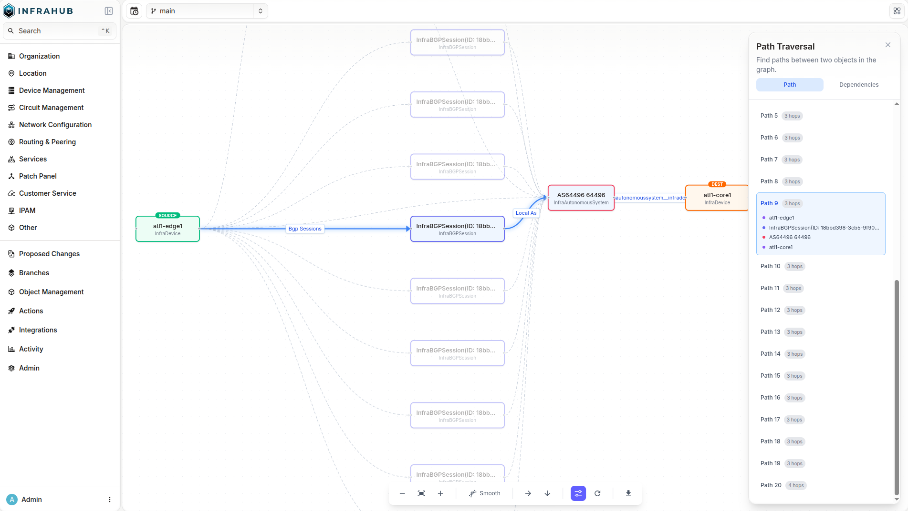

<table>
  <tbody>
    <tr>
      <th>Release Number</th>
      <td>1.10.0</td>
    </tr>
    <tr>
      <th>Release Date</th>
      <td>June 23rd, 2026</td>
    </tr>
    <tr>
      <th>Tag</th>
      <td>[infrahub-v1.10.0](https://github.com/opsmill/infrahub/releases/tag/infrahub-v1.10.0)</td>
    </tr>
  </tbody>
</table>

We're excited to announce the release of Infrahub, v1.10.0!

The headline addition is **graph path traversal** - a new way to ask the question Infrahub's graph was built to answer: *how is this connected to that?* A new GraphQL API and a visual topology explorer let you trace every path between two objects, or find everything reachable from a single node for impact analysis. Infrahub Enterprise also adds **native LDAP authentication**, completing external authentication for organizations without an OIDC/OAuth2 identity provider.

Alongside these, the release centers on three themes: **authentication & identity** - LDAP for Enterprise, auto-creation of account groups from identity-provider claims, and a reworked SSO account-identity model; **performance & reliability** - branch merges executed at the database level, precise artifact regeneration that only rebuilds what a commit actually changed, and a lighter computed-attribute and task pipeline; and **API ergonomics** - a structured, machine-readable GraphQL error catalogue and richer `order_by` controls for schema designers.

⚠️ This release includes several breaking changes. Read the [Breaking changes](#breaking-changes) section before upgrading - in particular the new structured GraphQL error codes, the reserved `node_metadata` name, restricted inheritance on internal `Core` generics, the `BuiltinIPPrefix.resource_pool` change and the restriction on using double underscores in schema attribute and relationship names.

⚠️ **Single Sign-On accounts.** v1.9.0 began capturing additional identity information against accounts created from OAuth2/OIDC providers, and warned that a future release would consume it. This is that release. v1.10.0 identifies SSO accounts by the provider-issued identity (`sub`) rather than the display name. A transitional setting, `INFRAHUB_SECURITY_SSO_ACCOUNT_NAME_FALLBACK` (enabled by default), still lets an SSO login reuse a pre-existing account by matching its display name, so upgrades remain smooth. **Make sure every SSO user has logged in at least once**, then disable the fallback as a hardening step - see [Reworked SSO account identity](#reworked-sso-account-identity) below.

## Main changes

### Graph path traversal and topology explorer

Infrahub's data is stored in a graph, and 1.10 exposes the graph's most natural capability: traversal. Two new top-level GraphQL queries let you walk relationships across the entire model - not just physical cabling, but *any* relationship between objects.

- **`InfrahubPathTraversal`** finds the paths between two specific objects. Given a `source_id` and a `destination_id`, it returns the connecting paths (shortest first) as an ordered list of hops, each hop naming the node and the relationship traversed. Bound the search with `max_depth` and `max_paths`, and narrow it with `kind_filter`, `relationship_filter`, `excluded_kinds`, and `excluded_namespaces`.
- **`InfrahubReachableNodes`** answers "what depends on this?" Given a `source_id` and a list of `target_kinds`, it returns every reachable object of those kinds together with the shortest path to each - ideal for blast-radius and impact analysis ("if this device goes offline, what's affected?").

Traversal is branch- and time-aware, read-only, and permission-safe: any path that crosses an object the user cannot read is dropped entirely rather than leaked. A set of internal namespaces (`Core`, `Internal`, `Builtin`, `Lineage`, `Profile`, `Template`) is always excluded so results stay focused on your data; `excluded_namespaces` only adds to that set.

In the UI, a new **Topology Explorer** renders results as an interactive graph built on React Flow with automatic layout. You can switch between path mode and dependency mode, filter by kind and namespace, highlight an individual path, and step between paths from the keyboard. Object detail pages add a **Trace from this object** action to launch the explorer pre-seeded with that node. Because results are returned over GraphQL, the same traversal is available for AI assistants over the MCP server, allowing agents to get a full contextual understanding of data in the intended infrastructure graph.



### LDAP authentication *(Enterprise)*

Infrahub Enterprise now supports **native LDAP authentication** against Active Directory, OpenLDAP, and other RFC 4510-compliant directories. This gives organizations that have no OIDC/OAuth2 identity provider a first-class external-authentication path that coexists with local accounts and SSO - all three can be active at once and converge on the same session, account, and group handling. On first successful login an Infrahub account is provisioned automatically, matching existing SSO behavior.

Configuration is via `INFRAHUB_LDAP_*` environment variables and is validated at startup. You can point Infrahub at one or more servers (the first is primary, the rest act as failover), choose bind-then-search with a service account, select the `username_attribute` appropriate to your directory (for example `sAMAccountName` on AD or `uid` on OpenLDAP), and secure the connection with LDAPS or STARTTLS. Optional group mapping (`group_enabled`) matches LDAP group membership - including nested groups - against existing Infrahub `CoreAccountGroup` names, granting permissions through the usual account-group → role → permission chain. Combined with auto-created groups (below), group membership can be provisioned on first login with no manual setup.

This feature is available on Infrahub Enterprise only.

### Auto-create account groups from your identity provider

Infrahub can now **create account groups automatically from identity-provider claims** on login, so you no longer have to pre-create a `CoreAccountGroup` for every group your IdP (or LDAP directory) reports. The feature is opt-in and off by default.

Activate it by setting a claim filter:

- `security.auto_create_groups_filter` (`INFRAHUB_SECURITY_AUTO_CREATE_GROUPS_FILTER`) - a regular expression, or an ordered list of them, matched against each incoming group claim. The first match wins. A named capture group `(?P<name>...)` becomes the local group name (for example `^LDAP/group/(?P<name>.+)$` maps `LDAP/group/network-eng` to `network-eng`); with no capture the full claim is used. Non-matching claims are dropped, so unrelated IdP groups never appear in Infrahub. Setting this filter is what activates the feature; leaving it empty keeps auto-creation off.
- `security.auto_create_groups_max_per_login` - caps the number of *new* groups created in a single login (default `50`). Reuse of existing groups is never capped. If the cap is hit, surplus claims are dropped, a warning event is emitted, and the login still completes.

Auto-created groups start with no roles or permissions and run on every external login (OIDC, OAuth2, and native LDAP). If at least one claim matches, it takes precedence over the existing `security.sso_user_default_group` fallback; if none match, that fallback still applies.

### Reworked SSO account identity

Single Sign-On accounts are now keyed on the stable, provider-issued subject identifier (`sub`) together with the provider and protocol, stored on a dedicated `CoreExternalIdentity` node, rather than on the user's display name. This removes a class of problems where two users sharing a display name could collide, or where a changed display name produced a duplicate account on the next login. The human-readable name is now stored on the account's `label` attribute and is refreshed when it becomes stale.

To keep upgrades smooth, the transitional setting `INFRAHUB_SECURITY_SSO_ACCOUNT_NAME_FALLBACK` (`security.sso_account_name_fallback`, enabled by default) allows an SSO login that has no linked identity yet to reuse a pre-existing account that matches by display name. This setting is **deprecated** and will be removed in a future release. The recommended sequence is: upgrade, have every SSO user log in at least once so their `CoreExternalIdentity` is created, then disable the fallback. Once it is disabled, any SSO account that never re-logged in will be treated as new and a duplicate account will be created - so complete the re-login step first.

### Structured GraphQL error catalogue

GraphQL errors are now **structured and machine-readable**. Every entry in a GraphQL `errors[]` array includes an `extensions` block with:

- `extensions.code` - a stable string identifier such as `"NODE_NOT_FOUND"` or `"AUTHENTICATION_REQUIRED"`.
- `extensions.data` - a typed payload specific to that code (may be empty).
- `extensions.http_status` - the integer HTTP status.

You can now branch on a stable code instead of parsing the human-readable `message`, which remains present but is explicitly not part of the stable contract. Multi-field validation failures emit one error per offending field, each with its own `code`, `data`, and a `path` pointing at the exact input - enabling single-pass form validation. The catalogue defines codes including `NODE_NOT_FOUND`, `AUTHENTICATION_REQUIRED`, `TOKEN_EXPIRED`, `PERMISSION_DENIED`, `ATTRIBUTE_REQUIRED`, `ATTRIBUTE_INVALID_TYPE`, `ATTRIBUTE_CONSTRAINT_VIOLATION`, `BRANCH_NOT_FOUND`, and `SCHEMA_NOT_FOUND`, with `UNDEFINED_ERROR` as a fallback for any uncatalogued exception.

This is a **breaking change** for consumers that previously read `extensions.code` as an integer - see [Breaking changes](#structured-graphql-error-codes) for migration guidance. REST (`/api/...`) responses are unchanged.

### Order by metadata and explicit sort direction

Schema `order_by` entries add two capabilities, letting designers set smarter defaults without passing an ordering argument on every query or view:

- Order by **object-level metadata**: `node_metadata__created_at` and `node_metadata__updated_at` sort by the timestamps Infrahub tracks on every node.
- Add an **explicit direction**: any entry may end in `__asc` or `__desc` (for example `name__value__desc`, `node_metadata__created_at__desc`). Without a suffix, ascending is assumed, so existing `order_by` definitions keep their current behavior.

The new grammar is honored consistently across top-level listings, relationship-peer listings, and hierarchy (`ancestors`/`descendants`) listings, and a node UUID tiebreaker is always appended so ordering - and pagination - is stable across all paths.

```yaml
nodes:
  - name: Note
    namespace: Documentation
    order_by:
      - node_metadata__created_at__desc   # newest first by creation time
    attributes:
      - name: title
        kind: Text
```

The same grammar is available at query time through the GraphQL `order` argument, which accepts an `by: [OrderByItem!]` list at the root level:

```graphql
query {
  DocumentationNote(order: { by: [{field: "node_metadata__created_at", direction: DESC}]}) {
    edges { node { title { value } } }
  }
}
```

Two behavior changes to note: a query-time `order` argument now **fully replaces** the schema-level `order_by` default instead of layering on top of it, and `node_metadata` is now a **reserved** attribute/relationship name (see [Breaking changes](#node_metadata-is-now-a-reserved-name)).

### Object templates can assign groups to their instances

Object Templates now expose two new relationships, `member_of_groups_for_instances` and `subscriber_of_groups_for_instances`. Groups assigned through these fields are propagated to **every object created from the template**, mirroring the resource-pool pattern. The existing `member_of_groups` and `subscriber_of_groups` continue to apply to the template object itself only.

```yaml
# On a template: every instance created from it joins "production-devices"
member_of_groups_for_instances:
  - production-devices
```

### Smarter artifact regeneration on repository changes

When a Proposed Change includes commits to a linked repository, Infrahub now regenerates **only the artifacts whose transform source, GraphQL query, or artifact definition was actually affected** by the change - instead of regenerating every artifact in the repository. A typo fixed in an unrelated README no longer triggers a regeneration sweep across thousands of nodes.

Detection automatically follows Jinja2 transitive includes (``, ``, ``) and a Python transform's package directory. For dependencies Infrahub cannot detect automatically - templates loaded dynamically, or helper modules imported at runtime - you can declare extra files with a new optional `watch:` key on `jinja2_transforms` and `python_transforms` entries in `.infrahub.yml`. Track dependencies explicitly for both `Python` and `Jinja2` transforms. 

```yaml
jinja2_transforms:
  - name: device_config
    template_path: "templates/device.j2"
    watch:
      files:
        - "templates/partials/"          # directory entries are recursive
        - "templates/macros/common.j2"
```

The rollout is self-healing: Transformations imported before the upgrade keep working unchanged and conservatively regenerate on any file change in their repository until their next import, after which they switch to the precise behavior automatically - no manual migration. Read-only repositories now participate fully even when `sync_with_git` is `False`.

### Faster, more reliable branch merges

The merge of a branch or Proposed Change has been reworked along three axes:

- **Performance** - the merge logic moved from in-memory processing down to the database level. Previously the diff was loaded and serialized one piece at a time into Cypher; large merges that could take tens of minutes are now substantially faster and more robust.
- **Stability** - removing the step-by-step in-memory serialization eliminates a class of failure modes that could leave an instance in a hard-to-recover state. A specific correctness fix: the merge can now correctly delete an object whose kind or inheritance was changed on the default branch after the merging branch forked.
- **Failure handling** - `infrahub upgrade` no longer overwrites the status of branches in a terminal state (`MERGED`, `DELETING`), so they no longer reappear as `NEED_UPGRADE_REBASE` after an upgrade.

Generator dispatch within a Proposed Change is also more precise: a Generator instance is now only re-run when the diff touches a field its GraphQL query actually reads, rather than for every instance that merely shares a relationship target with a changed node.

### Reworked database migration experience

Database migrations - run on upgrade via `infrahub db migrate` - are now far more transparent and controllable. The command adds a `rich`-based, staged console output plus several new flags: `--check` (report state without applying), `--plan` (show the execution plan and the Cypher query names without running anything), `--verbose` (detailed per-migration output), and `--migration-number` (apply a single migration). Two new commands, `infrahub db showmigrations` and `infrahub db showmigration <n>`, list all migrations with their applied/pending status and describe an individual migration. You can see exactly which step is running without being flooded by default.

### UI: path-based tab navigation and unified data fetching

Two structural improvements make the web UI faster and more predictable:

- **Path-based tab navigation** - tabs on the Profile, Branch details, Proposed change, and Object details pages are now in the URL path (`/profile/tokens`, `/branches/foo/data`, `/proposed-changes/abc/checks`, `/objects/CoreTag/abc/members`) instead of a `?tab=` query parameter. Each tab is deep-linkable and can be bookmarked, browser back/forward moves between tabs as distinct history entries, and each tab's content is lazy-loaded. Old `?tab=` bookmarks still load the page but land on its default tab - re-bookmark from the new URL.
- **Unified data-fetching layer** - the UI now uses a single library (TanStack Query) for all GraphQL access, where it previously mixed two with caching disabled. Lists, detail pages, and forms share one caching layer, so returning to a page you just visited reuses the data instead of fetching it again, and the JavaScript bundle is smaller. No user action is required and there are no URL changes.

The account token list page was also redesigned for a cleaner, more readable layout.

## Ecosystem updates

Recent releases across the Infrahub tooling during this cycle:

### Infrahub Sync 2.0.0

- Reduce execution time on scheduled, recurring syncs by extracting only the records that have changed since the last successful run on supported adapters, rather than re-reading the full dataset each time.
- Add new models to a sync without defining an explicit `order`, which is now derived automatically from the schema mapping.
- Run scheduled syncs without risking mass deletions, with a row-count check that validates each resource against its last successful baseline and stops the run if a source shrinks beyond the configured threshold.
- Audit or troubleshoot any run after it completes, working from the snapshots, change plans, and metadata that each diff and sync now writes to disk.
- Review the upgrade notes before scheduling syncs against custom or non-thread-safe adapters, now that concurrent loading, parallel execution, and full extraction are enabled by default.

[Infrahub Sync release notes →](https://docs.infrahub.app/sync/release-notes/infrahub-sync)

### Infrahub AI skills

Infrahub AI Skills give an AI assistant built-in Infrahub expertise, so a team can build, query, and audit Infrahub from natural language. They are now ready for everyday use.

- **A full set of skills** — build and manage schemas, objects, checks, generators, transforms, and menus; analyze a live instance; audit a repository; and import data, each driven from natural language.
- **Branch-first by default** — every data change opens on a branch, so AI-assisted work follows the same review flow as any other change.
- **More efficient generators** — a Generator can build related objects from a single query response instead of one request per object.
- **Operational support** — a diagnostics skill collects a redacted support bundle, and a `reporting-issues` skill files sanitized bug reports and feature requests in the right repository.
- **`CoreFileObject` support** — work with file-bearing nodes.

A documentation site covers installation and each skill. [Release notes](https://docs.infrahub.app/skills/release-notes)

### Infrahub MCP server

The Infrahub MCP server lets AI assistants and a LLM (Claude Desktop/Code, Cursor, custom agents) work with Infrahub over the Model Context Protocol, and it is now ready to run in production as a shared service.

- **Query and change data** — query Infrahub data and open Proposed Changes for review from any MCP-compatible client.
- **Self-correcting queries** — error responses include schema hints, so an agent can fix an invalid query and retry instead of failing.
- **Deployment** — a multi-arch container image published to `registry.opsmill.io/opsmill/infrahub-mcp-server`, available as an optional service in Docker Compose and the `infrahub-helm` chart (`mcp-server.enabled: true`), with deployment and agent-integration guides.
- **Authentication and write controls** — pass-through authentication runs each agent under the user's own Infrahub API token, preserving the permission model and audit trail; a read-only mode (`INFRAHUB_MCP_READ_ONLY=true`) leaves write tools unregistered; and writes target an isolated per-session or user-specified branch instead of main, aligning with the Proposed Change workflow.
- **Reliable session branches** — a session branch is validated before reuse, so an unusable branch fails with a clear reason rather than partway through.
- **Multi-change continuity** — a single AI conversation can span multiple Proposed Changes, with automatic session-branch recovery and a reset tool.

[MCP server release notes](https://docs.infrahub.app/mcp/release-notes)

### Infrahub Python SDK

The Python SDK and `infrahubctl` keep pace with Infrahub 1.10, so its new capabilities are available from your own code and automation.

- **Trace relationships from your own scripts** — follow the paths between objects, or find everything that depends on one, with new traversal methods that bring 1.10's graph traversal into automation.
- **Return query results in the order you need** — set an explicit order with `Order.by`, the same control now available in the schema.
- **Manage schemas from the command line** — fetch a schema or collection from the marketplace at a pinned version, or export an existing schema to disk, with new `infrahubctl` commands.

[Python SDK changelog](https://github.com/opsmill/infrahub-sdk-python/blob/stable/CHANGELOG.md)

## Breaking changes

Read this section before upgrading.

### Structured GraphQL error codes

GraphQL error responses now return a stable **string** code in `extensions.code` (for example `"NODE_NOT_FOUND"`, `"AUTHENTICATION_REQUIRED"`), a typed `extensions.data` payload, and a new integer `extensions.http_status`. Previously `extensions.code` was an **integer** mirroring the HTTP status (most visible on the `/graphql` authentication short-circuit path).

```json
// Before
{ "errors": [ { "message": "Authentication required.",
  "extensions": { "code": 401 } } ] }

// After
{ "errors": [ { "message": "Authentication required.",
  "extensions": { "code": "AUTHENTICATION_REQUIRED", "http_status": 401, "data": {} } } ] }
```

Consumers that read the integer code (for example `if (extensions.code === 401)`) must migrate. Move numeric checks to `extensions.http_status`, or - preferably - switch on the stable string code (`extensions.code === "AUTHENTICATION_REQUIRED"`). This affects any GraphQL client, including external integrations. REST (`/api/...`) responses are unchanged.

### `node_metadata` is now a reserved name

With the new metadata-aware `order_by` grammar, `node_metadata` becomes a reserved attribute and relationship name. A schema that literally uses `node_metadata` as an attribute or relationship name will fail to load on upgrade and must be renamed. Malformed `order_by` entries (an unsupported metadata field, a bad direction token such as `__descending`, or duplicate/conflicting entries) are now rejected at schema-load time with an actionable error naming the offending node and entry.

Note also the behavior change above: a query-time `order` argument now fully replaces the schema-level `order_by` default rather than layering on top of it.

### Restricted inheritance on internal `Core` generics

Continuing the namespace-restriction work started in 1.9 (which covered `CoreGenericRepository` and `CoreWebhook`), several additional built-in `Core` generics that have special internal handling now restrict inheritance to the `Core` namespace. **Any user-defined node schema that inherits from one of the generics below must be removed - and its data deleted - before upgrading.** Infrahub will refuse to load a violating schema and the upgrade will not complete. The newly restricted generics are:

- `CoreCredential`
- `CoreGenericAccount`
- `CoreResourcePool`
- `CoreIPPool`
- `CoreTransformation`
- `CoreBasePermission`
- `CoreMenu`
- `CoreComment`
- `CoreThread`
- `CoreValidator`
- `CoreKeyValue`
- `CoreTriggerRule`
- `CoreAction`
- `CoreNodeTriggerMatch`

### `BuiltinIPPrefix.resource_pool` now returns the `CoreIPPool` generic

A new `CoreIPPool` generic groups `CoreIPPrefixPool` and `CoreIPAddressPool`, and `BuiltinIPPrefix.resource_pool` now points at it. This fixes the IP-prefix detail "Resource Pool" tab so it lists both pool types that reference the prefix; a database migration consolidates the relationships on upgrade. Because `resource_pool` now returns the abstract generic, GraphQL queries that selected concrete-pool fields directly under `resource_pool` must use inline fragments. Fields on the `CoreResourcePool` generic (`name`, `description`) still select directly.

```graphql
# Before
query {
  BuiltinIPPrefix { edges { node { resource_pool { edges { node {
    name { value } default_address_type { value }
  } } } } } }
}

# After
query {
  BuiltinIPPrefix { edges { node { resource_pool { edges { node {
    name { value }
    ... on CoreIPAddressPool { default_address_type { value } }
    ... on CoreIPPrefixPool  { default_prefix_type  { value } }
  } } } } } }
}
```

### Single sign-on account identity

SSO accounts are now keyed on the provider-issued `sub` rather than the display name (see [Reworked SSO account identity](#reworked-sso-account-identity)). The transitional `INFRAHUB_SECURITY_SSO_ACCOUNT_NAME_FALLBACK` setting (default enabled, deprecated) preserves the old display-name matching during the transition. Ensure all SSO users log in once after upgrading before you disable it, otherwise accounts that have not re-logged in will be treated as new and duplicated.

### Schema's using double underscores for an attribute or relationship name are invalid

The double underscore `__` is used in Infrahub's schema as a path separator. Attributes and relationships containing a double underscore in their name will be rejected. If you are using a schema that uses `__` in the name of attribute or relationship, then you will have to rename them prior to upgrading.

In our documentation you can find how to rename existing schema elements: https://docs.infrahub.app/schema/migration#rename-existing-elements

## Migration of an Infrahub instance

Before you upgrade an instance of Infrahub, we strongly advise you to delete branches that are no longer needed within Infrahub. Deleting old branches helps speed up the upgrade process and avoids spending time running migrations for branches that are no longer needed.

**Please** read the Breaking changes section above before starting the upgrade. In particular, confirm you have no schema extensions inheriting from `CoreGenericRepository` or `CoreWebhook`, and that no client code still references the removed GraphQL queries or `_updated_at` field.

**Please** make sure to upgrade any existing installations of the infrahub-sdk to v1.22.0.

**Please** make sure to backup your instance of Infrahub and make sure you are familiar with and have tested the restore procedure. For more information visit https://docs.infrahub.app/backup

**First**, stop the existing Infrahub instance

```shell
docker compose down
```

**Second**, update the Infrahub version running in your environment.

Below are some example ways to get the latest version of Infrahub in your environment.

- For deployments via Docker Compose, download the updated Docker Compose file
  - `curl https://infrahub.opsmill.io -o docker-compose.yml`
- Set the `VERSION` environment variable and start the environment
  - `export VERSION="1.10.0"; docker compose pull && docker compose up -d`
- For deployments via Kubernetes, utilize the latest version of the Helm chart supplied with this release

**Third**, once you have the desired version of Infrahub in your environment, run the migrations.

Infrahub provides the `infrahub upgrade` command to start these migrations.

> Note: If you are running Infrahub in Docker/K8s, this command needs to run from a container where Infrahub is installed.

```shell
docker compose exec infrahub-server infrahub upgrade
```

**Finally**, restart all instances of Infrahub.

```shell
docker compose restart
```

## Migration of a dev or demo instance

If you are using the `dev` or `demo` environments, we have provided `invoke` commands to aid in the migration to the latest version.
The below examples provide the `demo` version of the commands, however similar commands can be used for `dev` as well.

```shell
git fetch origin
git checkout infrahub-v1.10.0
git pull
git submodule update --init
invoke demo.stop
invoke demo.pull
invoke demo.upgrade --rebase-branches
invoke demo.start
```

If you don't want to keep your data, you can start a clean instance with the following command.

> **Warning: All data will be lost, please make sure to backup everything you need before running this command.**

```shell
git fetch origin
git checkout infrahub-v1.10.0
git submodule update --init
invoke demo.destroy demo.build demo.start demo.load-infra-schema demo.load-infra-data
```

The repository [infrahub-demo-edge](https://github.com/opsmill/infrahub-demo-edge) has also been updated, it's recommended to pull the latest changes into your fork.

## Full changelog

### Security

- Bumped transitive docs dependencies to address Dependabot advisories: `dompurify` >= 3.4.0, `follow-redirects` >= 1.16.0, `lodash` and `lodash-es` >= 4.18.0, `postcss` >= 8.5.10, and `uuid` (v11) >= 11.1.1.

### Added

- Object Templates now expose `member_of_groups_for_instances` and `subscriber_of_groups_for_instances` relationships. Groups assigned through these fields are propagated to every object created from the template, mirroring the resource-pool pattern. The existing `member_of_groups` and `subscriber_of_groups` on a template continue to apply to the template itself only. ([#9094](https://github.com/opsmill/infrahub/issues/9094))
- Per-provider `groups_claim` setting for OAuth2 and OIDC providers: configure the JSON key used to extract the user's groups from the IdP claim payload (default `groups`). See the SSO guide for details. ([#9144](https://github.com/opsmill/infrahub/issues/9144))
- Added graph path traversal feature with visual topology explorer. Users can discover paths between any two nodes, find dependencies from a source node, filter by kind and namespace, and explore the graph interactively with React Flow visualization.
- Infrahub can now auto-create account groups from identity-provider claims on SSO login. Opt in by configuring a claim filter under `security.auto_create_groups_filter`, with an optional per-login cap.
- The GraphQL `order` argument now uses a single, structured interface for ordering results:

  - `order: {by: [{field: "name__value", direction: ASC}, {field: "node_metadata__created_at", direction: DESC}]}`
  - `field` is an attribute (`name__value`), a relationship attribute (`owner__name__value`), or node metadata (`node_metadata__created_at` / `node_metadata__updated_at`). It no longer carries a trailing `__asc`/`__desc` suffix.
  - `direction` is an enum (`ASC` / `DESC`) and defaults to `ASC` when omitted.
  - When provided, `by` fully replaces the schema's `order_by` default. It works at the root level, on many-relationship fields, and on hierarchical (`ancestors` / `descendants`) relationships.

  The `node_metadata` field on the `order` argument is deprecated; order by metadata through `by` using the `node_metadata__created_at` / `node_metadata__updated_at` fields instead. `node_metadata` cannot be combined with `by` in the same input.

  Schema-level `order_by` entries are unchanged and still reference object-level metadata (`node_metadata__created_at`) with an optional `__asc`/`__desc` suffix. A UUID tiebreaker is always appended so ordering is stable across paths.

  Breaking change: `node_metadata` is a reserved attribute and relationship name. Schemas that literally use `node_metadata` as an attribute or relationship name will fail to load and must rename the offending element.

### Changed

- **Breaking:** GraphQL error responses now carry a stable string code in `extensions.code` (for example `"NODE_NOT_FOUND"`, `"AUTHENTICATION_REQUIRED"`) and a typed `extensions.data` payload, plus a new integer `extensions.http_status`. Previously `extensions.code` was an integer mirroring the HTTP status. Consumers reading the integer code (most commonly on the `/graphql` auth-short-circuit path) must migrate to switching on the string code; numeric checks now read `extensions.http_status`. REST `/api/...` responses are unchanged.
- HFID attribute values are now indexed in Neo4j for faster lookup. A migration normalizes existing HFID values to consistent all-string format and adds database indexes. The HFID lookup query has been simplified to match directly on the stored value instead of reconstructing per-field filters.
- Improve merge performance by moving the logic to the database level
- Improved design of the account token list page
- Prefect task read queries optimized to fetch only required fields. `client.all()` and `client.filters()` calls replaced with targeted `execute_graphql()` queries in `display_labels`, `hfid`, `computed_attribute`, `git`, and `generators` tasks, significantly reducing data transfer per workflow execution.
- Refined graph path traversal API: renamed `InfrahubDependencies` to `InfrahubReachableNodes`, renamed `node_filter` input to `kind_filter`, added generic-kind support in filters, and hardened default-branch edge filtering.
- Rewrote the CLI reference and upgrade documentation for the 1.10 upgrade/migrate UX. The `--verbose` flag on `infrahub db migrate` and `infrahub upgrade` now correctly describes that it controls internal `infrahub`/`prefect` logger output (not per-migration progress, which is always shown). Developer-facing `Raises:` blocks are no longer leaked into the rendered CLI reference. The upgrade overview now explains the six-step upgrade pipeline, what operators should expect to see during an upgrade, and how to use `db showmigrations`, `db showmigration N`, and `db migrate --plan`. Every migration now carries a required `description` field that `db showmigration N` surfaces, so operators can see what each migration does without reading the source. Migrations 068–073 ship with real descriptions; older migrations are stubbed as `N/A` for now. The migration console no longer renders Rich `file.py:NNN` debug tags on every line.
- Several built-in `Core` generic schemas that have special handling in Infrahub now restrict inheritance to the `Core` namespace via the `restricted_namespaces` field. This prevents user-defined schemas from inheriting from generics whose code paths assume a specific internal structure.

  **Breaking change.** Any user-defined node schema that inherits from one of the generics listed below must be removed (and its data deleted) before upgrading. Infrahub will refuse to load a schema that violates these restrictions and the upgrade will not complete.

  The newly restricted generics are:

  - `CoreCredential`
  - `CoreGenericAccount`
  - `CoreResourcePool`
  - `CoreIPPool`
  - `CoreTransformation`
  - `CoreBasePermission`
  - `CoreMenu`
  - `CoreComment`
  - `CoreThread`
  - `CoreValidator`
  - `CoreKeyValue`
  - `CoreTriggerRule`
  - `CoreAction`
  - `CoreNodeTriggerMatch`
- Tab navigation on detail pages (Profile, Branch details, Proposed change, Object details) now uses URL path segments (`/profile/tokens`, `/branches/foo/data`, `/proposed-changes/abc/checks`, `/objects/CoreTag/abc/members`) instead of `?tab=` query parameters. Browser back/forward navigates between tabs as distinct history entries, and each tab's content is lazy-loaded per route. Bookmarks to old `?tab=` URLs render the default tab.
- The data-fetching layer in the UI has been unified on TanStack Query. Previously the frontend mixed two libraries (Apollo and TanStack) for talking to the GraphQL API, with caching disabled globally. Lists, detail pages and forms now share a single caching layer, so navigating back to a page you just visited reuses the data instead of it again, and the JavaScript bundle is smaller. No user action is required and there are no URL changes from this update.
- When a proposed change includes commits to a linked repository, Infrahub now regenerates only the artifacts whose transform source, GraphQL query, or artifact definition was actually affected by the change, instead of regenerating every artifact in the repository. Each regeneration decision is recorded in the proposed change's task log, naming the file, query, or definition field that triggered it. Transformations imported before this change keep working unchanged and adopt the precise behavior automatically on their next import; until then they conservatively regenerate on any file change in their repository.

  For dependencies Infrahub cannot detect automatically, such as templates pulled in dynamically or helper modules imported at runtime, you can declare extra files with a new optional `watch:` key on `jinja2_transforms` and `python_transforms` entries in `.infrahub.yml`. Changes to a declared file or directory then trigger regeneration of that transform's artifacts.

### Fixed

- Removed the required asterisk from the "Sync with Git" checkbox on the create-branch form, since the checkbox is optional and the asterisk misleadingly implied it had to be checked. ([#IFC-2747](https://github.com/opsmill/infrahub/issues/IFC-2747))
- Added a new boolean input, allowing users to explicitly submit true, false, or null values. ([#4418](https://github.com/opsmill/infrahub/issues/4418))
- Stop `infrahub upgrade` from overwriting the status of merged or deleting branches. Branches in a terminal state (`MERGED`, `DELETING`) are now skipped, so they no longer reappear as `NEED_UPGRADE_REBASE` after an upgrade. ([#9103](https://github.com/opsmill/infrahub/issues/9103))
- Stop object-type conversion of agnostic nodes with aware attributes from re-opening merged or deleting branches. The "needs rebase" status now only applies to non-terminal branches. ([#9103](https://github.com/opsmill/infrahub/issues/9103))
- Prevent duplicated Node, Generic, Attribute, and Relationship schemas from being created in the case of a worker's in-memory schema cache being stale while updating schemas. ([#9250](https://github.com/opsmill/infrahub/issues/9250))
- Fix a bug in the merge logic that prevented the merge operation from deleting an object that had its kind or inheritance updated on the default branch after the branch being merged forked. ([#9283](https://github.com/opsmill/infrahub/issues/9283))
- Within a proposed change, Generator instances are now only re-run when the diff touches a field that the Generator's GraphQL query actually reads. Previously a Generator was dispatched for every instance sharing a relationship target with a changed node, even when the change touched no field the query depended on. ([#9378](https://github.com/opsmill/infrahub/issues/9378))
- Fix the "Resource Pool" tab on the IP prefix detail view so that it now lists both `CoreIPPrefixPool` and `CoreIPAddressPool` pools that have the prefix as a resource. A new `CoreIPPool` generic groups the two pool types and the `BuiltinIPPrefix.resource_pool` relationship now points at it. A database migration retroactively consolidates the IP pool ↔ IP prefix relationships.

  **Breaking change for GraphQL clients.** Because `BuiltinIPPrefix.resource_pool` now returns the abstract `CoreIPPool` generic (instead of the concrete `CoreIPAddressPool`), any existing GraphQL queries that selected fields directly under `resource_pool` will need to be updated to use inline fragments for fields that are specific to `CoreIPAddressPool` or `CoreIPPrefixPool`. For example:

  ```graphql
  # Before
  query {
    BuiltinIPPrefix {
      edges { node { resource_pool { edges { node { name { value } default_address_type { value } } } } } }
    }
  }

  # After
  query {
    BuiltinIPPrefix {
      edges { node { resource_pool { edges { node {
        name { value }
        ... on CoreIPAddressPool { default_address_type { value } }
        ... on CoreIPPrefixPool  { default_prefix_type  { value } }
      } } } } }
    }
  }
  ```

  Fields that exist on the `CoreResourcePool` generic (`name`, `description`) can still be selected directly without a fragment.
- Fixed Python transform based computed attributes not being configured after a repository commit update. The trigger template referenced `event.payload['commit']` instead of `event.payload['data']['commit']`; starting with Prefect 3.7 an undefined template reference fails the whole automation action instead of rendering an empty string, so the setup workflow never ran.
- Proposed change action buttons (approve, reject, merge, close, draft) now surface the actual backend error message in the toast instead of a generic "An error occurred" message, making failures easier to diagnose.
- The SSO default group (`sso_user_default_group`) is now only assigned on a user's first login, when their external identity is created. Previously it was re-applied on every login whenever the identity provider returned no group claims, so an administrator who removed a user from the default group would find them added back on their next login. Groups derived from identity-provider claims continue to be synchronized on every login.

### Housekeeping

- Refactored permission system to extract decision logic into a single `PermissionResolver` class. `PermissionManager` now delegates resolution to the resolver and the permission report uses the same resolver, ensuring the GraphQL pipeline and UI report always agree.
