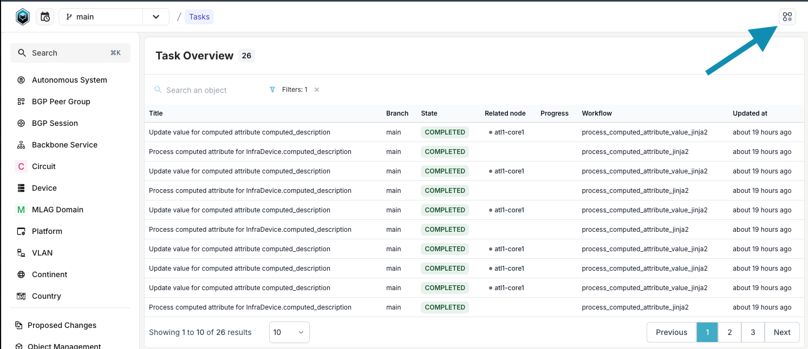

<table>
  <tbody>
    <tr>
      <th>Release Number</th>
      <td>1.1.0</td>
    </tr>
    <tr>
      <th>Release Date</th>
      <td>December 30th, 2024</td>
    </tr>
    <tr>
      <th>Release Codename</th>
      <td>Lyon</td>
    </tr>
    <tr>
      <th>Tag</th>
      <td>[infrahub-v1.1.0](https://github.com/opsmill/infrahub/releases/tag/infrahub-v1.1.0)</td>
    </tr>
  </tbody>
</table>

# Release 1.1.0

This release contains both new features and bug-fixes to resolve issues found in Infrahub v1.0.10 and prior.

## Main changes

Infrahub 1.1 brings computed attributes, a new (and highly-requested) feature, as well as many behind-the-scenes changes.

See the detailed changelog in the following sections for more information.

### Computed attributes

The computed attributes feature enables the dynamic calculation of attribute values based on user-defined logic.
This functionality is valuable in a number of use cases, not least of which is programmatically generating interface or circuit names.
Several users have requested this capability and we are excited to make it available in Infrahub 1.1.

There are two main ways to configure computed attributes, they can be created using either **Jinja2** or **Python**.

For basic use cases, Jinja2-based computed attributes are now available.
To use this style of computed attribute, the user writes a concise Jinja2 template directly into their Schema definition file.
Then, any changes to a field referenced in the template will update the resultant computed attribute automatically.
There are some limitations with Jinja2-based computed attributes however; for example, only direct relationships can be used (a relationship of a relationship is not accessible).

For more complex use cases, with the need for nested relationships or more detailed logic, Python-based computed attributes are also available.
Python-based computed attributes leverage the exiting Python-based transform feature.
Users can define a transformation within the schema to apply to their field, and the attribute is then generated asynchronously by an Infrahub worker.
When using Python-based computed attributes, note that there can be system performance impact with large or complex Python scripts.

See [this table in the documentation](../../topics/computed-attributes.mdx#choosing-between-jinja2-and-python) for a concise comparison of the two types of computed attributes.

#### Caveats

- Only URL and Text attribute kinds are supported at the moment.

#### Documentation

For more information on either style of computed attribute, please see the below documentation.

- [Computed Attributes Guide](../../guides/computed-attributes.mdx)
- [Computed Attributes Topic](../../topics/computed-attributes.mdx)
- [Transformation Topic](../../topics/transformation.mdx)

### Infrahub task enhancements

As part of Infrahub 1.0, we added a new tool into the system to assist with task management and control.
In Infrahub 1.1, we have now begun to migrate key backend system tasks over to this tool.

What this means in practice for the user is that now Infrahub tasks will have more robust error reporting and supervision.

Some example tasks run in the background by the updated task worker and framework are:

- Rendering a Jinja template.
- Rendering a transform function.
- Executing a check.
- All Git operations (pull/merge/diff).

All of these and more will benefit from migration to the new task framework, providing additional logging capabilities and overall supervision and control.

Finally, this updated task framework has allowed us to add an indicator at the top right of the Infrahub window to give users task status at a glance.
For example, a section of the indicator will change color when tasks are running.
This indicator also serves as quick access to view in-progress or completed tasks.



### Remove shared storage requirements for Git

Previous to Infrahub 1.1, task workers needed access to shared storage such as NFS in order to function.

As of 1.1 this requirement is removed, and users are able to distribute task workers without needing shared storage for local Git repositories.
Each task worker now manages its own copy of any required Git repository.

This change not only simplifies deployment of Infrahub in some scenarios, but increases the overall reliability of the system.

## Changelog

The complete list of changes can always be found in the `CHANGELOG.md` file in the Infrahub Git repository.

### Removed

- Remove at parameter from GraphQL mutate functions ([#3587](https://github.com/opsmill/infrahub/issues/3587))
- Remove the "role" attribute of base schema account node. This attribute was no longer useful as roles are defined as dedicated nodes and are tightly related to permissions.
- Remove the /api/diff/data and /api/diff/schema endpoints that have been replaced by the DiffTree GraphQL query

### Added

- Add support for computed attributes. The computed attributes allows you to define a schema attribute as read only and provide logic for how the attribute should be updated. The logic that updates a computed attribute can be a Jinja2 template or a Python Transform. Aside from the initial creation when using a Jinja2 template the updates will be done asynchronously in the background. ([#3637](https://github.com/opsmill/infrahub/issues/3637))
- Add a "deprecation" property to attribute and relationship schema in order to allow users to identify deprecated fields for nodes and provide a user-friendly message about the deprecation reasons. ([#4245](https://github.com/opsmill/infrahub/issues/4245))
- Enhanced relationship inputs for hierarchical models with a new way to navigate and select objects directly within the hierarchy. ([#4636](https://github.com/opsmill/infrahub/issues/4636))
- Add ability to use node HFID to create a related node on a generic relationship ([#4649](https://github.com/opsmill/infrahub/issues/4649))

### Changed

- More efficient logic for retrieving cardinality-one relationships within a GraphQL query ([#522](https://github.com/opsmill/infrahub/issues/522))
- Change strings referring to file system paths to pathlib.Path objects ([#3545](https://github.com/opsmill/infrahub/issues/3545))
- Improved response time of menu endpoint

### Fixed

- Fix search anywhere so it looks at Groups ([#3173](https://github.com/opsmill/infrahub/issues/3173))
- Display the IP Namespace for prefixes and IP addresses in the search anywhere ([#3577](https://github.com/opsmill/infrahub/issues/3577))
- Use the repository object ID as name for its git working copy directory ([#4296](https://github.com/opsmill/infrahub/issues/4296))
- Search anywhere now supports IPv6 extended format ([#4613](https://github.com/opsmill/infrahub/issues/4613))
- - Update action buttons UI in the branch details view
  - Pre-fill the source branch select when creating a proposed change from the branch details view
  ([#4678](https://github.com/opsmill/infrahub/issues/4678))
- Synchronise git repository clones and updates for task workers in order to remove the need for a shared storage ([#4789](https://github.com/opsmill/infrahub/issues/4789))
- FIX: Resolved edge cases in 'Search Anywhere' that were causing old results to be displayed. ([#4863](https://github.com/opsmill/infrahub/issues/4863))
- Remove Profile in registry for renamed schema nodes ([#4909](https://github.com/opsmill/infrahub/issues/4909))
- Forbid changing the "optional" property of an inherited attribute to not break GraphQL schema generation ([#4936](https://github.com/opsmill/infrahub/issues/4936))
- Send a request to the backend on logout to delete session cookies and prevent remaining information ([#4962](https://github.com/opsmill/infrahub/issues/4962))
- Fix query to correctly send the variables in the tasks details view ([#5002](https://github.com/opsmill/infrahub/issues/5002), [#5118](https://github.com/opsmill/infrahub/issues/5118))
- Update alerts type on errors with proposed changes and branches ([#5293](https://github.com/opsmill/infrahub/issues/5293))
- - Verify the tasks related to the proposed changes view to show or hide the tasks accordion in the details view
  - Disable the merge button if there is an ongoing merge
  - Add poll-interval to the proposed changes query to be up to date on the state and disable the merge button if the proposed change is already merged
- Add support for irresolvable conflicts to the diff logic and DiffTree GraphQL query
- Fix a bug that prevented updating a relationship during a merge if ONLY the metadata was updated and not the peer.
- Fix permission check when using multiple backends, if one grants a permission the next ones must not be queried.
- Update logic to check if the changes on a branch include schema changes to use the new diff
- Update the api/diff/artifacts endpoint to use a dedicated query
- Verify if the requested branch exists. If it doesn't, it redirects to the homepage on the default branch.

  This helps avoid query issues, such as empty results (for example, an empty menu) or incorrect queries being sent.

## Migration guide

The process to migrate your instance of Infrahub to the latest version may vary depending on your deployment of Infrahub.
However, at a high-level, it will involve getting the latest version of the Infrahub code, and then performing any needed Database Migrations and Schema updates.

Please ensure you have a **backup of your Infrahub environment** prior to attempting any migration or upgrade activities.

### Migration of an Infrahub instance

**First**, update the Infrahub version running in your environment.

Below are some example ways to get the latest version of Infrahub in your environment.

- For deployments via Docker Compose, update your container version by updating the `VERSION` environment variable and relaunch:
  - `export VERSION="1.1.0"; docker compose pull && docker compose up -d`
- For deployments via Kubernetes, utilize the latest version of the Helm chart supplied with this release

**Second**, once you have gotten the desired version of Infrahub in your environment, please run the following commands.

> Note: If you are running Infrahub in Docker/K8s, these commands need to run from a container where Infrahub is installed.

```shell
infrahub db migrate
infrahub db update-core-schema
```

**Finally**, restart all instances of Infrahub.

### Migration of a dev or demo instance

If you are using the `dev` or `demo` environments, we have provided `invoke` commands to aid in the migration to the latest version.
The below examples provide the `demo` version of the commands, however similar commands can be used for `dev` as well.

```shell
invoke demo.stop
invoke demo.build
invoke demo.migrate
invoke demo.start
```

If you don't want to keep your data, you can start a clean instance with the following command.

> **Warning: All data will be lost, please make sure to backup everything you need before running this command.**

```shell
invoke demo.destroy demo.build demo.start demo.load-infra-schema demo.load-infra-data
```

The repository [infrahub-demo-edge](https://github.com/opsmill/infrahub-demo-edge) has also been updated, it's recommended to pull the latest changes into your fork.
