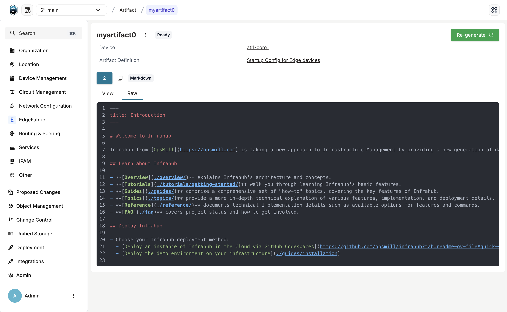
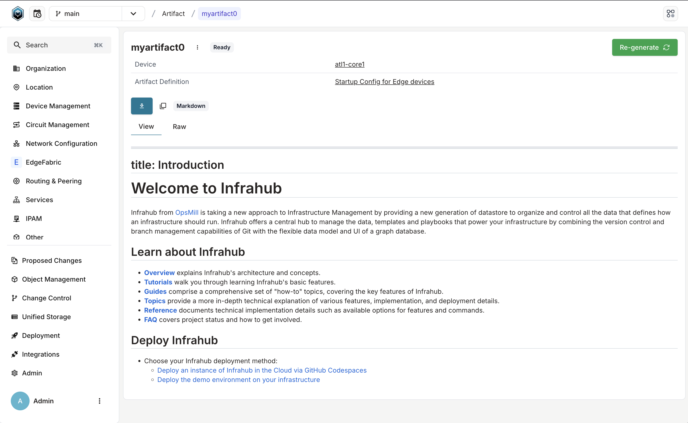
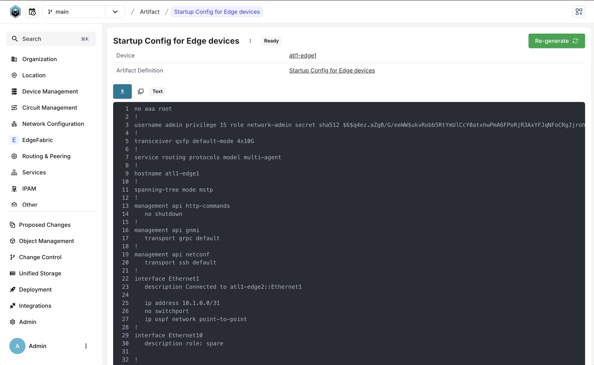
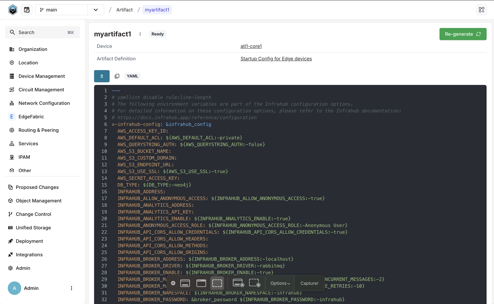
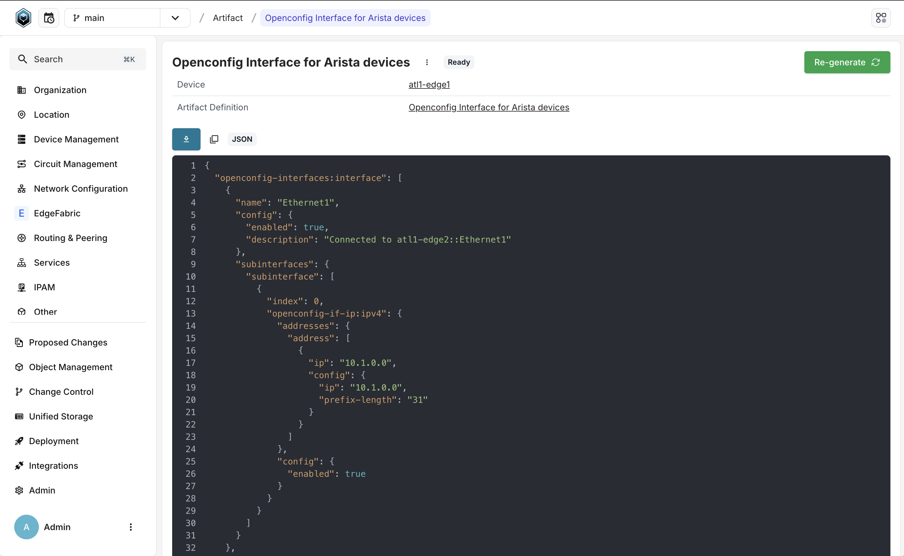
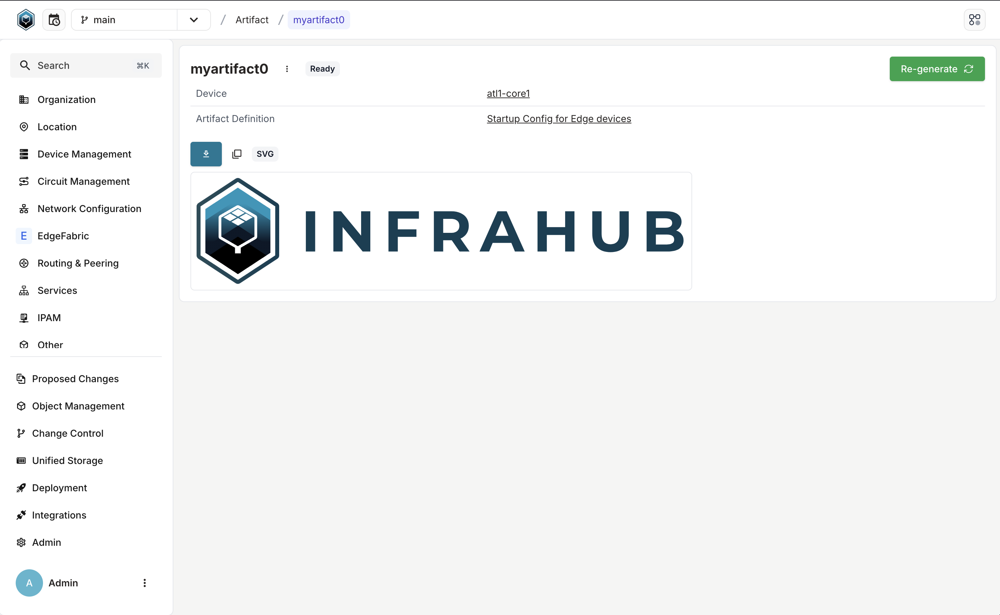

<table>
  <tbody>
    <tr>
      <th>Release Number</th>
      <td>1.1.6</td>
    </tr>
    <tr>
      <th>Release Date</th>
      <td>January 30th, 2025</td>
    </tr>
    <tr>
      <th>Release Codename</th>
      <td>Lyon, Patch #6</td>
    </tr>
    <tr>
      <th>Tag</th>
      <td>[infrahub-v1.1.6](https://github.com/opsmill/infrahub/releases/tag/infrahub-v1.1.6)</td>
    </tr>
  </tbody>
</table>

# Release 1.1.6

This release brings exciting new features to Infrahub's Artifact capability, as well as bug-fixes to resolve issues found in Infrahub v1.1.5 and prior.

## Main changes

The complete list of changes can always be found in the `CHANGELOG.md` file in the Infrahub Git repository.

### Artifact improvements

As part of our ongoing efforts to enhance the integrations and capabilities of Infrahub, the Artifact detail page has been redesigned.

This redesign focused on allowing a richer and more powerful Artifact experience.
Enhancements include support for additional content-types (as listed below), colorized syntax highlighting, and easier access to download or copy artifacts.

**Supported Artifact Content Types**:

- Markdown
- YAML
- JSON
- Text
- SVG

#### Examples

Markdown with syntax highlighting:



Markdown rendered for preview:



Text:



YAML:



JSON:



SVG:



### Added

- Allow Default Address Type quick selection in the Resource Manager form ([#3489](https://github.com/opsmill/infrahub/issues/3489))
- Added code viewer for new content-types, preview of raw markdown content, one-click file download or cop, and redesign of artifact details view ([#5452](https://github.com/opsmill/infrahub/issues/5452))

### Fixed

- Automatically mark hierarchical nodes `parent` relationship as optional if the parent is of the same kind or mandatory if the parent is of a different kind ([#3682](https://github.com/opsmill/infrahub/issues/3682))
- Revert back to `state=open` from `state=merging` if the merge of a proposed change fails.
  This fixes the possibility of leaving a proposed change in an unexpected state. ([#5563](https://github.com/opsmill/infrahub/issues/5563))
- Fixes an issue with retrieving object from S3 storage backend. ([#5573](https://github.com/opsmill/infrahub/issues/5573))
- Loosened requirement for group discovery using OIDC and id_token. This will probably be reverted or presented as a configuration option in the future. ([#5623](https://github.com/opsmill/infrahub/issues/5623))
- Significant improvements to diff calculation performance.

## Migration guide

The process to migrate your instance of Infrahub to the latest version may vary depending on your deployment of Infrahub.
However, at a high-level, it will involve getting the latest version of the Infrahub code, and then performing any needed Database Migrations and Schema updates.

Please ensure you have a **backup of your Infrahub environment** prior to attempting any migration or upgrade activities.

### Migration of an Infrahub instance

**First**, update the Infrahub version running in your environment.

Below are some example ways to get the latest version of Infrahub in your environment.

- For deployments via Docker Compose, update your container version by updating the `VERSION` environment variable and relaunch:
  - `export VERSION="1.1.6"; docker compose pull && docker compose up -d`
- For deployments via Kubernetes, utilize the latest version of the Helm chart supplied with this release

**Second**, once you have gotten the desired version of Infrahub in your environment, please run the following commands.

> Note: If you are running Infrahub in Docker/K8s, these commands need to run from a container where Infrahub is installed.

```shell
infrahub db migrate
infrahub db update-core-schema
```

**Finally**, restart all instances of Infrahub.

### Migration of a dev or demo instance

If you are using the `dev` or `demo` environments, we have provided `invoke` commands to aid in the migration to the latest version.
The below examples provide the `demo` version of the commands, however similar commands can be used for `dev` as well.

```shell
invoke demo.stop
invoke demo.build
invoke demo.migrate
invoke demo.start
```

If you don't want to keep your data, you can start a clean instance with the following command.

> **Warning: All data will be lost, please make sure to backup everything you need before running this command.**

```shell
invoke demo.destroy demo.build demo.start demo.load-infra-schema demo.load-infra-data
```

The repository [infrahub-demo-edge](https://github.com/opsmill/infrahub-demo-edge) has also been updated, it's recommended to pull the latest changes into your fork.
