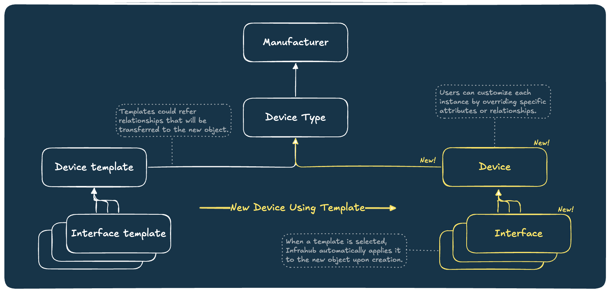
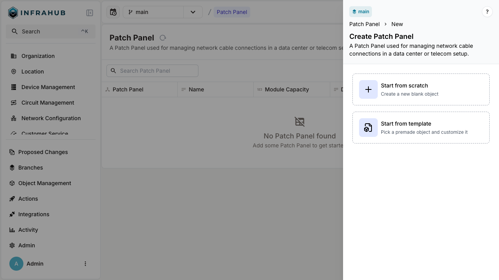
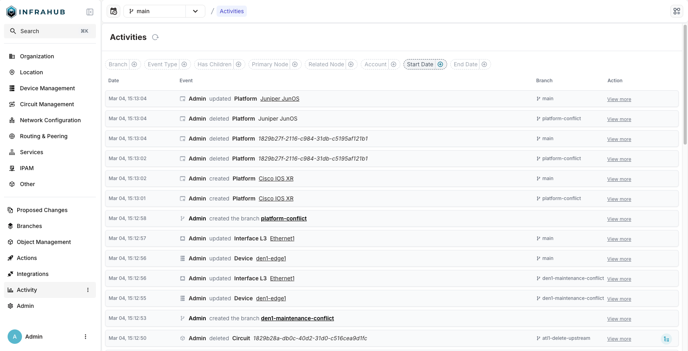
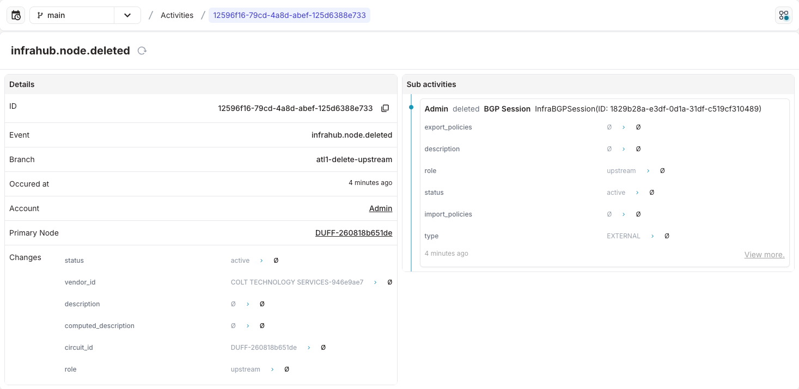
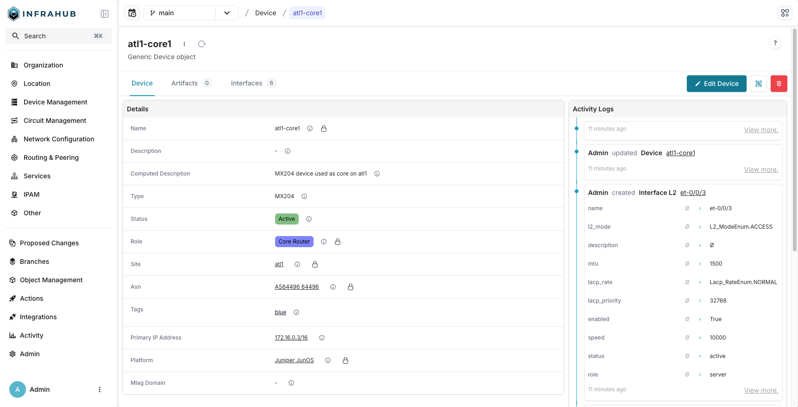
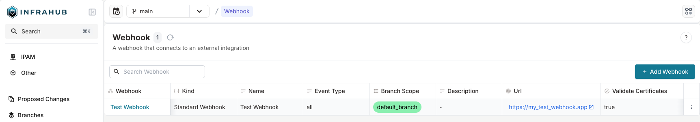
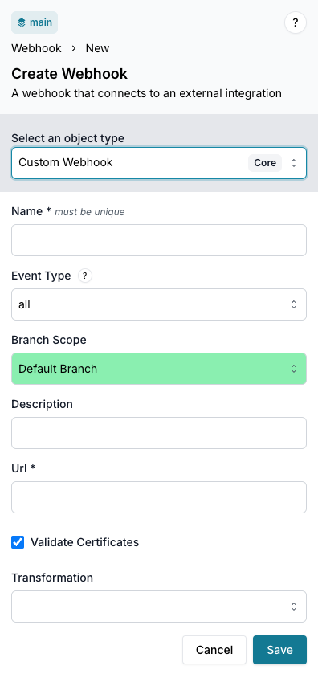
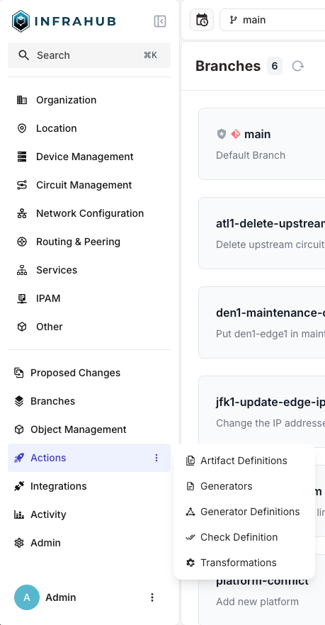

<table>
  <tbody>
    <tr>
      <th>Release Number</th>
      <td>1.2.0</td>
    </tr>
    <tr>
      <th>Release Date</th>
      <td>MArch 19th, 2025</td>
    </tr>
    <tr>
      <th>Release Codename</th>
      <td>Chicago</td>
    </tr>
    <tr>
      <th>Tag</th>
      <td>[infrahub-v1.2.0](https://github.com/opsmill/infrahub/releases/tag/infrahub-v1.2.0)</td>
    </tr>
  </tbody>
</table>

# Release 1.2.0

Infrahub 1.2 contains both highly anticipated new features as well as bug-fixes and performance improvements to resolve issues found in Infrahub v1.1.9 and prior.

## Main changes

One of the features we are excited to announce in this release is the ability to define a Template for an object in Infrahub.
This is a powerful new capability designed to significantly accelerate and standardize the creation of infrastructure data.

In addition, we've added a new Activity Log, a comprehensive feature designed to provide complete transparency and auditing of all changes within your infrastructure data.
This new capability allows users to track every event, understand the context of changes, and effectively troubleshoot any unforeseen modifications.

Finally, rounding out the new key features, we have greatly improved the Webhook functionality.
Now users are able to trigger Webhooks based on a wider range of events, including node creation, updates, and deletions.
This enhancement provides greater flexibility and control over the Webhooks that are triggered in Infrahub, allowing users to better integrate with their existing workflows and systems.
The new Webhook functionality also includes the ability to execute custom Infrahub Transformations to manipulate the data in the payload.
This means you can now customize the data Infrahub sends to your Webhook endpoints, unlocking even more possibilities.

These exciting new features aside, we have also made several improvements to the UI for a cleaner look, including a more compact and reorganized builtin menu.
There are also quite a few performance improvements, including a faster object list retrieval and an optimized query for saving a diff.

See the detailed changelog in the following sections for information on the above and more!

### Templates

The new Templates feature allows users to define reusable Templates for complex objects, such as devices and their associated components (i.e., interfaces, ports), dramatically reducing manual data entry and ensuring consistency across your infrastructure records.
These Templates can then be used to create new objects with the same properties and relationships.

With the Templates feature, you can now enable Template support directly within your schema, define templates with pre-populated data, and instantiate new objects based on these predefined configurations.
This is particularly beneficial for scenarios involving repetitive object creation, such as deploying multiple devices with identical interface configurations.



For example, you can create a "PatchPanel" template that includes 48 pre-defined ports, ensuring every new panel is consistently configured.
Then, when creating a new PatchPanel object, you can choose to either create it from the template or from scratch.
This flexibility allows you to leverage the power of templates while still having the option to customize individual objects as needed.



Key benefits of utilizing Templates include:

- **Accelerated Data Entry**: Reduce the time and effort required to create complex infrastructure objects.
- **Enhanced Consistency**: Ensure uniformity across your infrastructure data by using standardized templates.
- **Schema-based Management**: Easily enable template generation at the node level within your schema.
- **Flexible Template Application**: Choose to create new objects from templates or from scratch, providing flexibility for various use cases.
- **GraphQL and Web Interface Support**: Seamlessly create and manage templates through both our web interface and GraphQL API.

This feature empowers infrastructure teams to maintain a more organized, efficient, and consistent data model, ultimately improving operational agility and reducing the potential for configuration errors.
We believe Templates will be a valuable addition to your Infrahub toolkit, enabling you to manage your infrastructure data with greater ease and precision.

#### Documentation

For more information on Templates, please see the below documentation.

- https://docs.infrahub.app/topics/object-template
- https://docs.infrahub.app/guides/object-template

#### Template schema Namespace

With the introduction of this feature we have to restrict the Template schema namespace. This namespace is now only available Infrahub's internal usage. 

If you have an existing schema that is using this namespace, you will first have to migrate these nodes to a different namespace. More information on how to perform schema updates can be found in our [documentation](https://docs.infrahub.app/topics/schema#schema-update-and-data-migrations).

### Activity log

The Activity Log is a powerful tool that allows you to see all the changes that have been made to an object, and to track the history of any object in Infrahub.
This information is critical for auditing purposes, as well as for debugging and troubleshooting.
While this type of information has always been stored and available in the Infrahub database, it was not readily available in the UI until this release.

The Activity Log includes all the changes that have been made to the object, as well as all the relationships that have been added or removed.
This information is available on the right side of the node details view (for Activities related to a specific object), as well as under `Activity/Activities` in the menu (for all objects).

#### Screenshots

Example of the Activity Log page:



Each entry can be expanded to see more details, as well as any related child/sub-activities:



Finally, for any given object, the right side of the detail view now shows related activities:



#### Documentation

For more information on the Activity Log, please see the below documentation.

- https://docs.infrahub.app/topics/activity-log

### Webhook enhancements

The Webhook functionality has been enhanced in this release to provide more flexibility and control over the Webhooks that are triggered in Infrahub.
This work is closely tied to previous and ongoing work to provide a more flexible and powerful event system in Infrahub.

Previously, Webhooks were only triggered based on node specific events.
Webhooks can now be triggered based on the following events:

- `infrahub.artifact.created`
- `infrahub.artifact.updated`
- `infrahub.node.created`
- `infrahub.node.updated`
- `infrahub.node.deleted`
- `infrahub.branch.created`
- `infrahub.branch.merged`
- `infrahub.branch.rebased`
- `infrahub.branch.deleted`
- `infrahub.group.member_added`
- `infrahub.group.member_removed`

There remain two types of Webhooks available to users, Standard and Custom.
Both can be triggered by the above events, but differ in the following ways:

1. Standard Webhooks send a payload to the configured destination in response to one of the selected event types (or all events).
2. Custom Webhooks trigger the same as Standard Webhooks, but are also able to execute a custom Infrahub Transformation to manipulate the data in the payload.

Below are several screenshots of the new Webhook page. First is the list view for all configured Webhooks:



And here is the view of editing or creating a Custom Webhook:



#### Documentation

For more information on Webhooks, please see the below documentation.

- https://docs.infrahub.app/topics/webhooks
- https://docs.infrahub.app/guides/webhooks

### UI enhancements

The builtin menu has been reorganized and enhanced in this release, to provide a better user experience.

The goal of this reorganization is to make it easier to find the objects you are looking for, and to provide a more consistent experience across the different objects.
For example, the "Unified Storage" and "Change Control" sections have been deprecated, and their contents moved to either Object Management or Integrations to be more aligned with the purpose of each page.

In addition to this reorganization, the sub-menus in the sidebar now support icons, which makes it easier to identify the objects you are looking for.
The top menu has also been made more compact, to provide a cleaner look.



### Backup process

Users of Neo4j-enterprise and infrahub-enterprise already had the capability to backup the Neo4j database following the process in our [documentation](https://docs.infrahub.app/guides/database-backup).

With Infrahub 1.2.0 there's a new requirement to also backup the Postgres database that is used for Infrahub's internal task and event system. More information can be found in the [Installing Infrahub Enterprise guide](https://docs.infrahub.app/guides/installation-enterprise#backup-and-restore-infrahub-enterprise).

## Changelog

The complete list of changes can always be found in the `CHANGELOG.md` file in the Infrahub Git repository.

### Added

- Added Containerlab to the GitHub Codespace base image. ([#458](https://github.com/opsmill/infrahub/issues/458))
- We have completely redesigned the object tables to improve usability, performance, and clarity:

  - Display Improvements:
    - Attributes and relationships are now clearly differentiated in the table
    - HFID is displayed when available

  - Performance Enhancements:
    - Infinite scroll replaces pagination for smoother navigation
    - Query performance improved for faster node list loading

  - Filtering Enhancements:
    - Filter specific columns directly by clicking the column header
    - New conditional filters: *contains*, *is empty*, *is not empty*
    - **Note:** Filtering is not yet available in relationship tables

  - New action menu on each row; edit or delete a node without opening the detail page
  - And more coming soon!

  ([#3456](https://github.com/opsmill/infrahub/issues/3456))
- You can now manually trigger a Generator Instance or Generation Definition run from the UI. ([#5354](https://github.com/opsmill/infrahub/issues/5354))
- Added validation to the UI for `min_count` and `max_count` in relationships fields. ([#5661](https://github.com/opsmill/infrahub/issues/5661))
- Added a new feature to create object templates when setting `generate_template: true` in the schema on a node.
- Added activities logs into the node details view.
- Added icon support to sub-menu items in the sidebar.
- Improved Infrahub app layout for a cleaner look. Made the top menu more compact.
- On object creation, you can now specify a list of groups to add the object to.
- We updated the global UI layout for better balance, alignment, and to prepare for future enhancements.

### Changed

- Replaced `PrefixPool` with `netaddr.IPSet`. ([#3547](https://github.com/opsmill/infrahub/issues/3547))
- Modified the query analyzer to not list all potential meta data models when only querying for "source" or "owner" ID. The full models will still show up if a fragment is used under the meta data properties. This change makes it easier to setup fine grained permissions and also speeds up the permission lookup as it doesn't require as many checks. ([#4644](https://github.com/opsmill/infrahub/issues/4644))
- Improved typing of GraphQL schema by defining list as non-nullable and ensure that top level item are mandatory.
- Made object list retrieval faster with an optimized query.
- Reorganized builtin/default menu to provide a better user experience. The "Unified Storage" and "Change Control" sections have been deprecated, and their contents moved to either Object Management or Integrations to be more aligned with the purpose of each page.
- Updated Infrahub account tokens view:

  - Redesigned for a faster, cleaner experience.
  - Improved clarity and formatting of expiration dates.
  - Resolved an issue where expiration data was not being sent to the API.

### Fixed

- Fixed a bug where deleting an object from the details view keeps you on your current branch instead of redirecting to the main branch. ([#5232](https://github.com/opsmill/infrahub/issues/5232))
- Fixed an event error in event state after merging a proposed change, they were incorrectly set as "merging" instead of "merged". ([#5600](https://github.com/opsmill/infrahub/issues/5600))
- Fixed an issue where the pool selection was not displayed correctly when eligible in a hierarchical relationship field. ([#5888](https://github.com/opsmill/infrahub/issues/5888))
- Default prefix type in IP Prefix Pool form can now be selected from a dropdown. ([#5889](https://github.com/opsmill/infrahub/issues/5889))
- Fixed incorrect toast messages for IP address pool creation, updates, and errors. ([#5908](https://github.com/opsmill/infrahub/issues/5908))
- Resolved an issue where Generic/Component Relationships couldn’t be added or updated in IPAM views. ([#5924](https://github.com/opsmill/infrahub/issues/5924))
- Infrahub will now correctly display all relationships in IPAM summary views ([#5925](https://github.com/opsmill/infrahub/issues/5925))
- Fixed an issue where list attribute could not be cleared using UI edit form. ([#5934](https://github.com/opsmill/infrahub/issues/5934))

### Housekeeping

- Activated `ruff` B rules. ([#2193](https://github.com/opsmill/infrahub/issues/2193))
- Activated `ruff` C4 rule. ([#2194](https://github.com/opsmill/infrahub/issues/2194))
- Added a basic integration test for the HTTP service adapter. ([#5553](https://github.com/opsmill/infrahub/issues/5553))

## Migration guide

The process to migrate your instance of Infrahub to the latest version may vary depending on your deployment of Infrahub.
However, at a high-level, it will involve getting the latest version of the Infrahub code, and then performing any needed Database Migrations and Schema updates.

Please ensure you have a **backup of your Infrahub environment** prior to attempting any migration or upgrade activities.

### Template schema Namespace

Before you start the migration to v1.2.0 you should verify if you are using the Template schema namespace.

Please [read this section](#template-schema-namespace) before you continue, if you are using the Template namespace.
If you don't use the Template namespace you can continue with the next steps.


### Migration of an Infrahub instance

**First**, update the Infrahub version running in your environment.

Below are some example ways to get the latest version of Infrahub in your environment.

- For deployments via Docker Compose, update your container version by updating the `VERSION` environment variable and relaunch:
  - `export VERSION="1.2.0"; docker compose pull && docker compose up -d`
- For deployments via Kubernetes, utilize the latest version of the Helm chart supplied with this release

**Second**, once you have gotten the desired version of Infrahub in your environment, please run the following commands.

> Note: If you are running Infrahub in Docker/K8s, these commands need to run from a container where Infrahub is installed.

```shell
infrahub db migrate
infrahub db update-core-schema
```

**Finally**, restart all instances of Infrahub.

### Migration of a dev or demo instance

If you are using the `dev` or `demo` environments, we have provided `invoke` commands to aid in the migration to the latest version.
The below examples provide the `demo` version of the commands, however similar commands can be used for `dev` as well.

```shell
invoke demo.stop
invoke demo.build
invoke demo.migrate
invoke demo.start
```

If you don't want to keep your data, you can start a clean instance with the following command.

> **Warning: All data will be lost, please make sure to backup everything you need before running this command.**

```shell
invoke demo.destroy demo.build demo.start demo.load-infra-schema demo.load-infra-data
```

The repository https://github.com/opsmill/infrahub-demo-edge has also been updated, it's recommended to pull the latest changes into your fork.
