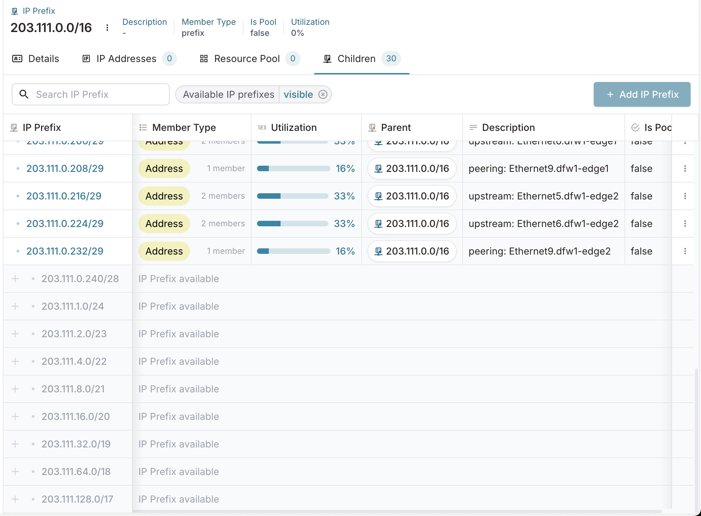
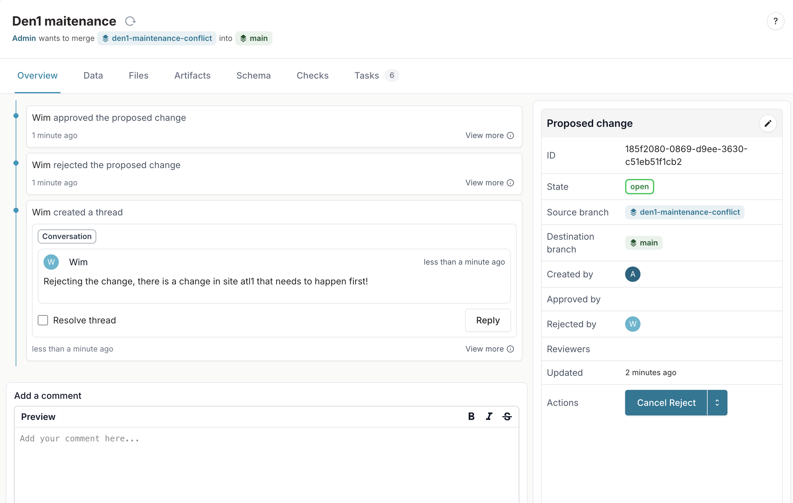
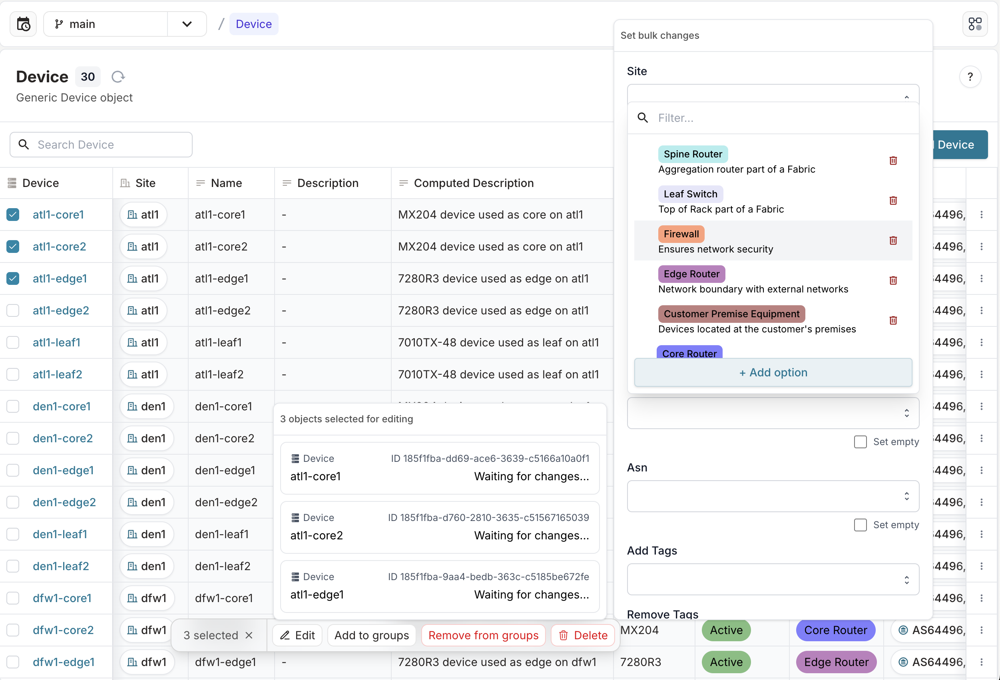
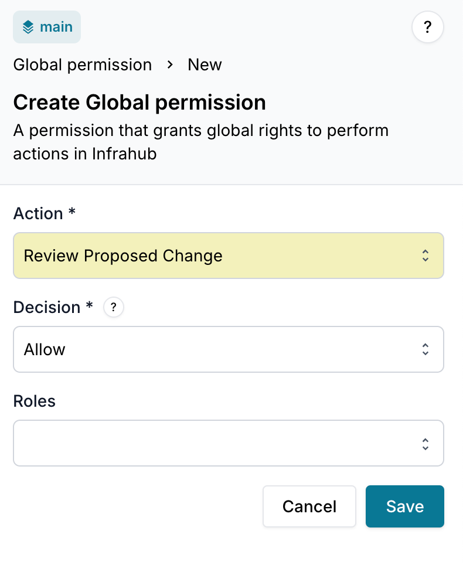

<table>
  <tbody>
    <tr>
      <th>Release Number</th>
      <td>1.4.0</td>
    </tr>
    <tr>
      <th>Release Date</th>
      <td>August 26th, 2025</td>
    </tr>
    <tr>
      <th>Tag</th>
      <td>[infrahub-v1.4.0](https://github.com/opsmill/infrahub/releases/tag/infrahub-v1.4.0)</td>
    </tr>
  </tbody>
</table>

We're excited to announce the first release candidate of Infrahub 1.4.0!

This release focuses on several key improvements to enhance usability, performance, and enterprise-level control.

The most significant update is the redesign of the generic list view, which now dynamically adapts columns and filters based on the selected schema node. This change underpins major improvements to the IPAM module, including better contextual information, performance boosts, and new features like displaying and creating objects from available address space.

For our Enterprise customers, we've introduced a proposed change approval workflow, allowing teams to implement proper change control with configurable approval settings and improved visibility into change status.

Additionally, this release introduces bulk edit capabilities in the object list view. We've also added signing and authentication for custom webhooks and implemented several performance improvements across the application, including the re-enabling of attribute indexes.

## Main changes

### UI generic list view allows you to select a specific schema node

The list view of generic schema nodes, now contains a dropdown control that allows you to select a specific schema node that inherits from this generic. When selecting a specific schema node, the list view will be filtered to the objects of that kind and the columns in the list view will now show you the attributes and relationships of that kind.

If there's only 1 specific schema node inheriting from the generic, then it will be automatically selected and the list view will immediately show the attributes and relationships of this schema node.

### IPAM improvements

Several improvements have been made to the IPAM functionality in Infrahub, improving the overall experience when navigating IPAM data or when searching for new available IP address space.



#### Improved contextual information on prefixes and addresses

The IPAM views have been updated to leverage the [generic list view improvements](#UI generic list view allows you to select a specific schema node). Schema nodes inheriting from the BuiltinIPPrefix or BuiltinIPAddress generics will now show additional attributes and relationships that are defined on them, providing more context when navigating the IPAM tree.

#### Hide tree navigation component

You can now hide the IPAM tree navigation component, providing more space to display the information in the IP prefix and IP address list views.

#### Display available prefix or address space

Infrahub can now optionally display available IP prefixes or IP addresses in the IPAM view.

For prefixes, Infrahub will automatically calculate the largest available prefixes it can create and display them in the interface.
Similarly Infrahub will calculate the available IP addresses, summarizing them into ranges when possible.

#### Create new IP Prefix or IP Address objects from available prefix or address space

Clicking an available IP Prefix or IP Address in the list view of Infrahub, will now open the object creation form, which will be prefilled with the available IP prefix or IP address, simplifying the process of creating new IP Address or IP Prefix records.

#### Improved default view

When you click on an IP Prefix object in the IP prefix list view, Infrahub will now show you the child prefixes or the IP addresses contained within that prefix. What data is being displayed depends on the member type defined on the prefix object.
Additionally more detailed information about the prefix will be available in that view.

#### Performance improvements

Performance improvements have been made to improve the overall user experience while navigating your IPAM data in Infrahub.

#### Ability to create new IP prefixes and IP addresses using resource managers

The frontend now supports creating new IP prefix and IP address objects using resource managers, previously this was only possible on nodes that had a relation to an IP address or IP prefix object.

### Proposed change approval workflow (Enterprise)

Add support to configure required approvals of proposed changes, allowing users to implement proper change control mechanisms.

- a new global permission has been introduced to allow users to review a proposed change
- configuration setting that allows you to define a required amount of approvals (enterprise only)
- configuration setting to automatically revoke approvals when new changes are made to a branch (enterprise only)

With this change multiple improvements have been made to the overall proposed change feature in Infrahub:

- The proposed change list view has been updated, so that you can more easily identify the proposed changes that need your attention.
- Added the ability to set a proposed change to be a draft, allowing you to more easily indicate the state of a certain change
- The overview tab of a proposed change now contains a more detailed timeline of all the actions/state changes that happened in a proposed change.

Please refer to the documentation for a guide that explains how to setup a change approval workflow: [Change Approval Workflow Guide](../../guides/change-approval-workflow.mdx)



### Bulk edit capabilities

Infrahub now supports bulk edit capabilities in the object list view in the web interface, allowing you to modify attributes/relationships of multiple nodes in a single operation.



### Custom webhooks now support signing and authentication using a shared key

Infrahub now supports authentication and signing for custom webhooks. Previously this was only possible for standard webhooks.

### Performance improvements

Several improvements were made to improve the performance of Infrahub.

- Re-enable attribute indexes at the database level
- Support scaling out the prefect task manager component (enterprise) (experimental)

## Full changelog

### Added

- Add support for nested named GraphQL fragments for cardinality=many relationships. ([#5322](https://github.com/opsmill/infrahub/issues/5322))
- Added support for authentication / signing to custom webhooks. If using a transform it is assumed that the transform renders JSON data. ([#6521](https://github.com/opsmill/infrahub/issues/6521))
- Enhance form context to auto-fill parent fields based on the current view. When a user is viewing a node, adding certain relationships will automatically populate parent fields in the form using information from the current node, if available. ([#6686](https://github.com/opsmill/infrahub/issues/6686))
- Make created_by relationship of CoreProposedChange read-only. Set the relationship server-side during the CoreProposedChangeCreate mutation.
- Add `CoreProposedChangeAvailableActions` GraphQL query to get possible actions that can be taken by someone on a proposed change
- Add a permission to allow users to review proposed changes (identifier `global:review_proposed_change:allow_all`). Users with existing Infrahub instances may need to create this permission to use it.
- Add events for proposed change reviews and merge
- Add support to see available IP spaces when querying for generic IP prefixes or generic IP addresses by using the `include_available` filter
- Added new database-level indexing logic to improve performance of queries that are searching for specific values
- New on IPAM:
  - IP Prefix details page now shows the list of members first instead of full details.
  - When viewing a prefix's children list, you can now see the available sub-prefixes.
- On generic list view and IPAM, we added a new picker to select an inheriting schema. When you pick one:
  - The list view updates to display all columns defined by that schema.
  - Filtering and sorting are supported on these schema-specific fields.
  - If the generic schema has only one inheriting schema, the list view will automatically display its columns without requiring manual selection.
- You can now bulk edit selected rows in object list view

### Changed

- - Enhance the Proposed Changes list view by adding filters and improving the UI.
  - Enhance actions and add a select menu to choose which action to trigger.
  - Allow draft states for proposed changes
  - Add events in main overview page for approvals, rejects and threads
  ([#proposed-changes](https://github.com/opsmill/infrahub/issues/proposed-changes))
- Allow `prefix_length` to be omitted when using `IPPrefixGetNextAvailable` GraphQL query to return the first next available prefix
- Deprecate `IPAddressGetNextAvailable` and `IPPrefixGetNextAvailable` in favour of `InfrahubIPAddressGetNextAvailable` and `InfrahubIPPrefixGetNextAvailable` respectively. Also deprecate mutations `IPPrefixPoolGetResource` and `IPAddressPoolGetResource` in favour of `IPPrefixPoolGetResource` and `InfrahubIPAddressPoolGetResource`.
- Stopped the IPAM menu item from showing up if there are no nodes inheriting from BuiltinIPAddress or BuiltinIPPrefix

### Fixed

- Raise error on schema load if someone tries to override the peer of a generic relationship as the GraphQL schema doesn't allow for that. ([#6699](https://github.com/opsmill/infrahub/issues/6699))
- Fix bug that prevented proposed changes in the `merging` state from showing in the UI. ([#6749](https://github.com/opsmill/infrahub/issues/6749))
- Fix: Always show suggested filters
- Fixed RelationshipAdd and RelationshipRemove mutations so they can't update read-only relationships
- Fixed an issue where false was shown as `-` instead of `false` in object table

## Migration of an Infrahub instance

**Please** make sure to upgrade any existing installations of the infrahub-sdk.

**First**, update the Infrahub version running in your environment.

Below are some example ways to get the latest version of Infrahub in your environment.

- For deployments via Docker Compose, download the updated Docker Compose file
  - `curl https://infrahub.opsmill.io -o docker-compose.yml`
- Set the `VERSION` environment variable and start the environment
  - `export VERSION="1.4.0"; docker compose pull && docker compose up -d`
- For deployments via Kubernetes, utilize the latest version of the Helm chart supplied with this release

**Second**, once you have gotten the desired version of Infrahub in your environment, please run the following command.

> Note: If you are running Infrahub in Docker/K8s, this command need to run from a container where Infrahub is installed.

```shell
infrahub upgrade
```

**Finally**, restart all instances of Infrahub.

### Migration of a dev or demo instance

If you are using the `dev` or `demo` environments, we have provided `invoke` commands to aid in the migration to the latest version.
The below examples provide the `demo` version of the commands, however similar commands can be used for `dev` as well.

```shell
git fetch origin
git checkout infrahub-v1.4.0rc0
git pull
invoke demo.stop
invoke demo.pull
invoke demo.migrate
invoke demo.start
```

If you don't want to keep your data, you can start a clean instance with the following command.

> **Warning: All data will be lost, please make sure to backup everything you need before running this command.**

```shell
git fetch origin
git checkout infrahub-v1.4.0rc0
invoke demo.destroy demo.build demo.start demo.load-infra-schema demo.load-infra-data
```

The repository [infrahub-demo-edge](https://github.com/opsmill/infrahub-demo-edge) has also been updated, it's recommended to pull the latest changes into your fork.

### New permission for proposed change approvals

A new global permission was introduced to approve proposed changes. For existing installations that have been upgraded to this release candidate, you will have to update the roles to include this new permission. This is only needed for the roles that have been assigned to the account groups that need to be able to approve proposed changes.

The following steps are needed to create the global permission:

1. Login with account that has the permission `global:super_admin:allow_all`, for example the default admin account
2. In the menu navigate to Admin > Users and Permissions and open the Global Permissions tab
3. Click on Create Global Permission
4. In the Create Global Permission form set the action to `Review Proposed Change`
5. Set the Decision to Allow
6. Select the roles that need to be able to approve Proposed Changes
7. Click Save



You should now be able to login with a user that is member of an account group that has one of these roles assigned and approve proposed changes.
