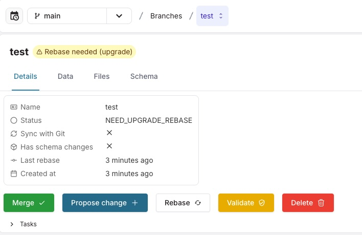
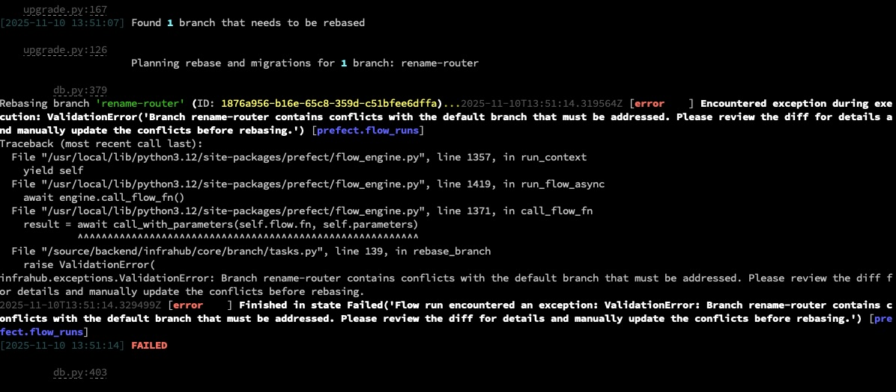
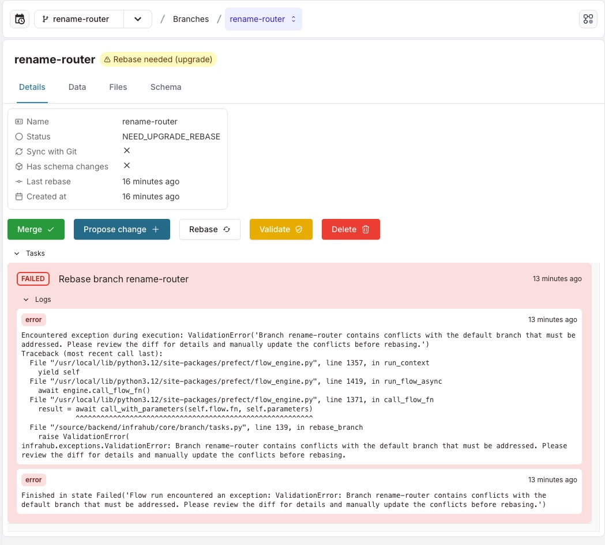
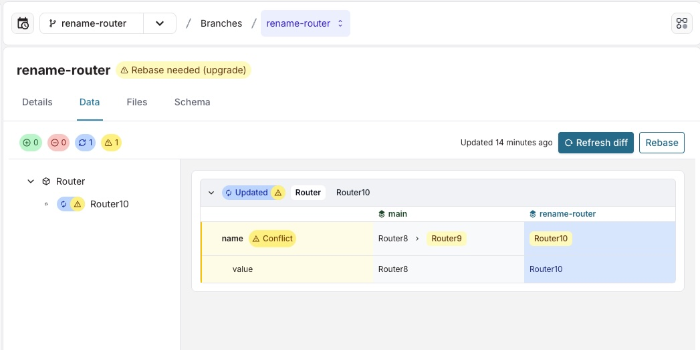

<table>
  <tbody>
    <tr>
      <th>Release Number</th>
      <td>1.5.0</td>
    </tr>
    <tr>
      <th>Release Date</th>
      <td>November 10th, 2025</td>
    </tr>
    <tr>
      <th>Tag</th>
      <td>[infrahub-v1.5.0](https://github.com/opsmill/infrahub/releases/tag/infrahub-v1.5.0)</td>
    </tr>
  </tbody>
</table>

We're excited to announce the latest version of Infrahub, v1.5.0!

This release delivers major enhancements focused on data lifecycle management, significant performance gains, and operational maturity.

We've made extensive architectural refactors across the board: HFIDs and Profiles are now computed at write time for faster reads, and the display_label property has been modernized to use Jinja2 templating, supporting relationships for richer context.

For automation, we introduced controls to disable generator runs during CI/merge events to eliminate redundancy. We also delivered a crucial new Backup & Restore Tool to orchestrate consistent recovery procedures across Neo4j, PostgreSQL, and artifact storage (initially supporting Docker Compose).

Finally, we've ensured Webhooks are more consistent by aligning custom webhook data formats with standard events, and improved overall efficiency via memory optimizations in multi-branch setups.

# Main changes

## Disable generator in Infrahub's CI pipeline and after a branch merge operation

To provide a cleaner experience when setting up event-based Generators, we've introduced the capability to selectively disable Generators during specific lifecycle events: CI pipeline execution and branch merge operations.

Previously, Generators could be triggered multiple times, leading to redundant processing: once by their configured event trigger rules, again during the Proposed Change (CI) phase, and finally after merging into the main branch.

You can now prevent this overlap by optionally disabling generator execution on a per-generator basis directly within your repository configuration file, `.infrahub.yml`. This ensures your automation runs only when you explicitly intend it to, giving you finer control over when your generation logic executes.

Benefit: Eliminates redundant generator runs

Requirement: This feature requires using version 1.15.0 or newer of the Infrahub Python SDK.

## New Infrahub backup and restore tool

We are introducing a new tool to ease the backup and restore process of Infrahub.

Infrahub stores critical state for your infrastructure in multiple systems: the Neo4j graph database, the PostgreSQL database that powers the task manager, and external artifact storage. If any piece is lost or corrupted, you can end up with drifted configurations, orphaned tasks, or a completely unusable deployment. Regulatory requirements and business continuity plans often demand auditable recovery procedures, so "having some dumps around" is rarely enough—you need consistent, verifiable recovery points.

The Infrahub Backup & Restore Tool orchestrates backup and restore workflows across deployment targets. It coordinates quiescing and snapshotting services, pulls data out with the right credentials, and packages everything so restores are deterministic. During restore, the tool brings services back in dependency order, reapplies data, and captures logs so you can prove the operation succeeded.

Installation instructions for the `infrahub-backup` tool can be found in the [documentation](https://infrahub-ops-cli.pages.dev/).

At this stage the tool only support Docker Compose based deployments, in the future we will be adding support for other deployment methods, such as Kubernetes.

## Refactor HFID of objects

We’ve refactored how HFIDs are handled internally to improve performance and scalability.

Previously, HFIDs were computed on-the-fly at read time and were not stored in the database. On objects with many relationships, this could lead to slower queries and higher CPU usage.

With this release, Infrahub now computes the HFID at write time (on create and update) and persists it in the database. Reads no longer need to derive HFIDs dynamically, resulting in faster object retrieval and more predictable query performance.

## Refactor the display_labels of objects

We’ve modernized how object display labels are defined and resolved, adding support for templating and relationships.
Previously, display_labels were evaluated dynamically at read time, which impacted query performance at scale and prevented us from supporting relationships.

What’s new:

- Computed at write time: display_label is now computed on create/update and stored, improving read performance.
- Templating with Jinja2: define display_label using the same Jinja2 syntax available for computed attributes, including first-level relationships.
- Single-attribute shorthand remains supported, i.e. `attribute__value`
- For multi-field labels, use Jinja2: `{{ relationship__attribute__value }}-{{ attribute__value }}`

Deprecation and migration:

- The display_labels property is deprecated in favor of display_label.
- Infrahub automatically migrates existing schema nodes:
  - `display_labels: ["name__value"]` → `display_label: name__value`
  - `display_labels: ["type__value", "name__value"]` → `display_label: {{ type__value }} {{ name__value }}`

You can review the result on each schema node’s detail page (Menu > Object Management > Schemas).

⚠ **Required action after migration**:

Update your schema files to use the new `display_label` property and remove deprecated `display_labels` after verifying the automatic migration.

In the documentation you can find [specific instructions to migrate existing schema nodes to the new `display_label`](https://docs.infrahub.app/release-notes/deprecation-guides/display_labels/).

Today, in some places in the UI, we are using the HFID of objects to display them with useful context. This was mostly done to overcome the restriction of not supporting relationships in the `display_label`. In a future release we will use the `display_label` for this instead.

## Refactor profiles

Profiles have been reworked for performance and future flexibility.
Previously, attribute values derived from profiles were resolved dynamically at read time, which could impact performance at scale. With 1.5.0:

- Attribute values influenced by profiles are now computed and stored at write time (create/update object or profile).
- Reads no longer have to compute derived values, improving query performance and predictability.
- This refactor lays groundwork to expand profile capabilities, such as adding relationships to profiles in future versions of Infrahub.

## Memory optimizations

We reduced the memory footprint of the GraphQL schema in multi-branch setups:

- Branches that use the exact same schema now share the same in-memory GraphQL schema.
- Individual GraphQL types can be shared across schema versions across branches where compatible.

This lowers memory consumption and improves runtime efficiency.

## Webhook improvements

### Aligned the format of custom webhooks with the schema of standard webhooks

The format of the event data that custom webhooks receive in a Python transform, is now aligned with the format of events in standard webhooks. This allows users of custom webhooks to have access to the same data as standard webhooks.

An example of the format of the event data:

```python
{
    'data': {
        'kind': 'BuiltinTag',
        'action': 'created',
        'fields': ['name', 'description'],
        'node_id': '1869ad37-fb84-8958-58d8-1746970be2f5',
        'changelog': {
            'node_id': '1869ad37-fb84-8958-58d8-1746970be2f5',
            'node_kind': 'BuiltinTag',
            'attributes': {
                'name': {'kind': 'Text', 'name': 'name', 'value': 'Green', 'properties': {'is_visible': {'name': 'is_visible', 'value': True, 'value_type': 'Boolean', 'value_previous': None, 'value_update_status': 'added'}, 'is_protected': {'name': 'is_protected', 'value': False, 'value_type': 'Boolean', 'value_previous': None, 'value_update_status': 'added'}}, 'value_previous': None, 'value_update_status': 'added'},
                'description': {'kind': 'Text', 'name': 'description', 'value': None, 'properties': {'is_visible': {'name': 'is_visible', 'value': True, 'value_type': 'Boolean', 'value_previous': None, 'value_update_status': 'added'}, 'is_protected': {'name': 'is_protected', 'value': False, 'value_type': 'Boolean', 'value_previous': None, 'value_update_status': 'added'}}, 'value_previous': None, 'value_update_status': 'unchanged'}
            },
            'display_label': 'Green',
            'relationships': {}
        }
    },
    'id': 'fe0172b4-8b69-4597-b0f5-17294de85882',
    'branch': 'main',
    'account_id': '1869ab9e-873b-1908-58d0-1746a8ed315d',
    'occured_at': '2025-09-29 06:33:05.523563+00:00',
    'event': 'infrahub.node.created'
}
```

⚠ !!! ***WARNING** this is a breaking change, existing Python transforms for custom webhooks will need to be adapted to handle this new format.

### Artifact definition name has been added to the webhook payload for artifact events

For artifact events, the webhook payload now includes the artifact definition name.

Events affected:

- `infrahub.artifact.created`
- `infrahub.artifact.updated`

This makes it easier to interpret artifacts in downstream systems without additional API queries and simplifies integration with configuration deployment frameworks.

## Web interface improvements

- Bulk select objects in list view — select multiple rows to apply bulk actions more efficiently.
- Better navigation for large diffs — improvements to the branch and proposed change diff views help you navigate big changes faster.
- Task list: direct access to related nodes — from each task, you can jump directly to the related nodes for quicker investigation.

## Convert between object types

You can now convert an object from one schema type to another without recreating it. This is especially useful when evolving objects as their type changes—for example, transforming a Layer 2 interface into a Layer 3 interface on a device.

Conversion of object type is available via: GraphQL API, Infrahub Python SDK and the Web interface

To streamline conversions, Infrahub proposes a field mapping that aligns attributes and relationships from the source type to the destination type. You can review and adjust the suggestions and provide values for any fields where no suggestion is available.

The following query has been added to the GraphQL API:

- `FieldsMappingTypeConversion` returns suggested mapping between source and destination types

The following mutations have been added to the GraphQL API:

- `ConvertObjectType` converts an object using the provided mapping

The following methods have been added to the Infrahub Python SDK:

- `convert_object_type` converts an object using the provided mapping


## SDK improvements

Version 1.5.0 of Infrahub requires the usage of infrahub-sdk version v1.15.0, which has been published to [PyPi](https://pypi.org/project/infrahub-sdk/1.15.0b0/).

### Diff based on timestamp

- `create_diff` — manually create a diff between two timestamps on a branch.
- `get_diff_summary` now accepts start/end timestamps to retrieve that diff.

### Object type conversion

new `convert_object_type` method — converts an object to a different type using field mappings.

### Clearing attribute/relationships of objects

You can clear the value of an optional attribute and a cardinality one relationship of an object via the SDK.

### Support for object file range expansion

Object templates support range expansion on string attributes to generate multiple similar objects more easily (i.e., device interfaces).

# Deprecations

## Graphql mutations

`IPPrefixPoolGetResource` and `IPAddressPoolGetResource` have been deprecated in favor of `InfrahubIPPrefixPoolGetResource` and `InfrahubIPAddressPoolGetResource`. The deprecated mutations will be removed in a future release. Please update your integrations accordingly.

## SDK

In the SDK client the `raise_for_error` attribute has been deprecated for the following methods:

- `execute_graphql`
- `query_gql_query`
- `get_diff_summary`
- `allocate_next_ip_address`
- `allocate_next_ip_prefix`

Migrate to try/except for handling errors raised by these methods. The deprecated attribute will be removed in a future release.

# Full changelog

## Added

- Clean up deadlocks at set intervals controlled by the `INFRAHUB_CACHE_CLEAN_UP_DEADLOCKS_INTERVAL_MINS` environment variable with a default value of `15` minutes ([#1290](https://github.com/opsmill/infrahub/issues/1290))
- Generate order_weight for generic templates ([#7157](https://github.com/opsmill/infrahub/issues/7157))
- Added new error message for git connection error ([#7392](https://github.com/opsmill/infrahub/issues/7392))
- - Added a "Select All" checkbox on list views that selects all rows currently loaded on the page.
  - Select multiple rows at once by holding Shift and clicking.
- Add `InfrahubRecomputeComputedAttribute` GraphQL mutation to trigger computed attribute re-computation on all nodes of a given kind or a subset of nodes given their IDs
- Add support for updating existing Profiles when the associated node or generic schema is updated to change an attribute's optional or read-only value or when an attribute is added or removed
- Added a 'warnings' attribute to the API payload for /api/schema/load and /api/schema/check, so that deprecation warnings could be returned for non critical schema violations.
- Added the name of the artifact definition to the payload of artifact webhook events.
- Added warnings to API endpoints /api/schema/check and /api/schema/load, as a way to notify schema developers when they use deprecated fields.
- Allow objects to be converted to another type by mapping fields or defining custom values.

  - For attributes, values from the source object will appear in the target form when the attribute type matches between the source and target schemas.
  - For dropdowns and enums, if the set of options is identical in both schemas, the selected source value will appear in the target form; otherwise, no value will be shown.
  - For relationships, linked objects from the source will appear in the target form when the related object type matches between the source and target schemas.
- Branches list page refreshed:

  - Improved layout for clearer grouping and labels
  - Better accessibility and full keyboard navigation
  - New: branch status is now displayed

  Branch details page:

  - Now shows all branch attributes for a complete view.
  - Added fields: description, status, schema changes, and sync with Git.

## Changed

- Add a new flow to apply migrations inside branches that will also set a `graph_version` property on branches after running. The upgrade process (via the provided command) is also updated with a new `--rebase-branches` flag to trigger branch rebase as part of the upgrade process. Also add the `NEED_UPGRADE_REBASE` branch status to identify branches that need the migrations flow to run.
- Increase default timeout for transform/checks from 10 to 60 seconds

## Fixed

- Prevent creation of relationships with state `absent` ([#4302](https://github.com/opsmill/infrahub/issues/4302))
  - In a proposed change, within the diff tree, clicking the arrow now only expands/collapses the tree without also triggering the item itself (and vice versa).
  - Diff tree and list of changes can be scrolled separately
  ([#5451](https://github.com/opsmill/infrahub/issues/5451))
- fix to allow updating the node kind to null when creating or updating a webhook ([#6397](https://github.com/opsmill/infrahub/issues/6397))
- Breaking change: The format of the data payload has been corrected for transform based webhooks so that they are consistent with standard webhooks as well as custom webhooks (without an attached transform). Due to this change any transforms attached to a webhook needs to be updated to account for the new format. ([#6815](https://github.com/opsmill/infrahub/issues/6815))
- Fixed an issue with resource pools allocating duplicate values on concurrent mutations. ([#7254](https://github.com/opsmill/infrahub/issues/7254))
- Prevent creation of attributes with state `absent` ([#7353](https://github.com/opsmill/infrahub/issues/7353))
- Prevent creation of nodes with state `absent` ([#7354](https://github.com/opsmill/infrahub/issues/7354))
- Fix bug in cypher query that could cause relationships in a large result set to be incorrectly set to null. By default, the nodes in the result set would need to collectively have over 5,000 relationships for the issue to appear.
- Fixed incorrect data diff counter when viewing a branch or proposed changes
- Improved 401 in UI: parallel queries now share a single refresh token call instead of each triggering their own.
- Performance improvements thanks to more granular locking on mutations.
- Resolved a problem that caused generator checks to fail when retrying requests

## Housekeeping

- Pin click version to 8.2.1.
- Refactor Generator execution triggered by an action.

# Migration of an Infrahub instance

Before you upgrade an instance of Infrahub, we strongly advise you to delete branches that are no longer needed within Infrahub. Deleting old branches helps speeding up the upgrade process and to avoid spending time running migrations for branches that are no longer needed.

This process can be used to determine if a branch can be deleted:

- navigate to the branches page in Infrahub
- for each open branch:
  - navigate to the branch detail page
  - refresh the diff from within the data tab
  - review the data and schema changes in the branch
  - if the branch is synchronized with your git repository, review the changes in the files tab
  - review any open proposed changes open for this branch and close or merge the proposed change
  - delete the branch after the proposed changes have been merged/closed or if the changes are no longer relevant

**Please** make sure to upgrade any existing installations of the infrahub-sdk to v1.15.0.

**First**, update the Infrahub version running in your environment.

Below are some example ways to get the latest version of Infrahub in your environment.

- For deployments via Docker Compose, download the updated Docker Compose file
  - `curl https://infrahub.opsmill.io -o docker-compose.yml`
- Set the `VERSION` environment variable and start the environment
  - `export VERSION="1.5.0"; docker compose pull && docker compose up -d`
- For deployments via Kubernetes, utilize the latest version of the Helm chart supplied with this release

**Second**, once you have gotten the desired version of Infrahub in your environment, we need to run migrations because of the changes to the HFID, display label and profiles.

These migrations need to be run on the main branch, and then afterwards the existing branches in Infrahub will need to be rebased, after which the migrations will be run in the branches.

Infrahub provides the `infrahub upgrade` command to start these migrations.

Optionally you can instruct the `infrahub upgrade` command to rebase existing branches and to trigger the migrations on the branches using the `--rebase-branches` option. You can use the `--interactive` option together with the `--rebase-branches` option. In that case the `infrahub upgrade` command will ask you for each branch, whether you want it to be rebased as part of the upgrade.

Alternatively you can manually rebase branches after you have run the `infrahub upgrade` command. A rebase operation can be performed from the branch detailed view or through the `infrahubctl branch rebase <branch name>` command. The required migrations in a branch will be triggered automatically by Infrahub, after it has been rebased.

Branches that have not been upgraded during the migration, will move to the status `NEED_UPGRADE_REBASE`. In this status you will not be able to merge the branch into main. You will need to rebase the branch before it can be merged.



A rebase operation for a branch can fail, for example when there is a conflict between the branch and the main branch. If the rebase operation for a branch fails, the upgrade command will show an error message with a reason for the failure (if you used the `--rebase-branches` operation).

In that case, the branch will move to the `NEED_UPGRADE_REBASE` status and will need to be rebased manually.
If there was a conflict that prevented the rebase from succeeding, then you will first have to resolve that conflict.

To resolve the conflict, open the branch detailed page and expand the task logs at the bottom. The task log will show you the reason the rebase operation failed.





To resolve the conflict, open the data tab and/or the schema tab and inspect the diff.



In this image we see a conflict, because Router8 object was renamed in main to Router9 and in the `rename-router` branch the same Router8 object was renamed to Router10. To resolve the conflict we either have to rename the object back to Router8 in main or in the `rename-router` branch.

After resolving the conflict, we can rebase the branch, after which Infrahub will automatically trigger the required migrations.

> Note: If you are running Infrahub in Docker/K8s, this command need to run from a container where Infrahub is installed.

```shell
infrahub upgrade --rebase-branches
```

**Finally**, restart all instances of Infrahub.

## Migration of a dev or demo instance

If you are using the `dev` or `demo` environments, we have provided `invoke` commands to aid in the migration to the latest version.
The below examples provide the `demo` version of the commands, however similar commands can be used for `dev` as well.

```shell
git fetch origin
git checkout infrahub-v1.5.0
git pull
invoke demo.stop
invoke demo.pull
invoke demo.upgrade --rebase-branches
invoke demo.start
```

If you don't want to keep your data, you can start a clean instance with the following command.

> **Warning: All data will be lost, please make sure to backup everything you need before running this command.**

```shell
git fetch origin
git checkout infrahub-v1.5.0
invoke demo.destroy demo.build demo.start demo.load-infra-schema demo.load-infra-data
```

The repository [infrahub-demo-edge](https://github.com/opsmill/infrahub-demo-edge) has also been updated, it's recommended to pull the latest changes into your fork.
