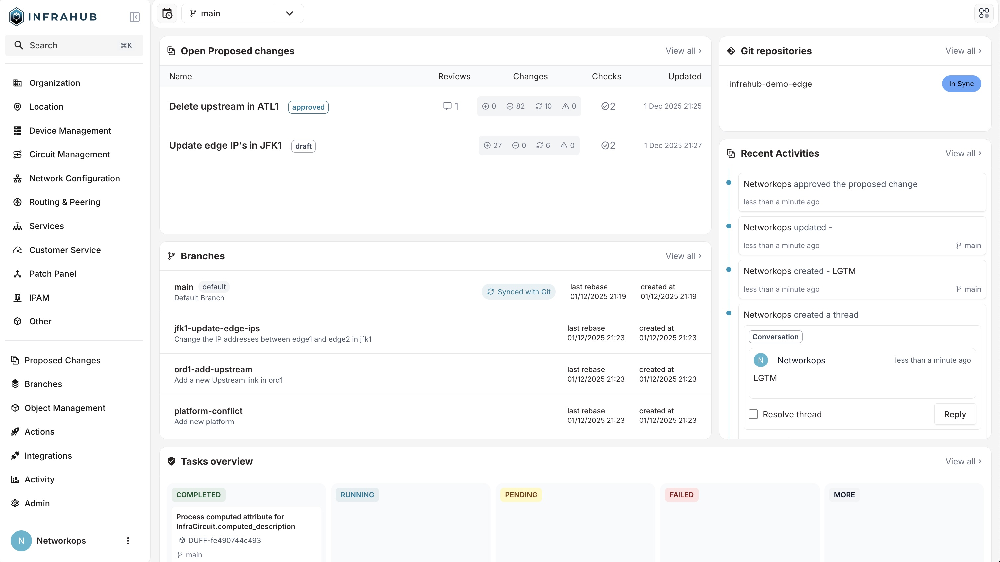
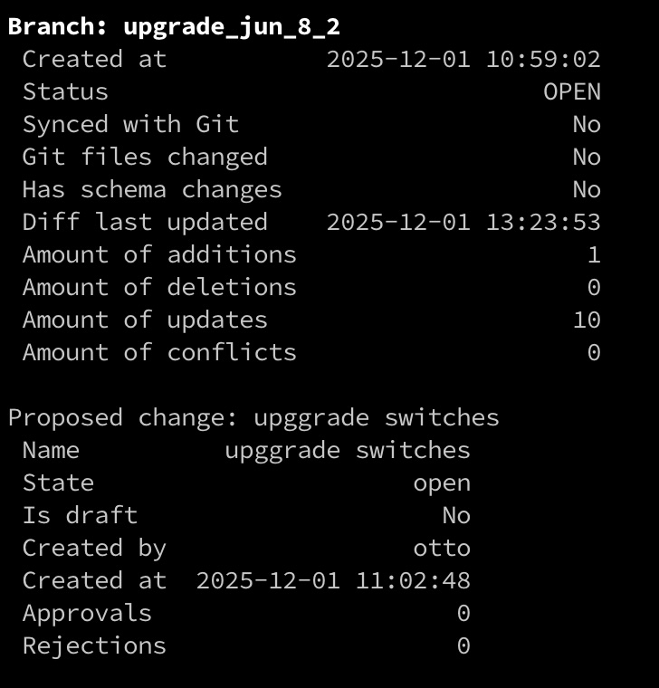
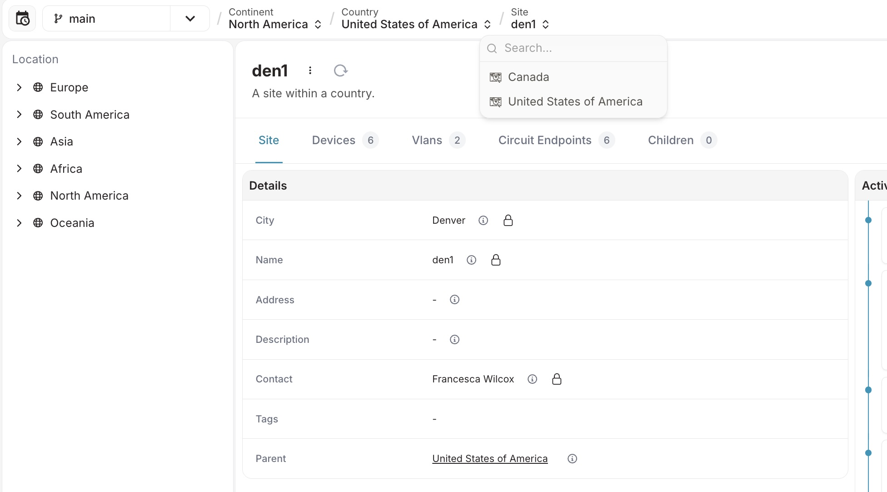
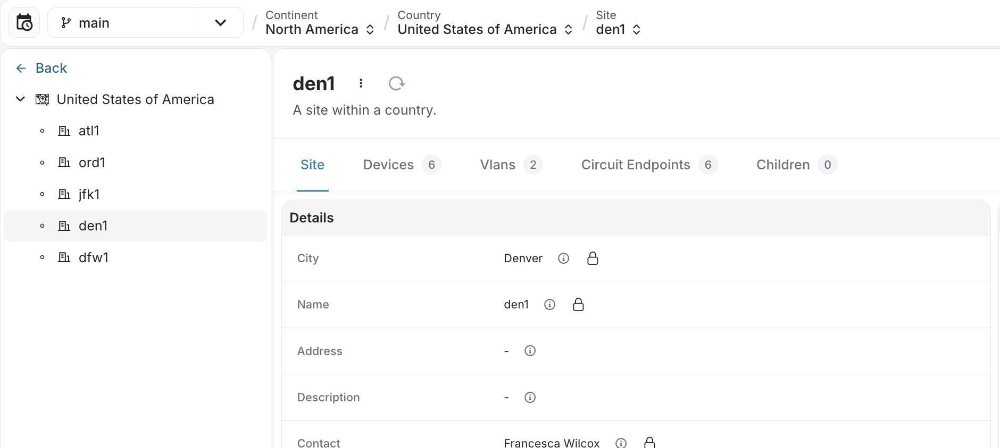

<table>
  <tbody>
    <tr>
      <th>Release Number</th>
      <td>1.6.0</td>
    </tr>
    <tr>
      <th>Release Date</th>
      <td>December 1st, 2025</td>
    </tr>
    <tr>
      <th>Tag</th>
      <td>[infrahub-v1.6.0](https://github.com/opsmill/infrahub/releases/tag/infrahub-v1.6.0)</td>
    </tr>
  </tbody>
</table>

We're excited to announce the release of Infrahub v1.6.0!

This release brings significant improvements to Git integration, UI navigation, branch management, Profiles in Object Templates and introduces a new dashboard landing page.

# Main changes

## New dashboard landing page

We've replaced the static landing page with an interactive dashboard so you can immediately see what's happening in your Infrahub environment. The interactive dashboard shows:

1. **Open proposed changes** with status and review state
2. **Git repositories** sync status
3. **Branches** with quick details
4. **Recent activity**  view the latest actions in Infrahub
5. **Tasks overview** the number of tasks that are running, completed, or that have failed.
6. **Getting started with Infrahub** – Access key resources like docs, labs, and tools.

## Use Profiles in Object Templates

You can now define profiles in Object Templates so they're automatically applied when objects are created, ensuring consistency without manual post-creation steps.

## Selective branch synchronization filter for Git repositories

Control which Git branches sync to Infrahub using configurable naming rules and patterns. Perfect for teams using multi-purpose repositories who want to keep Infrahub focused on relevant branches.

With this change you can now configure Infrahub to instead consult a list of branch names or regular expressions to determine if a given branch will be imported and created in Infrahub or not.

## Explicit merge commits

Infrahub now optionally creates three-way merge commits instead of fast-forward merges, making it easy to trace Infrahub-originated merges in your Git repository history. You also have an option to configure the Git username and email that Infrahub will use to create the merge commit.

## `infrahubctl branch report` command

The `infrahubctl branch report` command provides comprehensive status reports that help with branch cleanup and maintenance. When managing large environments with many branches, teams can now quickly identify which branches are safe to be removed.

The report displays:

- Branch metadata (creation time, sync status, schema changes)
- Git file changes detection
- Diff tree analysis with counts of added/updated/removed nodes
- Proposed changes summary with creator, approval status, and draft state

The `infrahubctl branch report` requires the installation of `infrahub-sdk` v1.16.0 with the `ctl` extra.

## New breadcrumb navigation

Interactive breadcrumbs that adapt to your current view, show full object lineage, and let you switch between related objects directly.

## Revamped hierarchy tree

We have redesigned the hierarchical tree to improve performance, and usability. This update addresses several long-standing issues and introduces a more intuitive navigation experience:

- Improved performance for large hierarchies
- Independent collapsing and navigation actions
- Resizable tree panel (10-50% of screen width)
- Smart loading when landing directly on detail views
- Better keyboard navigation and accessibility

## Standardized label resolution in UI

All node labels will now resolve using this order:

1. If the schema defines a `display_label`, show `node.display_label`.
2. If not, but the schema defines an `hfid`, show `node.hfid`.
3. Otherwise, fall back to the node's `id`.

## IPAM

The IPAM tree now uses the new hierarchy tree component (see changelog above) and is resizable.

## Display Infrahub edition

See which Infrahub edition you're using in the account menu alongside the version.

## Fixed nested `convert_query_response`

⚠ **BREAKING CHANGE**

When using `convert_query_response` with nested relationships in Python transforms and generators, queries must now include `id` and `__typename` fields on all nodes. This fixes a bug where objects were only converted one level deep.

If you are not using `convert_query_response` or if the queries that you are using with this feature aren't deeply nested, then you don't have to change anything.

# Full changelog

## Added

- Templates now support profile assignment. When both `generate_template` and `generate_profile` are configured on a schema node, profiles can be assigned to templates and will be automatically inherited by objects created from those templates. Profiles provide values for attributes not explicitly configured on the template, while template values take precedence when manually set. Multiple profiles can be assigned with proper priority handling. This enables bulk configuration updates across templated objects while maintaining consistency through profile inheritance. ([#template-profiles](https://github.com/opsmill/infrahub/issues/template-profiles))
- Merge core read only repositories on branch merge ([#5978](https://github.com/opsmill/infrahub/issues/5978))
- IPAM tree is now resizable:

  - Adjust the width of the IPAM tree panel by dragging the divider
  - Tree panel can be resized between 10% and 50% of the screen width

  ([#7262](https://github.com/opsmill/infrahub/issues/7262))
- You can now see which Infrahub edition you're using, displayed next to the app version in the account menu. ([#7549](https://github.com/opsmill/infrahub/issues/7549))
- - Update the landing page documentation links to guide users in getting started with Infrahub.
  - Show Git repositories.
  - List branches on the landing page, sorted by creation date, with the main branch displayed first.
  - Include the proposed changes, showing only the key details.
  - Show recent activities, displaying only essential information.
  - Add tasks overview to display recent tasks and sort them by state.
- Add Explicit Merge Commits for Infrahub Branch Merges. These can be controlled via the INFRAHUB_GIT_USE_EXPLICIT_MERGE_COMMIT environment variable.
  The following environment variables are added:

  - INFRAHUB_GIT_USER_NAME
  - INFRAHUB_GIT_USER_EMAIL
  - INFRAHUB_GIT_GLOBAL_CONFIG_FILE
  - INFRAHUB_GIT_USE_EXPLICIT_MERGE_COMMIT

- Added branch filtering capability to selectively synchronize remote branches based on configurable import sync patterns.
- In the Proposed Changes data tabs, each node label is now a clickable link that takes you to the updated object’s detail page.
- New breadcrumb navigation:

  - Display full ancestors lineage of objects (parent objects or all ancestors for hierarchical schemas)
  - Display schema hierarchy for hierarchical schemas
  - Search and switch objects directly from breadcrumbs
- New hierarchy tree navigation:

  - It is now displayed in a dedicated and resizable sidebar on the left.
  - Added pagination on each level with infinite scroll.
  - Highlight current item in view.
  - Improved keyboard navigation and accessibility for easier browsing.
  - Clicking a chevron now expands or collapses the tree without opening the node detail.
  - Clicking a label now opens the node detail without expanding or collapsing the tree.

  When the user arrives directly on the detail view of a hierarchical object:

  - We will show a tree that only display the current node’s parent and siblings for faster loading.
  - Include a ‘Back’ button at the top, to return to the full tree view

## Fixed

- Prevent long titles from overflowing event cards

  - Long titles now automatically truncate with ellipsis
  - Event cards no longer expand outside the visible area
  - Improves readability and keeps the UI layout intact

  ([#activities-title](https://github.com/opsmill/infrahub/issues/activities-title))
- Display node labels using the following priority: display_label, then hfid, then id. ([#display-labels](https://github.com/opsmill/infrahub/issues/display-labels))
- Backend database sessions are now handled consistently avoiding resource leakage.
- Fix retrieving human friendly ID and display label for relationship nodes via GraphQL, incorrect values could be returned instead of the ones stored in the database
- Fixed a UI issue that prevented the sidebar from fully collapsing when a link existed at the top level.
