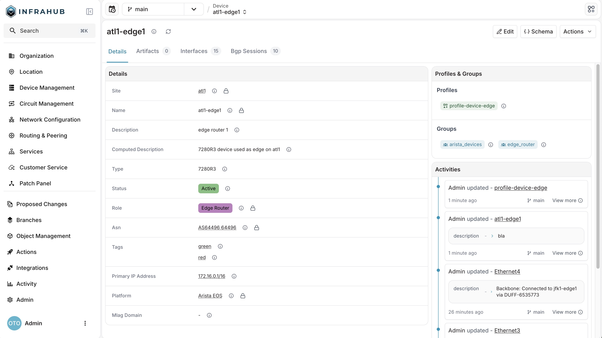

<table>
  <tbody>
    <tr>
      <th>Release Number</th>
      <td>1.7.0</td>
    </tr>
    <tr>
      <th>Release Date</th>
      <td>January 8th, 2026</td>
    </tr>
    <tr>
      <th>Tag</th>
      <td>[infrahub-v1.7.0](https://github.com/opsmill/infrahub/releases/tag/infrahub-v1.7.0)</td>
    </tr>
  </tbody>
</table>

We're excited to announce the release of Infrahub, v1.7.0! This release focuses on enhancing data governance and strengthening the platform foundation for enterprise deployments.

Version 1.7 introduces comprehensive audit capabilities with immutable metadata tracking, expands profile functionality to support relationships. Under the hood, we've upgraded critical backend dependencies to ensure optimal performance, security, and long-term maintainability.

## Main changes

### Object level meta data

Infrahub now automatically tracks who created and last modified every object in your infrastructure data. This foundational capability enables complete audit trails and accountability across your entire automation stack.

Every object now includes:

- **Created by** and **updated by** — user attribution for all changes
- **Created at** and **updated at** — precise timestamps for data lifecycle tracking

This metadata is available through the UI, GraphQL API and Python SDK, enabling you to determine who created or updated an object and at which time.

The metadata is read-only and survives across branch operations, ensuring you have a reliable audit trail even in complex version control workflows.

This positions Infrahub as enterprise-ready for organizations requiring detailed data provenance and accountability.

The `created_at` and `updated_at` metadata will be set for all objects, even those that were create before this feature.
The `created_by` and `updated_by` metadata will be set for objects that have been created or updated after this release, existing objects will not be backfilled.

### Relationships in Profiles

Profiles now support relationships in addition to attributes, enabling you to define complete, reusable templates for entire classes of objects.

Previously, profiles could only set attribute values, limiting their usefulness and adoption. Now you can:

- Define relationships within a profile alongside attributes
- Create comprehensive templates that capture both data and connections
- Enforce data consistency across large inventories with less manual work
- Apply complete object configurations at scale

Additionally profiles now support required attributes and relationships, as long as they are not part of a uniqueness constraint.

For example, you can now create a "Production Server Interface" profile that captures configurations, such as the speed and MTU and mode, but also automatically connect it to a specific VLAN.

This reduces manual configuration, minimizes errors when scaling automation projects, and ensures that relationships are consistently applied across your infrastructure data model.

### Branch list page scaling

Several users of Infrahub, have a requirement to have a large number of branches active at any given time in Infrahub. The branch list page has been updated to provide a better user experience when you have a large number of branches.

The branch list page now uses the previously introduced `InfrahubBranch` GraphQL query, which provides pagination functionality for the branch query. In this release we have also introduced a `partial_match` filter, which allows a user to search for a branch by a partial name.

Additionally the branch list page displays the new object level metadata, which allows you to more easily find the branch that you are looking for.

### Redesigned object detail view

The object detail page has been significantly improved to provide better access to key information and actions.

Header improvements:

- New info icon provides quick access to the new object-level metadata
- Action button was redesigned and relocated for better accessibility
- New dedicated button to navigate directly to the object's schema definition
- Refreshed button styling

Groups management:

- New dedicated section displays all groups the object belongs to
- Easily add or remove the object from groups without navigating away

Profiles management:

- New section shows all profiles currently applied to the object
- Manage profile assignments directly from the object detail view

These changes make it faster to understand an object's context (its metadata, groups, and profiles) without switching between multiple views.

### Upgraded backend dependencies

The platform foundation has been strengthened with major version upgrades across all core backend components:

- **Python**: 3.12 → 3.13
- **Neo4j**: 2025.03 → 2025.10/11
- **RabbitMQ**: 3.13 → 4.2
- **Redis**: 7.2 → 8.x
- **PostgreSQL**: 14 → 18

These upgrades deliver:

- Enhanced performance across the platform
- Improved security with the latest patches
- Access to new features in underlying technologies
- Better long-term maintainability and support

The upgrades have been thoroughly tested to ensure compatibility and performance regression has been validated to maintain Infrahub's reliability standards.

## Infrahub Python SDK

Infrahub v1.7.0 requires the usage of [infrahub-sdk v1.18.0](https://github.com/opsmill/infrahub-sdk-python/releases/tag/v1.18.0), please update the `infrahub-sdk` package accordingly.

## Full changelog

### Deprecated

- Deprecated the '_updated_at' query field for GraphQL queries. The new node metadata field should be used instead. The '_updated_at' field will be completely removed in Infrahub 1.9.

### Added

- Add search functionality to the branches list view, allowing users to filter branches by name. ([#2107](https://github.com/opsmill/infrahub/issues/2107))
- Added ability to enable and disable webhooks ([#6761](https://github.com/opsmill/infrahub/issues/6761))
- Added option to use username/password authentication on Redis connections ([#7994](https://github.com/opsmill/infrahub/issues/7994))
- Add display label based GraphQL filters `display_label__isnull`, `display_label__value` and `display_label__values`
- Added metadata display in branch list view showing last rebase, last update, created at, and created by information
- Added partial_match parameter to InfrahubBranch query for case-insensitive substring filtering on branch names
- Display "No task" on branch details when task are empty.
- Improved menu in IPAM details view:

  - Replaced the three-dot menu with a clearly labeled Actions button to open menu
  - Added quick navigation to related tasks
  - Added convert object type action
  - Added icons for all menu items

### Changed

- This refactors timestamp handling across query and relationship functions to accept only Timestamp types, updates all dependent code and tests accordingly, refreshes development environment files, and includes no user-facing changes. ([#63](https://github.com/opsmill/infrahub/issues/63))
- Improve branches list and details views to use the updated GraphQL API structure. ([#2108](https://github.com/opsmill/infrahub/issues/2108))
- Upgraded backend dependencies: Neo4j to 2025.10.1, Redis to 8.4.0, RabbitMQ to 4.2.1, PostgreSQL to 18

### Fixed

- Fixed issue with creating and deleting webhook automations for installations with a high number of automations in Prefect.
- Fixed relationship fields not being cleared when removing a profile from a node
- Fixed the display order of attributes and relationships in detail views.
- Re-enable running a single migration in `infrahub db migrate` using the `--migration-number` option
- Updating your account information now correctly refreshes the visible data, preventing outdated data from being shown.
