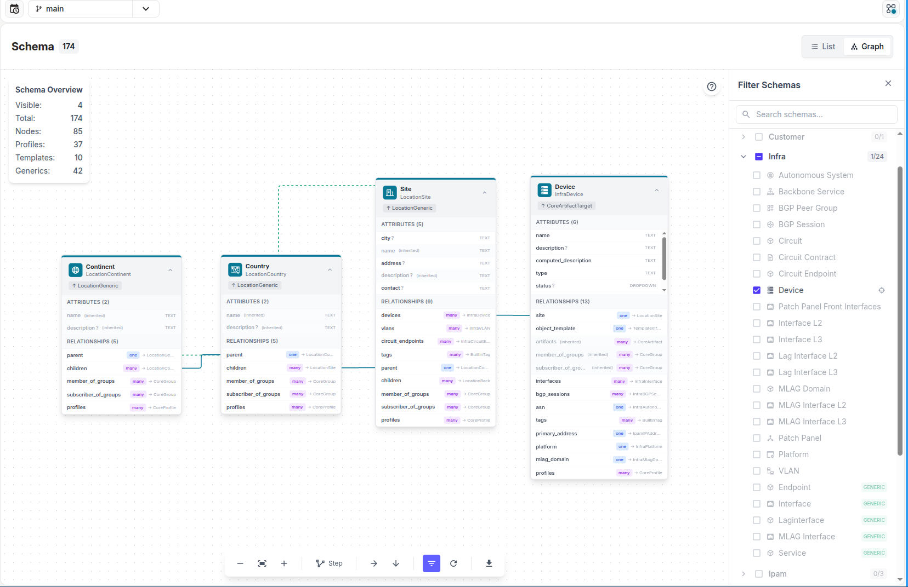
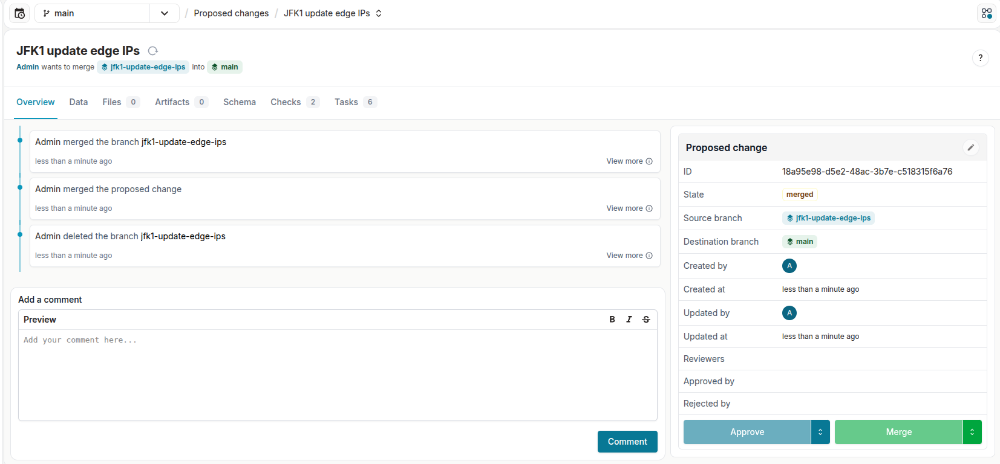
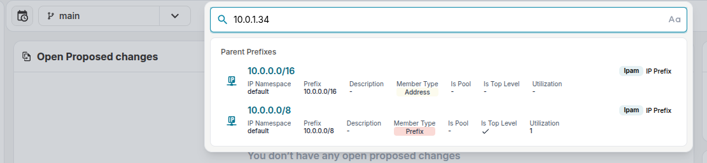
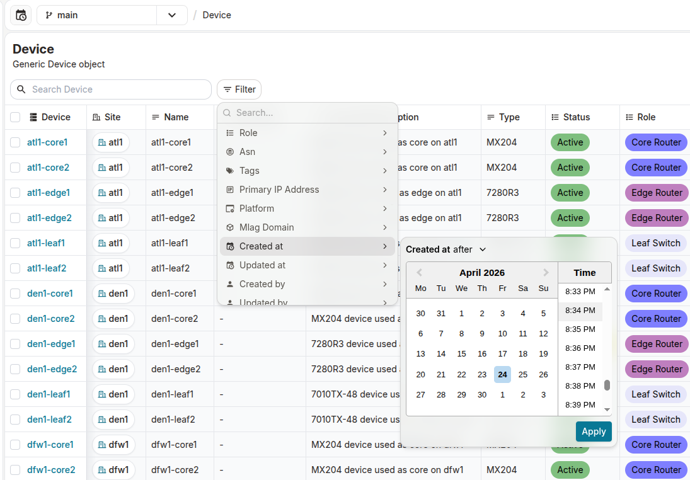

<table>
  <tbody>
    <tr>
      <th>Release Number</th>
      <td>1.9.0</td>
    </tr>
    <tr>
      <th>Release Date</th>
      <td>April 24th, 2026</td>
    </tr>
    <tr>
      <th>Tag</th>
      <td>[infrahub-v1.9.0](https://github.com/opsmill/infrahub/releases/tag/infrahub-v1.9.0)</td>
    </tr>
  </tbody>
</table>

We're excited to announce the release of Infrahub, v1.9.0!

Two headline additions lead the release: a brand-new **interactive schema visualizer** that turns your schema into a navigable graph, and **syslog log forwarding** for Infrahub Enterprise - giving operators a live view into both the schema and the runtime. Around those, the release is centred on three themes: **performance** - Jinja2 computed attributes now recalculate inline on local changes instead of spawning a background task per node; **artifact composition** - reusable GraphQL fragment files in `.infrahub.yml` and artifact content composition via Jinja2 filters; and **lifecycle & auditability** - automatic branch deletion after merge, login/logout activity events, and custom HTTP headers on webhooks.

⚠️ After upgrading to this release, every Infrahub user account that originated from an OAuth2 or OIDC identity provider must log in again. The login flow captures additional information that Infrahub now stores against these accounts.

A future release will require this information to already be present. Any account missing it at that point will be treated as new, resulting in a duplicate account. We'll give advance notice before that release ships.

## Main changes

### Schema visualization

A new **schema graph visualizer** turns your schema into an interactive, navigable graph. Instead of opening YAML files or paging through the schema viewer one schema node at a time, you can see the whole model - nodes, generics, profiles, and templates - laid out together with their relationships drawn as edges between them.

The visualizer is a canvas you can drag, zoom, and pan, with an automatic layout. Each schema kind is colour-coded so you can tell nodes, generics, profiles, and templates apart at a glance. Relationship edges with `many` cardinality are animated, and self-referencing relationships are highlighted.

You'll find it as a new **Graph** toggle on the Schema page, switching between the existing schema viewer and the graph view. Clicking the `view in graph` button in a schema node's details opens the graph with that node pre-highlighted.

The visualizer includes:

- A **filter panel** to toggle whole namespaces or individual schema types in and out of the view, so you can isolate just the part of the model you care about.
- A **node details panel** that opens on click to show the selected schema's attributes and relationships, so you don't need to switch tabs to read the definition.
- Context menus on nodes and edges for quick navigation.
- **Zoom, pan, and fit-to-view** controls plus **PNG export** of the current view - useful for docs and architecture reviews.
- State persistence, so the filters and layout you set up stick around between sessions.



### Syslog log forwarding *(Enterprise)*

Infrahub Enterprise now supports native Syslog forwarding to external SIEM systems such as Splunk, Datadog, and ELK. All `infrahub.*` activity events - including the new login/logout events - are can be forwarded continuously. Permission-denied errors on rejected GraphQL and REST requests are forwarded as `infrahub.permission.denied` events, and each destination can optionally include Infrahub's own application logs, filtered by a minimum severity. The MSG field of each syslog entry carries the JSON representation of the event.

Configuration is via the Infrahub configuration file or environment variables and supports multiple destinations, TCP or UDP transport, optional TLS, and both RFC 5424 and RFC 3164 formats - designed to meet enterprise security and compliance requirements (SOC2, ISO 27001).

### Modular GraphQL queries with reusable fragments

Queries stored in a Git repository can now use standard GraphQL fragment spread syntax (`...fragmentName`) to pull from reusable fragment files declared in the repository's `.infrahub.yml`. This eliminates query duplication in multi-artifact pipelines and is a building block for the artifact composition features below. At repository sync time, Infrahub resolves each referenced fragment (including transitive dependencies), inlines only the fragments actually needed, and stores a single self-contained query document - no external fragment resolution at execution time.

Declare fragment files alongside queries in `.infrahub.yml`:

```yaml
queries:
  - name: device_details
    file_path: "queries/device_details.gql"

graphql_fragments:
  - name: interface_fields
    file_path: "fragments/interfaces.gql"
  - name: device_fields
    file_path: "fragments/devices.gql"
```

Then reference them from query files:

```graphql
query DeviceDetails($name: String!) {
  InfraDevice(name__value: $name) {
    edges {
      node {
        ...deviceFragment
        interfaces {
          edges {
            node { ...interfaceFragment }
          }
        }
      }
    }
  }
}
```

Transitive dependencies are resolved automatically - a fragment that spreads another fragment brings both along. Unresolvable references fail at sync time with an actionable error identifying the query and fragment. The same rendering applies when executing queries locally via `infrahubctl`, so IDE workflows keep working.

### Artifact content composition

Jinja2 Transformations gain a new set of filters for composing an artifact from the content of other artifacts:

- `artifact_content` takes a `storage_id` and returns the rendered content of another artifact as a string.
- `file_object_content` does the same for a `CoreFileObject`.
- `file_object_content_by_hfid` takes the `hfid` of a `CoreFileObject` and returns the content as a string
- `file_object_content_by_id` takes the `id` of a `CoreFileObject` and returns the content as a string
- `from_json` and `from_yaml` parse the inlined content so the composing template can traverse it as structured data.

This lets a template inline and parse sections from other artifacts without duplicating the template logic that produced them. Python Transformations can achieve the same by calling `object_store.get()` via the SDK.

### Display options for attributes and relationships

Schema definitions for attributes and relationships now support a `display` property with two values: `default` (the existing behaviour) and `extra`. Setting `display: extra` marks a field as secondary - hidden from list views and collapsed behind an **Extra** toggle in the object details card. Create and edit forms always show all fields regardless of the `display` value, and API and GraphQL access is unchanged - `display` is purely a UI hint. Generics propagate the property to every node that inherits from them, so you can define the expected UI layout once.

Example:

```yaml
attributes:
  - name: name
    kind: Text
    display: default
  - name: checksum
    kind: Text
    display: extra
```

The IPAM detail pages have been unified with the standard object-details card in the same pass, picking up field metadata, the **Extra** toggle, metadata editing, and profiles & groups tabs.

### Delete branch after merge

Merged branches can now be cleaned up automatically. Two opt-in configuration flags control the behaviour:

- `INFRAHUB_DELETE_BRANCH_AFTER_MERGE` - deletes the Infrahub branch after a successful merge, whether the merge happened through a direct branch merge or a Proposed Change.
- `INFRAHUB_GIT_DELETE_GIT_BRANCH_AFTER_MERGE` - also deletes the corresponding Git branch from synced repositories. The Git deletion runs asynchronously as a separate background job and records per-repository failures in each repository's task log, so a failure in one repository doesn't roll back deletions that succeeded elsewhere.

The `BranchDelete` GraphQL mutation accepts a `delete_from_git` parameter to override the Git deletion setting per request. A new delete-branch dialog in the UI exposes the same Git-delete option for manual cleanup when auto-delete is off.



### Custom HTTP headers on webhooks

Webhooks can now carry arbitrary custom HTTP headers - the most common use case being authentication to target systems that require `Authorization: Bearer <token>` or similar.

A single header can be attached to multiple webhooks, so rotating a credential in one place propagates to all of them on the next event. Two new node kinds back this, both implementing a shared `CoreKeyValue` generic:

- **`CoreStaticKeyValue`** - the value is stored as-is in Infrahub. Appropriate for system identifiers, tenant IDs, or tokens that don't need external secret management.
- **`CoreEnvKeyValue`** - only the environment-variable **name** is stored; the actual value is resolved from the worker process environment at send time. The stored configuration never contains the secret, which lets secret managers (Kubernetes secrets, Vault, Delinea) inject credentials the usual way. Missing variables are logged with a warning and the header is skipped; the remainder of the request is sent intact.

If a custom header collides with a system-reserved header name (for example: `Content-Type`), the user's value wins.

Although shipped to solve the webhook-authentication use case, `CoreKeyValue` and its two implementations are not webhook-specific - they can be reused anywhere in other contexts as well.

### IPAM: closest parent prefix lookup in search

The search-anywhere dialog now understands IP addresses and CIDR prefixes. Typing `10.1.2.45` returns:

- Any existing IP address object with that value as a regular search result.
- A dedicated **Parent Prefixes** section listing all prefixes that strictly contain the input, ordered from most specific to least specific, labelled with their namespace.

The same works for CIDR input - searching for `10.1.2.0/24` returns the prefix itself as a regular match plus its containing parents (but not itself) in the Parent Prefixes section. IPv6 input is normalised so compressed and expanded forms produce the same results.

Searching for an IP address or prefix that does not exist in Infrahub now returns the closest matching prefix rather than an empty result, making it easier to navigate the prefix hierarchy when investigating address allocation.



### Unified filter menu with metadata filters

List views now have a single **Filter** button next to the search bar. It opens a menu grouping every available filter - suggested filters, new metadata filters, schema attributes, and relationships. Hovering an entry reveals the existing filter form inline; applying it attaches an active-filter tag below the toolbar that you can click to edit or remove.

The new **metadata filters** cover the four audit-style fields available on every node: `created_at`, `created_by`, `updated_at`, `updated_by`. Timestamps use the existing date-range picker; user references use the existing relationship picker targeting account entities.

Table column headers are no longer clickable filter triggers - they keep a filter icon to show that a filter is active on the column, but the filter menu is now the single entry point. Filter state continues to be persisted in URL query-string parameters.



### Login and logout activity events

Authentication is now observable through the activity event feed. Two new event kinds have been added:

- `infrahub.account.logged_in` - emitted on every successful interactive authentication (password, OAuth2, OIDC).
- `infrahub.account.logged_out` - emitted when a user explicitly logs out.

Event payloads include the account name and type, authentication method, session identifier, groups and roles, identity source, client IP, user agent, and timestamp. Session identifiers link a login event to its corresponding logout event so you can compute session durations.

Access to `infrahub.account.*` events is restricted to users with the `MANAGE_ACCOUNTS` permission.

### Role Manager list views redesigned

The Accounts, Groups, Roles, and Global Permissions tables in Role Manager now share the same design and feature set as every other object table in the application - same sorting, filtering, column-header behaviour, and visual rhythm.

### Namespace restrictions on generics

Generic schemas now accept a namespace restriction parameter that limits which namespaces can inherit from them. This is enforced at schema-load time. **This affects existing extensions of `CoreGenericRepository` and `CoreWebhook`** - see the Breaking changes section below.

### Computed attributes: local execution

Jinja2-based computed attributes that depend on attributes or relationships on the **same** node now recalculate inline during the mutation, instead of spawning a background task. By the time the GraphQL response returns, the computed value already reflects the new inputs - no background task, no reload.

Concretely:

- Updating an attribute used by a local computed attribute recomputes it inline; the mutation response contains the new value.
- Changing a relationship used by a local computed attribute (for example re-assigning a `Device` to a different `Site`) recomputes inline against the new peer's attributes.
- Bulk-updating thousands of nodes no longer spawns thousands of per-node background tasks for local changes.
- Each local-change mutation emits **one** consolidated event/webhook containing both the original change and the updated computed attribute, instead of two separate events.
- **Remote** changes (peer-node updates that affect computed attributes on other nodes) continue to use the existing background-task path - no behavioural change there. Python Transform-based computed attributes are also unchanged.

This eliminates the single most common source of trivial background-task load in large imports and bulk edits.

### Schema selector: sticky search and expand/collapse

The schema selector's search bar is now sticky at the top of the list, and two new buttons expand or collapse every namespace section at once - useful when working with schemas that span a lot of namespaces.

### Object list and detail page headers unified

Object list pages now share the same header style as detail pages, with consistent access to schema, docs, and refresh actions from both views.

## Infrahub Python SDK

Infrahub v1.9.0 requires the usage of infrahub-sdk v1.20.0, please update the `infrahub-sdk` package accordingly.

Notable SDK changes in this release:

- Fragment rendering for `.infrahub.yml` queries - the SDK is the single owner of fragment resolution and inlining. The same rendering pipeline is used by the Infrahub server during repository sync and by `infrahubctl` when executing queries from the local filesystem.
- `<TODO: add other SDK highlights from the python_sdk submodule's CHANGELOG for this release>`

## Breaking changes

Read this section before upgrading.

### Removed deprecated GraphQL queries and mutations

The following deprecated GraphQL operations have been removed - use the `Infrahub`-prefixed equivalents that have been available since 1.6:

| Removed                     | Replacement                         |
|-----------------------------|-------------------------------------|
| `IPAddressGetNextAvailable` | `InfrahubIPAddressGetNextAvailable` |
| `IPPrefixGetNextAvailable`  | `InfrahubIPPrefixGetNextAvailable`  |
| `IPPrefixPoolGetResource`   | `InfrahubIPPrefixPoolGetResource`   |
| `IPAddressPoolGetResource`  | `InfrahubIPAddressPoolGetResource`  |

Any client code (including SDK calls, scripts, and transforms) still using the old names will need to be updated.

### Removed `_updated_at` field

The previously deprecated `_updated_at` field on GraphQL nodes has been removed. Use `updated_at` under `node_metadata` instead:

```graphql
# Before
{ MyObject { edges { node { _updated_at } } } }

# After
{ MyObject { edges { node { node_metadata { updated_at } } } } }
```

### Namespace restrictions apply to `CoreGenericRepository` and `CoreWebhook` extensions

The new generic namespace restriction parameter applies to `CoreGenericRepository` and `CoreWebhook`. **Any existing schema extensions that inherit from either generic must be removed prior to the upgrade**, or the schema load will fail. If you need the equivalent capability going forward, the built-in webhook types and key-value pair headers (see "Custom HTTP headers on webhooks" above) cover most use cases.

### Proposed change comment metadata

The `created_at` and `created_by` attribute and relationship on proposed-change comments have been removed in favour of the node metadata `created_at` and `created_by` that already exist on every node. Any client code reading these from the comment body directly needs to switch to reading from `node_metadata`.

### Event consumer change: branch merged / deleted events

`infrahub.branch.deleted` and `infrahub.branch.merged` events now expose the associated proposed change (when one is associated) as the event's **primary node** instead of a related node. Consumers that filter on `primaryNodeIds` will start matching these events for the proposed change automatically. Consumers that relied on the proposed change appearing under `relatedNodes` must be updated.

## Migration of an Infrahub instance

Before you upgrade an instance of Infrahub, we strongly advise you to delete branches that are no longer needed within Infrahub. Deleting old branches helps speed up the upgrade process and avoids spending time running migrations for branches that are no longer needed.

**Please** read the Breaking changes section above before starting the upgrade. In particular, confirm you have no schema extensions inheriting from `CoreGenericRepository` or `CoreWebhook`, and that no client code still references the removed GraphQL queries or `_updated_at` field.

**Please** make sure to upgrade any existing installations of the infrahub-sdk to v`<TBD: confirm infrahub-sdk version>`.

**Please** make sure to backup your instance of Infrahub and make sure you are familiar with and have tested the restore procedure. For more information visit https://docs.infrahub.app/backup

**First**, stop the existing Infrahub instance

```shell
docker compose down
```

**Second**, update the Infrahub version running in your environment.

Below are some example ways to get the latest version of Infrahub in your environment.

- For deployments via Docker Compose, download the updated Docker Compose file
  - `curl https://infrahub.opsmill.io -o docker-compose.yml`
- Set the `VERSION` environment variable and start the environment
  - `export VERSION="1.9.0"; docker compose pull && docker compose up -d`
- For deployments via Kubernetes, utilize the latest version of the Helm chart supplied with this release

**Third**, once you have the desired version of Infrahub in your environment, run the migrations.

Infrahub provides the `infrahub upgrade` command to start these migrations.

> Note: If you are running Infrahub in Docker/K8s, this command needs to run from a container where Infrahub is installed.

```shell
docker compose exec infrahub-server infrahub upgrade
```

**Finally**, restart all instances of Infrahub.

```shell
docker compose restart
```

## Migration of a dev or demo instance

If you are using the `dev` or `demo` environments, we have provided `invoke` commands to aid in the migration to the latest version.
The below examples provide the `demo` version of the commands, however similar commands can be used for `dev` as well.

```shell
git fetch origin
git checkout infrahub-v1.9.0
git pull
git submodule update --init
invoke demo.stop
invoke demo.pull
invoke demo.upgrade --rebase-branches
invoke demo.start
```

If you don't want to keep your data, you can start a clean instance with the following command.

> **Warning: All data will be lost, please make sure to backup everything you need before running this command.**

```shell
git fetch origin
git checkout infrahub-v1.9.0
git submodule update --init
invoke demo.destroy demo.build demo.start demo.load-infra-schema demo.load-infra-data
```

The repository [infrahub-demo-edge](https://github.com/opsmill/infrahub-demo-edge) has also been updated, it's recommended to pull the latest changes into your fork.

## Full changelog

### Removed

- Remove proposed change comments created_at and created_by attribute and relationship in favor of already existing node metadata created_by and created_at
- Removed deprecated GraphQL queries and mutations `IPAddressGetNextAvailable`, `IPPrefixGetNextAvailable`, `IPPrefixPoolGetResource`, `IPAddressPoolGetResource`, use their `Infrahub` prefixed equivalents
- Removed previously deprecated "_updated_at" field within GraphQL queries. Use "updated_at" within the node_metadata instead.

### Added

- Added condition to restrict the addition of optional attributes that participate in uniqueness constraints to generated Profile schemas ([#7644](https://github.com/opsmill/infrahub/issues/7644))
- Added `display` field to `AttributeSchema` and `RelationshipSchema` with enum values `default` and `extra`, defaulting to `default`. This controls where attributes and relationships are displayed in the UI — `default` shows in the main view, `extra` in an expanded/secondary section.
- Added `infrahub db reset-deployment-id` CLI command to regenerate the internal `deployment_id` without rebuilding the database.
- Added a delete branch modal with the option to also delete the branch from Git
- Added ability to automatically delete branches after a successful merge. When `INFRAHUB_DELETE_BRANCH_AFTER_MERGE` is enabled (default: `False`), the Infrahub branch is deleted. Optionally, when `INFRAHUB_GIT_DELETE_GIT_BRANCH_AFTER_MERGE` is also enabled (requires the first setting), the corresponding Git branch is deleted from synced repositories. The `BranchDelete` GraphQL mutation accepts a `delete_from_git` parameter to override the Git deletion setting per request.
- Added an "Extra" toggle button in the object details card to reveal fields marked with display "extra", which are now hidden by default
- Added login and logout activity events (`infrahub.account.logged_in` and `infrahub.account.logged_out`). Successful authentication attempts via password, OAuth2, and OIDC, as well as explicit logouts, can now be queried via the activity event feed.
- Added namespace restriction parameter into generic schemas
- Added optional `description` field for Python Transformations in `.infrahub.yml`. Descriptions set in the repository configuration are propagated to the `TransformPython.description` attribute so they appear in the UI and API.
- Added parent prefix lookup to the search anywhere dialog (Cmd+K). When searching for a valid IP address or CIDR prefix, containing parent prefixes are now displayed in a dedicated "Parent Prefixes" section, ordered from most specific to least specific, across all namespaces. Supports both IPv4 and IPv6.
- Added schema graph visualizer plugin allowing users to view schemas as an interactive graph
- Added support for `graphql_fragments` in `.infrahub.yml`. Repositories can now declare reusable `.gql` fragment files and reference them with standard fragment spread syntax (`...FragmentName`) in query files. Fragment definitions are resolved (including transitive dependencies) and inlined at repository sync time, so the stored query is a self-contained document. The same rendering applies when running queries locally with `infrahubctl`.
- Added support for artifact content composition via Jinja2 filters. Templates running on Prefect workers can now use `artifact_content`, `file_object_content`, `from_json`, and `from_yaml` filters to inline and parse content from other artifacts and file objects. These filters are blocked in computed attributes for security.
- Added support for custom HTTP headers on webhooks. Users can create reusable key-value pairs (static or environment-variable-based) and associate them with webhooks.
- Schema selector search bar is now sticky at the top, with new collapse all and expand all buttons to quickly toggle every namespace section.
- Unified IPAM detail pages with the standard object details card, adding field metadata, extra fields toggle, edit metadata, and profiles & groups
- When `delete_branch_after_merge` is enabled, merging a branch now redirects to the branches list view and switches to the main branch if the deleted branch was the active one. Merging a proposed change stays on the detail page but switches to the main branch if the source branch was the active one.

### Changed

- Accounts, Groups, Roles, and Global Permissions tables in Role Manager now use the same updated design and features as other object tables across the application
- Added a unified filter picker for object list views and support for node metadata filtering:

  - New: Added a unified Filter menu that displays available filters for attributes, relationships and metadata
  - New: Added metadata filters (Created at, Created by, Updated at, Updated by)
  - New: Click an active filter tag to edit it or remove via the inline X
  - Improved: Active filter tags are now editable: click a tag to change its value without removing it
  - Improved: Filter tags now display human-readable conditions (contains, is any of, is empty, before, after etc...)
- Consistent headers across object list and detail pages. Object list pages now share the same header style as detail pages, with access to schema, docs, and refresh actions.
- Jinja2 computed attributes are now recalculated immediately when their dependent attributes or relationships change on the same node, eliminating background task overhead for local changes.
- Telemetry snapshots are now always stored locally in the database regardless of the telemetry opt-out setting, ensuring air-gapped and opted-out deployments retain usage data for support and auditing. New CLI commands `infrahubctl telemetry list` and `infrahubctl telemetry export` allow administrators to view and export stored telemetry data. A REST API endpoint `GET /api/telemetry/snapshots` provides programmatic access with `READ_TELEMETRY` permission enforcement.
- `infrahub.branch.deleted` and `infrahub.branch.merged` events now expose the associated proposed change (when applicable) as the event's primary node instead of a related node. Consumers filtering on `primaryNodeIds` will match these events for a proposed change; filters relying on the proposed change appearing under `relatedNodes` must be updated.
- hides the `internal` attributes of CoreFileObject in the UI

### Fixed

- Fix diff update logic that runs after merge and rebase operations to ignore diffs for merged and deleted branches. Add a new environment variable, "INFRAHUB_DIFF_UPDATE_AFTER_MERGE", that allows skipping the automatic diff updates following a merge. ([#8507](https://github.com/opsmill/infrahub/issues/8507))
- Fix a bug in diff calculation that could cause the wrong peer to be identified for a peer object belonging to a schema that had its kind or inheritance updated on the default branch.
- Fix bug in diff calculation that would cause source property update on the user-created branch to be ignored if the schema of the owning object was migrated to a new kind or inheritance on the default branch.
- Fix bug in diff calculation that would not correctly capture conflicts if the source of an attribute or relationship was updated to conflicting values on the default branch and the user-created branch.
- Fix clicking on kinds in the schema viewer modal to navigate to the related schema.
- Fix identifier not being returned when querying number pool allocations via GraphQL API.
- Fixed pagination offset being ignored when querying InfrahubBranch
- Fixed possible empty display labels by removing legacy display_labels processing
- Improve SVG artifact handling: allow scrolling in the preview so oversized content is no longer clipped, and fix the download action so the saved file contains the raw SVG content.
- Object table now refreshes automatically after adding or removing objects from groups in bulk
- Suppress spurious Neo4j SCHEMA notifications for optional relationship types that do not yet exist in the database schema, eliminating noisy log warnings about non-existent HAS_OWNER and HAS_SOURCE relationship types.

### Housekeeping

- Removed deprecated `forwardRef` usage across frontend components ([#INFP-560](https://github.com/opsmill/infrahub/issues/INFP-560))
