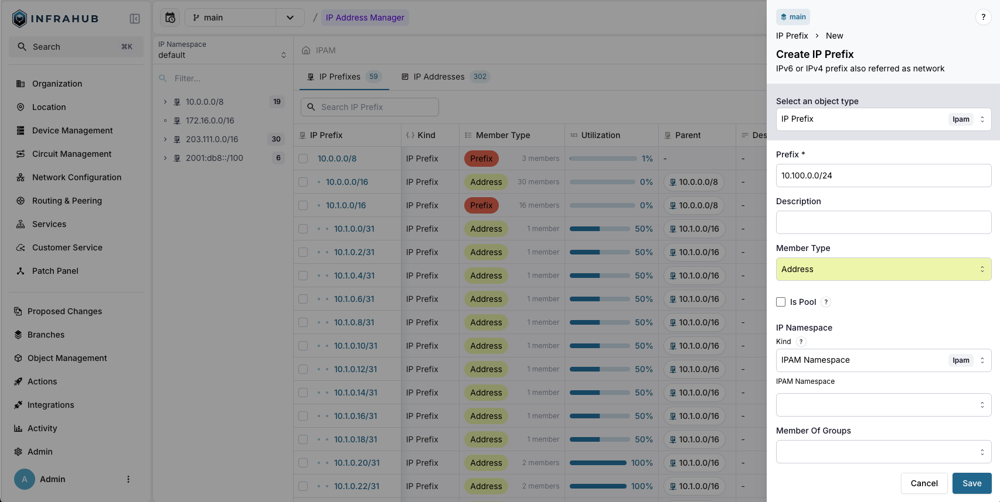
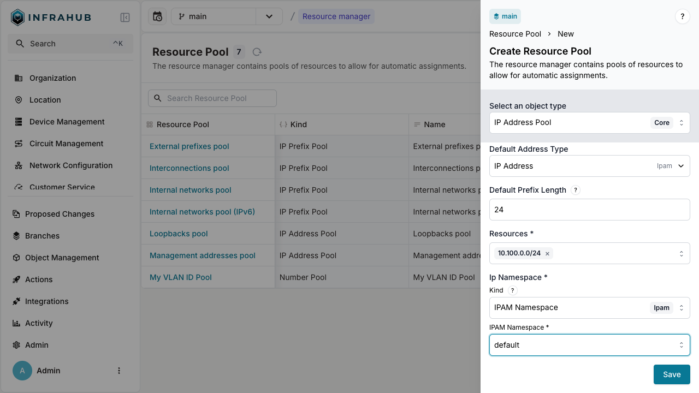
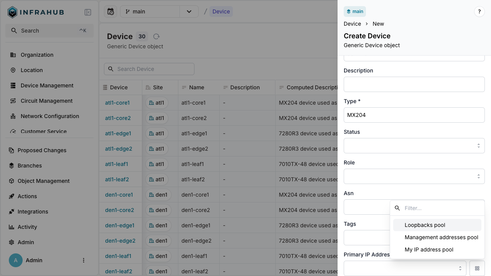
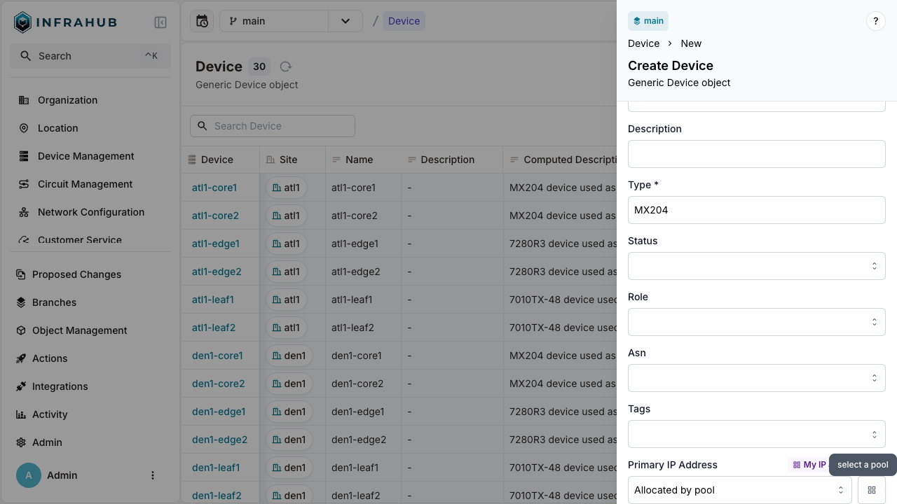

import Tabs from '@theme/Tabs';
import TabItem from '@theme/TabItem';

IP address pools (`CoreIPAddressPool`) dynamically allocate individual IP addresses from source prefixes.

## Prerequisites

- A running Infrahub instance

<details>
<summary>Schema used in this guide</summary>

The examples on this page use the following schema nodes. Adapt the type names to match your own schema.

```yaml
nodes:
  - name: IPPrefix
    namespace: Ipam
    inherit_from:
      - "BuiltinIPPrefix"

  - name: IPAddress
    namespace: Ipam
    inherit_from:
      - "BuiltinIPAddress"

  - name: Device
    namespace: Infra
    human_friendly_id: ["name__value"]
    attributes:
      - name: name
        kind: Text
        unique: true
    relationships:
      - name: primary_ip
        peer: IpamIPAddress
        kind: Attribute
        cardinality: one
```

</details>

## Step 1: Create an IP prefix object

Create the IP prefix that serves as the allocation source:

<Tabs groupId="method" queryString>
  <TabItem value="web" label="Web interface" default>

Navigate to **IPAM** → **IP Prefixes** and create a new prefix with:

- **Prefix**: `10.100.0.0/24`
- **Member Type**: `address`



</TabItem>

<TabItem value="graphql" label="GraphQL">

```graphql
mutation {
  IpamIPPrefixCreate(data: {
    prefix: {value: "10.100.0.0/24"},
    member_type: {value: "address"}
  })
  {
    ok
    object {
      id
    }
  }
}
```

:::important

Save the prefix ID for the next step!

:::

  </TabItem>
</Tabs>

## Step 2: Create the IP address pool

Create a `CoreIPAddressPool` Resource Manager:

<Tabs groupId="method" queryString>
  <TabItem value="web" label="Web interface" default>

Navigate to **Object Management** → **Resource Manager** and create a new IP Address Pool with:

- **Name**: `My IP address pool`
- **Default Address Type**: `IpamIPAddress`
- **Default Prefix Length**: `24`
- **Resources**: Select the `10.100.0.0/24` prefix
- **IP Namespace**: `default`



</TabItem>

<TabItem value="graphql" label="GraphQL">

```graphql
mutation {
  CoreIPAddressPoolCreate(data: {
    name: {value: "My IP address pool"},
    default_address_type: {value: "IpamIPAddress"},
    default_prefix_length: {value: 24},
    resources: [{id: "<prefix-id>"}],
    ip_namespace: {id: "default"}
  })
  {
    ok
    object {
      id
      hfid
    }
  }
}
```

:::important

Save the pool ID for allocation operations!

:::

  </TabItem>
</Tabs>

## Step 3: Allocate IP addresses

You can allocate IP addresses in two ways: direct allocation or allocation during node creation.

### Direct allocation

Allocate an IP address directly from the pool:

<Tabs groupId="method" queryString>
  <TabItem value="web" label="Web interface" default>

  This method is currently not available in the Web interface. Use the GraphQL method instead.

  </TabItem>
  <TabItem value="graphql" label="GraphQL">

  ```graphql
  mutation {
    InfrahubIPAddressPoolGetResource(
      data: {
        hfid: ["My IP address pool"]
        data: {description: "my first allocated ip"}
      }
    ) {
      ok
      node {
        id
        display_label
      }
    }
  }
  ```

  :::info Idempotent allocation

  Include an `identifier` field to ensure the same IP address is returned on repeated calls:

  ```graphql
  mutation {
    InfrahubIPAddressPoolGetResource(
      data: {
        hfid: ["My IP address pool"]
        data: {description: "my first allocated ip"}
        identifier: "my-allocated-ip"
      }
    ) {
      ok
      node {
        id
        display_label
      }
    }
  }
  ```

  This is essential for [Generators](../generators/overview) and automated workflows.

  :::

  </TabItem>
</Tabs>

:::success

You have created an IP address record from the pool!

:::

### Allocation during node creation

Allocate an IP address when creating a device:

<Tabs groupId="method" queryString>
  <TabItem value="web" label="Web interface" default>

  Navigate to **Devices** → **Add Device**. Next to the Primary IP Address field, click the pools button and select your resource pool.

  
  

  </TabItem>

  <TabItem value="graphql" label="GraphQL">

  ```graphql
  mutation {
    InfraDeviceCreate(
      data: {
        name: {value: "dev-123"}
        primary_ip: {from_pool: {id: "<POOL-ID>"}}
      }
    ) {
      ok
      object {
        display_label
        primary_ip {
          node {
            address {
              value
            }
          }
        }
      }
    }
  }
  ```

  </TabItem>
</Tabs>

:::success

The device is created with primary IP address allocated from the pool!

:::

## Next

- [Allocate IP prefixes](./allocate-ip-prefix.mdx)
- [Allocate numbers](./allocate-number.mdx)
- [Weighted allocation](./weighted-allocation.mdx) to control which source prefixes are preferred
