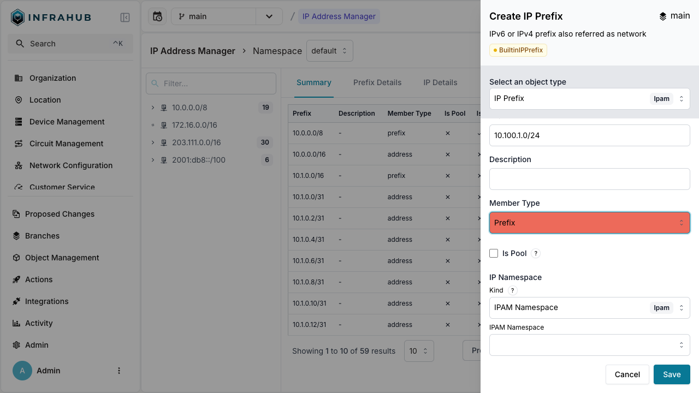
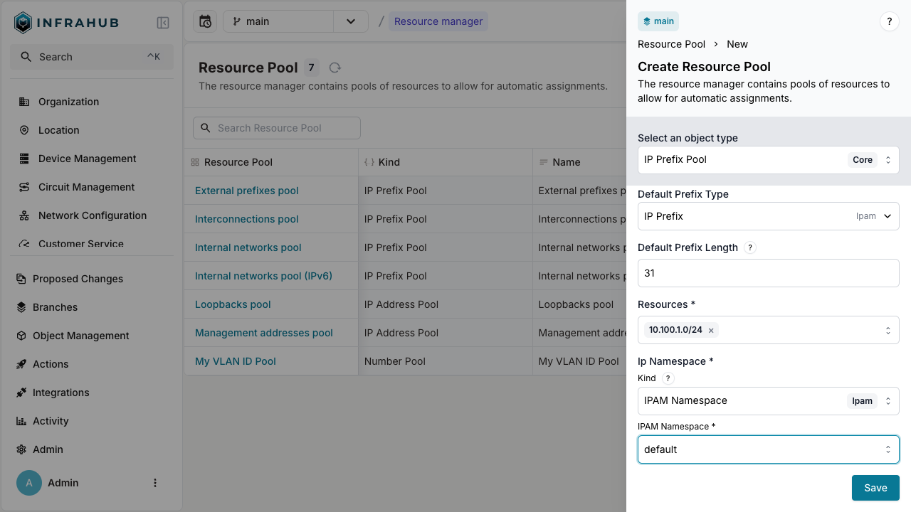

import Tabs from '@theme/Tabs';
import TabItem from '@theme/TabItem';

IP prefix pools (`CoreIPPrefixPool`) allocate IP subnets from larger prefixes.

## Prerequisites

- A running Infrahub instance

<details>
<summary>Schema used in this guide</summary>

The examples on this page use the following schema nodes. Adapt the type names to match your own schema.

```yaml
generics:
  - name: Service
    namespace: Infra
    human_friendly_id: ["name__value"]
    attributes:
      - name: name
        kind: Text

nodes:
  - name: IPPrefix
    namespace: Ipam
    inherit_from:
      - "BuiltinIPPrefix"

  - name: Service
    namespace: Customer
    inherit_from:
      - InfraService
    relationships:
      - name: assigned_prefix
        peer: IpamIPPrefix
        kind: Attribute
        cardinality: one
```

</details>

## Step 1: Create a source prefix

Create the parent prefix:

<Tabs groupId="method" queryString>
  <TabItem value="web" label="Web interface" default>

Navigate to **IPAM** → **IP Prefixes** and create a new prefix with:

- **Prefix**: `10.100.1.0/24`
- **Member Type**: `prefix`



  </TabItem>

  <TabItem value="graphql" label="GraphQL">

  ```graphql
  mutation {
    IpamIPPrefixCreate(
      data: {prefix: {value: "10.100.1.0/24"}
      member_type: {value: "prefix"}}
    ) {
      ok
      object {
        id
      }
    }
  }
  ```

  :::important

  Save the prefix ID for the next step!

  :::

  </TabItem>
</Tabs>

## Step 2: Create the IP prefix pool

Create a `CoreIPPrefixPool` Resource Manager:

<Tabs groupId="method" queryString>
  <TabItem value="web" label="Web interface" default>

Navigate to **Object Management** → **Resource Manager** and create a new IP Prefix Pool with:

- **Name**: `Customer Service Pool`
- **Default Prefix Type**: `IpamIPPrefix`
- **Default Prefix Length**: `31`
- **Resources**: Select the `10.100.1.0/24` prefix
- **IP Namespace**: `default`



  </TabItem>

  <TabItem value="graphql" label="GraphQL">

```graphql
mutation {
  CoreIPPrefixPoolCreate(data: {
    name: {value: "Customer Service Pool"},
    default_prefix_length: {value: 31},
    default_prefix_type: {value: "IpamIPPrefix"},
    resources: [{id: "<prefix-id>"}],
    ip_namespace: {id: "default"}
  })
  {
    ok
    object {
      id
      hfid
    }
  }
}
```

:::important

Save the pool ID for allocation operations!

:::

  </TabItem>
</Tabs>

## Step 3: Allocate IP prefixes

You can allocate IP prefixes in two ways: direct allocation or allocation during node creation.

### Direct allocation

Allocate an IP prefix directly from the pool:

<Tabs groupId="method" queryString>
  <TabItem value="web" label="Web interface" default>

  This method is currently not available in the Web interface. Use the GraphQL method instead.

  </TabItem>
  <TabItem value="graphql" label="GraphQL">

  ```graphql
  mutation {
    InfrahubIPPrefixPoolGetResource(data: {
      hfid: ["Customer Service Pool"]
      data: {
        description: "prefix allocated to point to point connection"
      }
    })
    {
      ok
      node {
        id
        display_label
      }
    }
  }
  ```

  </TabItem>
</Tabs>

:::success

You have created an IP prefix record from the pool!

:::

### Allocation during node creation

Allocate an IP prefix when creating a customer service:

<Tabs groupId="method" queryString>
  <TabItem value="web" label="Web interface" default>

  Navigate to **Customer Service** → **Add Customer Service**.

  Next to the Assigned Prefix field, click the pools button and select your resource pool.

  </TabItem>
  <TabItem value="graphql" label="GraphQL">

  ```graphql
  mutation {
    CustomerServiceCreate(
      data: {
        name: {value: "svc-123"}
        assigned_prefix: {from_pool: {id: "<POOL-ID>"}}
      }
    ) {
      ok
      object {
        display_label
        assigned_prefix {
          node {
            prefix {
              value
            }
          }
        }
      }
    }
  }
  ```

  :::info Idempotent allocation

  Include an `identifier` field in `from_pool` to ensure the same prefix is returned on repeated calls:

  ```graphql
  mutation {
    CustomerServiceCreate(
      data: {
        name: {value: "svc-123"}
        assigned_prefix: {from_pool: {id: "<POOL-ID>", identifier: "svc-456"}}
      }
    ) {
      ok
      object {
        display_label
        assigned_prefix {
          node {
            prefix {
              value
            }
          }
        }
      }
    }
  }
  ```

  This is essential for [Generators](../generators/overview) and automated workflows.

  :::

  </TabItem>
</Tabs>

:::success

The customer service is created with an IP prefix allocated from the pool!

:::

## Next

- [Allocate IP addresses](./allocate-ip-address.mdx)
- [Allocate numbers](./allocate-number.mdx)
- [Weighted allocation](./weighted-allocation.mdx) to control which source prefixes are preferred
