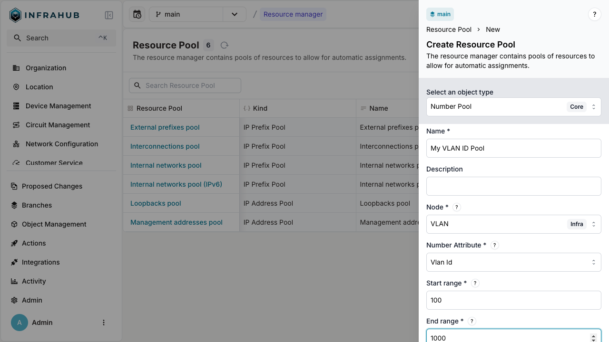
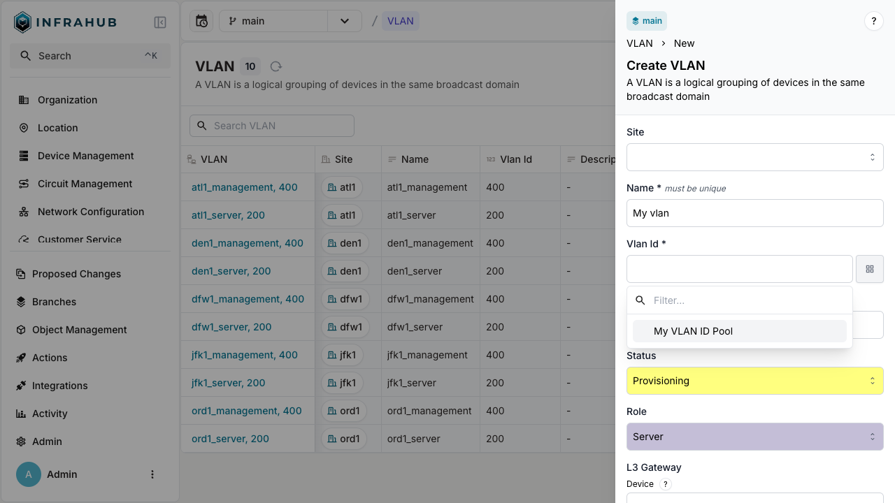
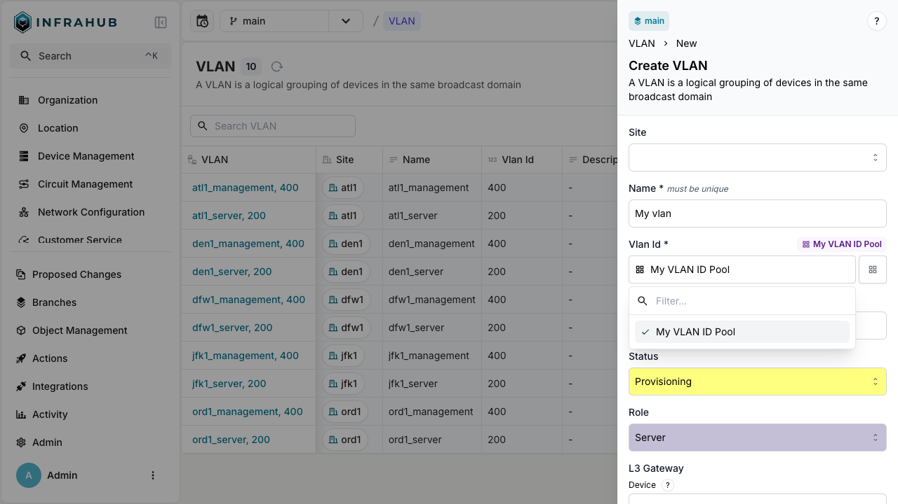

import Tabs from '@theme/Tabs';
import TabItem from '@theme/TabItem';

Number pools (`CoreNumberPool`) automatically assign sequential numbers to numeric attributes.

## Prerequisites

- A running Infrahub instance

<details>
<summary>Schema used in this guide</summary>

The examples on this page use the following schema node. Adapt the type names to match your own schema.

```yaml
nodes:
  - name: VLAN
    namespace: Ipam
    attributes:
      - name: name
        kind: Text
        unique: true
      - name: vlan_id
        kind: Number
```

</details>

## Step 1: Create a number pool

Create a pool for VLAN IDs:

<Tabs groupId="method" queryString>
  <TabItem value="web" label="Web interface" default>

Navigate to **Object Management** → **Resource Manager** and create a new Number Pool with:

- **Name**: `My VLAN ID Pool`
- **Node**: `IpamVLAN`
- **Node attribute**: `vlan_id`
- **Start range**: `100`
- **End range**: `1000`



  </TabItem>
  <TabItem value="graphql" label="GraphQL">

```graphql
mutation {
  CoreNumberPoolCreate(
    data: {
      name: {value: "My VLAN ID Pool"}
      node: {value: "IpamVLAN"}
      node_attribute: {value: "vlan_id"}
      start_range: {value: 100}
      end_range: {value: 1000}
    }
  ) {
    ok
    object {
      hfid
      id
    }
  }
}
```

:::important

Save the pool ID for allocation operations!

:::

  </TabItem>
</Tabs>

## Step 2: Allocate a VLAN ID

<Tabs groupId="method" queryString>
  <TabItem value="web" label="Web interface" default>

  Navigate to **VLAN** → **Add VLAN**. Next to the VLAN ID field, click the pools button and select your number pool.

  
  

  </TabItem>

  <TabItem value="graphql" label="GraphQL">

  ```graphql
  mutation {
    IpamVLANCreate(
      data: {
        name: {value: "My vlan"}
        vlan_id: {from_pool: {id: "<POOL-ID>"}}
      }
    ) {
      ok
      object {
        name {
          value
        }
        vlan_id {
          value
        }
        id
      }
    }
  }
  ```

  </TabItem>
</Tabs>

:::success

The VLAN is created with VLAN ID allocated from the pool!

:::

## Next

- [Allocate IP addresses](./allocate-ip-address.mdx)
- [Allocate IP prefixes](./allocate-ip-prefix.mdx)
