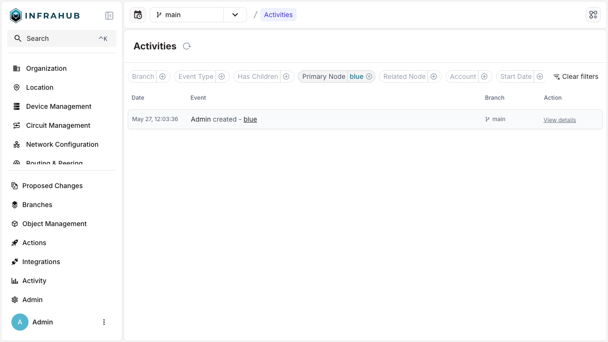

# Activity log

Changes (events) in Infrahub are documented in the **Activity log**. It helps you see which objects were impacted, when a change was made, and who made it. It can be used to troubleshoot unforeseen changes, audit previous operations, and comprehend the order of updates across various branches.

:::warning Permissions
Because figuring out who may view which changes requires complicated query requirements, we have currently set aside the permission framework for this functionality.

:::

The activity log, in general, compiles and arranges events from several branches and objects into a single timeline:

* **Global view**: A consolidated list of all branch-wide activities (events).
* **Object-level view**: A timeline that is particular to a single object and only displays events that are pertinent to that object.
* **Filtering**: You can narrow down your search using a variety of filters (by branch, event type, account, principal node, linked node, date range).
* **Nested / child events**: Cascade actions are observed when specific top-level events trigger additional child events.

## Accessing the activity log

The activity log can be accessed in any of two ways: globally or at the object level.

1. **Global activity log**:
   * Menu location: In the main navigation, go to **Activity** → **Activity log**.
   * URL: `https://<your-instance>/activities`

:::info Time and date
The activity log's date and time are determined by the local time in your browser.

:::

:::info Child Events
Events containing child events have an extra (blue) icon at the end of the line.

:::

2. **Object-level activity log**:
   * Node / object detail pages: Within a node's detail view (for example an IP address or device), you'll see a right-hand "Activity logs" panel or a separate tab.

## Filters and search

There are several ways to hone your view in the global activity log:

* **Branch**: Select the branch you wish to view the events in, such as `main`.
* **Event type**: Filter by categories such as `Node Created`, `Branch Deleted`. You can find more information in the [Infrahub Events](../reference/infrahub-events.mdx) topic.
* **Account / user**: Only display events that have been initiated by a certain account.
* **Primary / related node**: Highlight activities associated with a specific node.
* **Has children**: Whether a certain occurrence led to other smaller ones.
* **Date range**: Set a start and end time and date for the timeline.

## Viewing event details

If you choose **View more** from the global or object-level list, a separate detail page or popover will show up. Additional details are shown in this view, such as:

* **Event ID**: A unique UUID referencing the event.
* **Event type**: The type of the event, for example, `infrahub.node.updated`. You can find more information in the [Infrahub Events](../reference/infrahub-events.mdx) topic.
* **Occurred at**: The exact moment the incident took place
* **Account**: The account that carried out the activity.
* **Primary node**: The primary object that the event affects.
* **Related nodes**: Additional affected objects.
* **Changes**: Any before and after adjustments to updated attributes, if any

