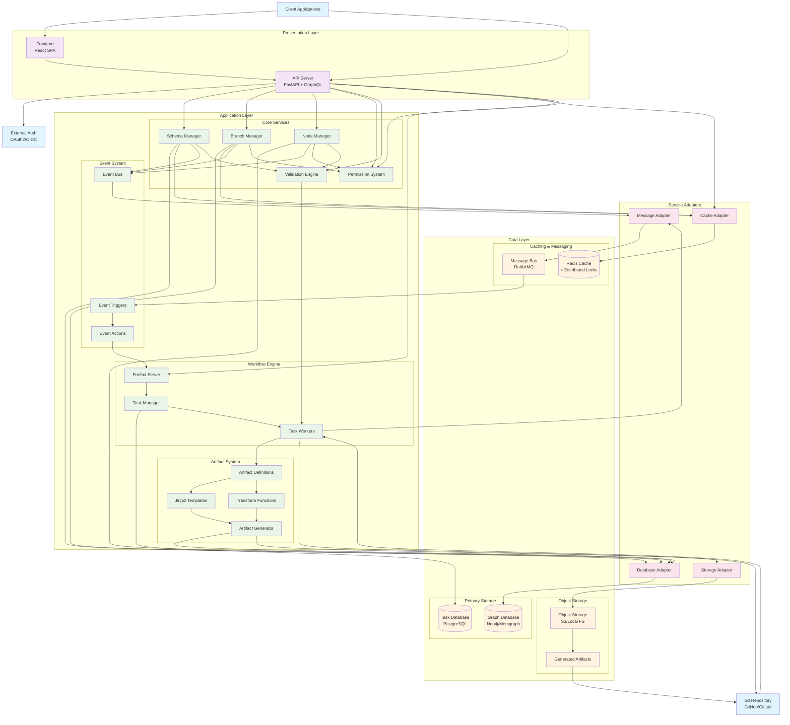

import ReferenceLink from "../../src/components/Card";

# Understanding Infrahub's Architecture

Infrahub's architecture combines graph database technology with Git-like version control to create a powerful platform for infrastructure management. This topic explains the core components, design principles, and how they work together to deliver a unified infrastructure management solution.

## Introduction

Understanding Infrahub's architecture helps you make informed decisions about deployment, scaling, and integration strategies. This explanation provides insight into the technical foundation that powers Infrahub's unique capabilities.

This topic answers key questions about Infrahub's architecture:

- How does Infrahub combine graph database capabilities with Git-like version control?
- What architectural patterns enable Infrahub's scalability and resilience?
- How do the various components communicate and coordinate?
- What design decisions were made and why?

## System architecture overview

Infrahub follows a layered architecture pattern that separates concerns and provides clear boundaries between different system responsibilities. The architecture consists of three conceptual layers:

1. **Presentation Layer**: User interfaces and API endpoints that provide access to Infrahub functionality
2. **Application Layer**: Business logic, workflow orchestration, and event processing that implement Infrahub's core capabilities
3. **Data Layer**: Persistent storage, caching, and messaging that provide reliable data management and communication

### Detailed component architecture

The following diagram shows the detailed interactions between Infrahub components, including data flow, event handling, and artifact generation:

This diagram illustrates:

- **Data Flow**: How requests flow from clients through the API to core services and data storage
- **Event-Driven Architecture**: How changes trigger events that flow through the message bus to workflows
- **Artifact Generation**: The complete pipeline from data to generated artifacts and Git integration
- **Service Abstraction**: How adapter patterns enable pluggable implementations
- **Cross-Cutting Concerns**: Authentication, authorization, caching, and validation

## Component deep dive

### API server

The API server is the central hub for all client interactions. Built with **FastAPI** and written in **Python**, it provides both REST and GraphQL endpoints with a sophisticated middleware stack for authentication, authorization, and request handling.

**Key Design Decisions:**

- **FastAPI over Flask/Django**: Chosen for async support, automatic API documentation, and type validation
- **GraphQL support**: Enables efficient, flexible queries that minimize over-fetching and under-fetching of data
- **Stateless design**: Facilitates horizontal scaling and reliability

:::info
The API server can be horizontally scaled by running multiple instances behind a load balancer, with all instances sharing the same backend services. This stateless design allows for high availability and increased throughput.
:::

<ReferenceLink title="FastAPI Project" url="https://github.com/fastapi/fastapi" />

### Graph database

The graph database is the heart of Infrahub's design. We selected **Neo4j**, a production-grade, battle-tested graph database used in thousands of deployments worldwide.

**Key Design Decisions:**

- **Graph Database over Relational Database**: Chosen for its ability to handle complex relationships and dynamic schemas
- **Native graph operations**: Enables efficient traversal and relationship analysis that would be inefficient in traditional databases
- **Schema flexibility**: Supports Infrahub's evolving data model requirements

:::note
Under the hood, we use Bolt protocol and Cypher query language for database communication. This abstraction allows Infrahub to potentially support other graph database providers in the future (for example Memgraph).
:::

<ReferenceLink title="Neo4j Project" url="https://github.com/neo4j/neo4j" />

### Task manager

The Task Manager orchestrates workflows and delegates tasks to one or more [Task workers](#task-workers). Infrahub uses **Prefect** for workflow orchestration, providing a robust task execution framework with advanced features like retries, scheduling, and observability.

**Key Design Decisions:**

- **Do not reinvent the wheel**: Leverage existing tools and frameworks for workflow orchestration instead of building a custom solution
- **Modern Python-native design**: Utilize Python's type system and async capabilities for better developer experience
- **Separation of orchestration from execution**: Allow independent scaling of workflow management and task processing

:::note
Prefect requires a SQL database (PostgreSQL) for storing workflow states and tracking execution. This is why you see a PostgreSQL database in the architecture diagram.
:::

<ReferenceLink title="Prefect Project" url="https://github.com/PrefectHQ/prefect" />

### Task workers

Task workers are the execution engines of Infrahub. Written in **Python**, they are responsible for executing tasks delegated by the [Task manager](#task-manager). These workers perform operations such as:

- Rendering Jinja templates for artifact generation
- Executing transform functions to manipulate data
- Performing validation checks against schemas and business rules
- Handling Git operations (pull, merge, diff, commit)
- Processing data transformations and migrations

Task workers operate asynchronously, consuming tasks from queues and reporting results back to the task manager.

:::note
Task workers can be scaled horizontally by adding more instances, allowing for increased throughput and parallelism in task execution. Different types of workers can also be deployed to handle specialized tasks.
:::

### Message bus

The message bus is the communication backbone between components in Infrahub. It enables asynchronous messaging and event-driven architecture patterns, decoupling services to allow them to evolve independently and scale individually. Infrahub primarily supports **RabbitMQ** as the message bus implementation.

**Key Design Decisions:**

- **Event-driven architecture**: Enables loose coupling and real-time reactivity to system events
- **Message persistence**: Ensures reliable delivery even during component failures
- **Multiple messaging patterns**: Supports publish-subscribe, work queues, and request-reply patterns

:::note
Infrahub also supports NATS JetStream as an alternative message bus implementation, offering different performance characteristics and deployment models.
:::

<ReferenceLink title="RabbitMQ Project" url="https://www.rabbitmq.com/" />

### Cache

The cache system is built on **Redis** and serves multiple critical functions:

- **Distributed locking**: Coordinates access to shared resources across distributed components
- **Temporary data storage**: Holds frequently accessed data to reduce database load

**Key Design Decisions:**

- **In-memory data store**: Provides ultra-fast access with optional persistence
- **Versatile data structures**: Supports complex operations beyond simple key-value storage
- **Pub/sub capabilities**: Enables lightweight messaging for specific use cases

:::note
Infrahub also supports NATS JetStream as an alternative cache implementation.
:::

<ReferenceLink title="Redis Project" url="https://github.com/redis/redis" />

### Frontend

The frontend is a single-page application built with **React**. It provides an intuitive user interface for interacting with Infrahub's features.

**Key Design Decisions:**

- **Component-based architecture**: Promotes reusability and consistency
- **State management**: Uses modern React patterns for efficient state management
- **Modular packaging**: Core UI components separated from application code

<ReferenceLink title="React Project" url="https://github.com/facebook/react" />

## Scalability and High Availability

Infrahub is designed to scale with your infrastructure needs and provide resilience against component failures.

### Horizontal scaling

Infrahub's architecture allows key components to scale horizontally to handle increased load:

- **API Servers**: Multiple stateless instances behind a load balancer
- **Task Workers**: Parallel task execution across multiple worker instances

### High availability deployment

A highly available deployment eliminates single points of failure through redundancy:

- **Neo4j Cluster**: 3+ nodes for graph database redundancy with automatic failover
- **Redis Sentinel**: Automatic detection of master failures and promotion of replicas
- **RabbitMQ Cluster**: Message bus redundancy with mirrored queues
- **PostgreSQL Replication**: Task manager database with primary-replica setup
- **Multiple API/Worker Instances**: Distributed across multiple availability zones
- **Load Balancers**: Redundant load balancers for API layer access

This architecture ensures that Infrahub continues to operate even if individual components experience failures.

<ReferenceLink title="High Availability Examples" url="../guides/installation#high-availability-deployment-examples" />

## Further reading

- [Infrahub Installation Guide](../guides/installation.mdx) - Step-by-step installation instructions including high availability deployment examples
- [Hardware Requirements](./hardware-requirements.mdx) - System requirements for optimal performance
