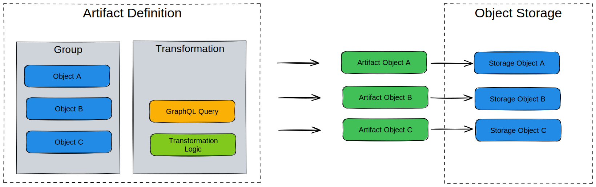
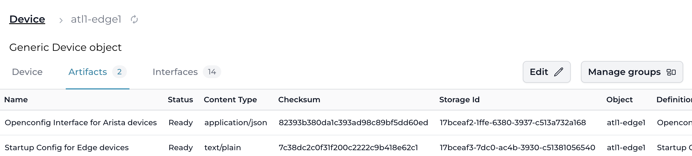

import ReactPlayer from 'react-player/youtube'

# Artifact

An artifact is the result of a [Transformation](./transformation.mdx) for a specific context and/or object.

The following MIME types or formats are supported and will be rendered properly in Infrahub's web interface:
- application/json
- application/yaml
- application/xml
- text/plain
- text/markdown
- text/csv
- image/svg+xml

:::success Examples

- For a network device, you can use an artifact to track the configuration generated from a Jinja template (Transformation).
- For a Security Device, an artifact can be the list of rules in JSON in the format of your choice generated by a Python Transformation.
- An artifact can also represent the configuration of a DNS server or the configuration of a specific Virtual IP on a load balancer.

:::

While it's always possible to generate [Transformations](./transformation.mdx) on demand via the API, having an Artifact provide some additional benefits:

- **Caching**: Generated artifacts are stored in the internal [object storage](./object-storage.mdx). For resource intensive transformations, it will significantly reduce the load of the system if an artifact can be serve from the cache instead of regenerating each time.
- **Traceability**: Past values of an artifact remain available. In a future release, it will be possible to compare the value of an artifact over time.
- **Peer Review**: Artifacts are automatically part of the [Proposed Change](./proposed-change.mdx) review process.
- **Database**: Artifact nodes are stored in the database and other nodes can optionally have a relationship with them, which makes it possible to perform certain artifact related queries.

While the content of an artifact can change, its identifier will remain the same over time.

<center>
  <ReactPlayer url='https://www.youtube.com/watch?v=ASGMKZVLCbY' light />
</center>

## High level design

Artifacts are defined by grouping a [transformation](./transformation.mdx) with a group of targets in an *Artifact Definition*.

An **artifact definition** centralizes all the information required to generate an artifact.

- Group of targets
- Transformation
- Format of the output
- Information to extract from each target that must be passed to the transformation.

From an **artifact definition** artifact nodes are created, for each target which is part of the group. The result of the transformation is stored in the [object storage](./object-storage.mdx). The generation of the artifacts is performed by the Task worker(s).



## CoreArtifactTarget

A node for which you want to generate an Artifact, must inherit from the `CoreArtifactTarget` generic.

As a result of this, an Artifacts tab will show up in the node's detailed view in the UI, which allows you to access all of the artifacts that have been generated for this node.



```yaml
nodes:
  - name: "Device"
    namespace: "Infra"
    inherit_from: ["CoreArtifactTarget"]
```
