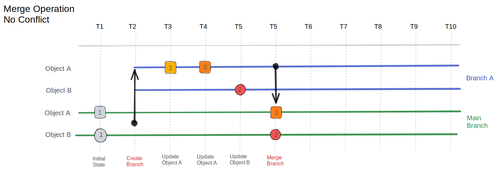
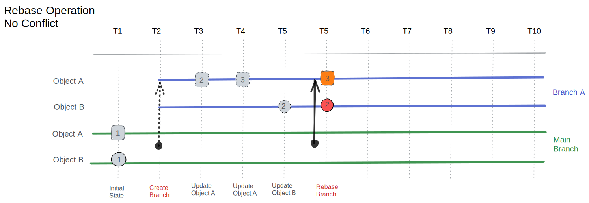
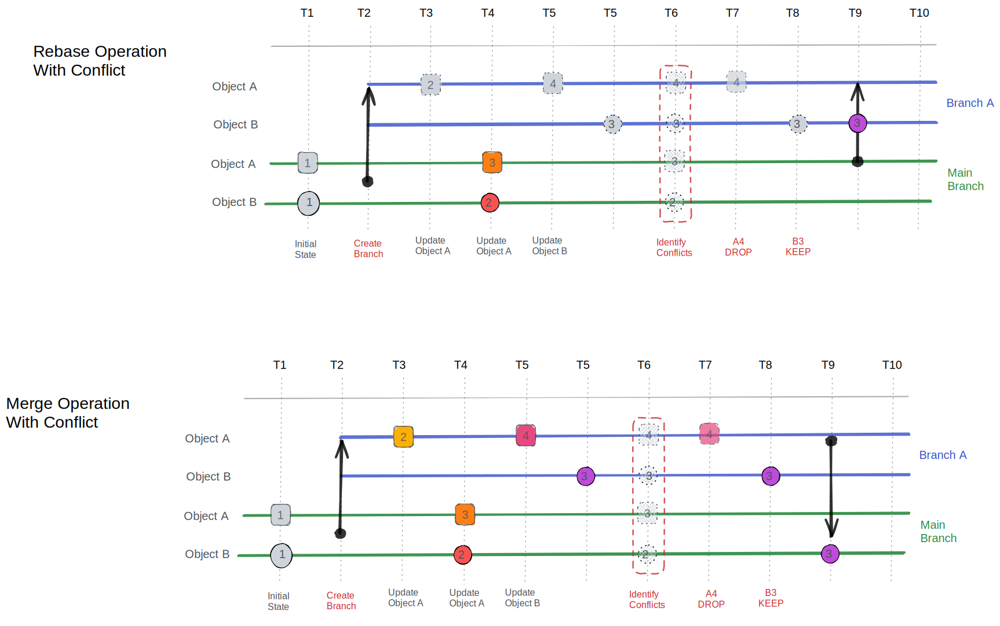

import VideoPlayer from '../../src/components/VideoPlayer';

# Understanding branching in Infrahub

Infrahub's branching model allows teams to work on features, fixes, or experiments in isolated environments. Each branch represents a separate line of development, enabling parallel work streams without interference. Unlike traditional version control systems, Infrahub's approach combines the familiar Git branching concepts with the unique data management capabilities of its graph database foundation.

  <VideoPlayer url='https://www.youtube.com/watch?v=_I7liNBkNC8' light />

Key aspects of branching in Infrahub:

- **Isolated realities**: Each branch provides a complete, isolated environment where changes can be made without affecting other branches or the production environment.
- **Powerful diffing**: Compare changes between branches to understand exactly what has been modified, added, or removed in your infrastructure data.
- **Controlled integration**: Changes flow between branches through a structured merge process that includes validation and conflict resolution.
- **Data integrity**: The branching system preserves data integrity through validation at key transition points.

## Use cases

Branching in Infrahub supports various infrastructure management workflows:

- **Large scale changes**: Create a branch for a large feature or refactor, allowing for extensive changes without impacting the production pipeline. This is particularly valuable when redesigning network architectures or migrating to a new vendor.
- **Collaborative review**: Create a branch for a feature, allowing team members to review and discuss changes before merging. This enables quality control and knowledge sharing within the team.
- **Experimentation**: Use branches to test new ideas or approaches without affecting the production environment. This provides a safe sandbox to validate new configurations or architectures before committing to them.
- **Transaction support**: Group related changes into a single branch, ensuring atomic updates and easier rollbacks. This maintains consistency when implementing interdependent infrastructure changes.

## Core concepts

Branches in Infrahub serve as isolated workspaces where changes can be prepared, validated, and reviewed before merging into production. Each branch maintains its own independent view of the data while sharing the underlying immutable history.

Unlike traditional Git repositories that track file changes, Infrahub branches track changes to graph data representing your infrastructure. This approach provides greater flexibility when working with complex, interconnected infrastructure components while maintaining the familiar branching workflow.

### Branch hierarchy

Infrahub implements a hierarchical branch model where:

- Branches are created from a parent branch (currently always `main`)
- Changes flow back to the parent through controlled merge operations
- Each branch tracks its creation point (`branched_from`) for accurate diffing

Currently, Infrahub supports a single level of hierarchy—all branches must be created from and merged back to the default branch. This constraint simplifies conflict resolution and ensures clear change lineage.

### Branch isolation modes

When creating a branch, you choose how it interacts with external Git repositories, allowing fine-tuned control over the scope of your changes:

- **Full branches** (`sync_with_git: true`): Extend to Git repositories, allowing infrastructure-as-code changes. These branches are synchronized with corresponding Git branches, enabling coordinated changes across both Infrahub data and infrastructure code.
- **Data-only branches** (`sync_with_git: false`): Isolate changes to Infrahub data without affecting Git repositories. These branches are ideal for data updates, corrections, or enhancements that don't require changes to infrastructure code.

:::note
Branch synchronization only applies to read-write repositories. Any branch created in a read-write repository will be considered a full branch and will be propagated to the Infrahub database.
:::

This flexibility allows different workflows—from quick data fixes to comprehensive infrastructure changes involving both data and code. Teams can choose the appropriate branch type based on the nature and scope of the changes they need to make.

### Branch-aware vs branch-agnostic

Unlike Git where all content is branch-specific, Infrahub introduces a nuanced approach where some elements of the schema can bypass the branching system and be global to all branches. This design decision allows for more efficient management of system-level configurations while still maintaining isolation for user data.

- **Branch-aware**: Records that are local to branches and follow the standard branching workflow. Changes to branch-aware records in one branch do not affect other branches until explicitly merged. Most user-created infrastructure data falls into this category.
- **Branch-agnostic**: Records that exist globally regardless of branch. These typically include system data, global configurations, and reference information that should remain consistent across all branches. Changes to these records are immediately visible in all branches.
- **Branch-local**: Records that exist only within a specific branch and are not meant to be merged to other branches. These include temporary data, experimental configurations, or branch-specific metadata that supports the workflow but isn't part of the final solution.

:::note
You can define in the schema the branch behavior for a given node or attribute of a node.
:::

### The default branch

The default branch (typically named `main`) in Infrahub has unique characteristics that distinguish it from other branches. It serves as the authoritative source of truth for your infrastructure and enforces stricter rules to maintain data integrity.

#### Integrity guarantees

The default branch enforces comprehensive integrity constraints to ensure production data quality:

- **Schema validation**: All data must conform to the current schema definitions, ensuring consistency and preventing invalid structures.
- **Relationship integrity**: All references between objects must be valid, preventing dangling references or broken relationships in the infrastructure graph.
- **Uniqueness constraints**: Duplicate values in unique fields are prevented, maintaining the integrity of identifiers and other unique attributes.
- **Required fields**: All mandatory attributes must have values, ensuring complete records that can function properly in production environments.

These protections ensure production data remains consistent, valid, and ready for deployment to real infrastructure environments.

#### Performance trade-offs

The integrity guarantees of the main branch come with performance implications that users should be aware of:

- **Sequential writes**: Certain operations serialize to prevent conflicts, ensuring data consistency at the cost of some concurrency.
- **Validation overhead**: Every change undergoes comprehensive validation, adding processing time but ensuring data quality.
- **Lock contention**: Concurrent modifications may experience delays as the system prevents potentially conflicting changes.

Feature branches strategically relax some of these constraints to optimize for development speed and flexibility. This balanced approach maintains data integrity where it matters most (in production) while enabling rapid iteration in development branches. Full validation occurs during the merge process via Proposed Changes, catching any issues before they reach the default branch.

## Best practices

To get the most out of Infrahub's branching capabilities, consider these recommended practices:

- **Use descriptive branch names**: Name branches in a way that clearly identifies their purpose, such as `feature-network-redesign` or `fix-datacenter-connectivity`.
- **Keep branches short-lived**: Complete work and merge branches promptly to minimize drift from the main branch and reduce conflict potential.
- **Rebase before creating a Proposed Change**: Update your branch with the latest changes from the default branch to identify and resolve conflicts early.
- **Use data-only branches for quick fixes**: When changes don't require infrastructure code updates, data-only branches provide a streamlined workflow.
- **Leverage branch permissions**: Restrict who can create branches and merge to the default branch to maintain quality control in production environments.
- **Document branch purpose**: Add clear descriptions to branches to help team members understand their purpose and scope.

## Branch lifecycle

Understanding the branch lifecycle helps teams manage the flow of changes through Infrahub and integrate them effectively into production environments:

1. **Branch creation**: Establishes an isolated workspace at a specific point in time, capturing the state of the parent branch as a starting point.
2. **Development**: Changes accumulate in the branch without affecting the main branch, allowing for focused work and experimentation.
3. **Validation**: Proposed Changes run automated checks and tests to verify the integrity and functionality of modifications before integration.
4. **Conflict resolution**: Any conflicts with the main branch are identified and resolved, ensuring smooth integration of changes.
5. **Merge**: Approved changes integrate into the main branch through a controlled process that preserves the integrity of the production environment.
6. **Cleanup**: The branch can be deleted after successful merge, maintaining a clean workspace and repository structure.

This structured approach ensures that changes are thoroughly validated before reaching production while giving teams the flexibility to work independently.

### Branch operations

Infrahub provides a comprehensive set of operations to manage the branch lifecycle:

- **Branch creation**: Start a new branch from an existing one, typically the `main` branch. This creates a snapshot of the current state that can be modified independently. When creating a branch, you specify a name, description, and whether it should synchronize with Git repositories.
- **Branch merging**: Once changes are complete, they can be merged back into the parent branch through a controlled process using Proposed Changes. This ensures that all modifications are validated and conflicts are resolved. The merge process creates a permanent record in the commit history that documents what changed and why.
- **Branch deletion**: After merging, branches can be safely deleted without losing any history. All changes are preserved in the commit history of the default branch. This keeps the workspace clean while maintaining a comprehensive audit trail of all changes.
- **Branch rebase**: Rebasing allows you to incorporate the latest changes from the parent branch into your feature branch. This helps keep your branch up-to-date and minimizes potential merge conflicts.

### Merge semantics

Infrahub implements a "latest-value wins" merge strategy that optimizes for clarity and efficiency. During a merge, only the most recent value for each changed attribute transfers to the destination branch. The complete change history within the branch doesn't carry over—instead, the final state becomes a single change at the merge point.

This approach provides several benefits:

- **Maintains immutability** of the main branch by creating a clean, atomic change
- **Simplifies conflict resolution** by focusing only on the final state rather than intermediate changes
- **Provides clear merge points** in history that are easy to trace and understand
- **Reduces storage overhead** by not duplicating the entire change history of the branch

This merge strategy aligns with Infrahub's focus on the current state of infrastructure rather than the historical evolution of individual files, making it particularly well-suited for infrastructure management workflows.

### Rebase operations

Rebasing is a powerful operation that updates a branch with the latest changes from its parent branch. This is essential for maintaining branch health and ensuring smooth integration of changes. Rebasing serves several important purposes:

- **Resolving conflicts before merge**: Identify and address conflicts in the development branch before creating a Proposed Change, reducing complexity during the review process.
- **Incorporating upstream changes**: Ensure your branch includes the latest updates from the main branch, preventing drift and maintaining compatibility with recent changes.
- **Maintaining a clean merge history**: Produce a cleaner, more linear history that's easier to understand and navigate.

During the rebase process, Infrahub performs the following steps:

1. The branch's base point (`branched_from`) updates to the current time, establishing a new foundation for the branch.
2. Changes in the branch are analyzed and replayed on top of the new base, incorporating the latest state from the parent branch.
3. Conflicts that arise during this process require manual resolution, allowing developers to make informed decisions about how to integrate conflicting changes.
4. The branch history resets, preserving only the final state. This simplification makes the branch easier to understand and work with.

Rebasing can be initiated through the Infrahub user interface or API.

### Conflict detection and resolution

Conflicts occur when the same data changes in both a feature branch and the main branch. Infrahub's conflict management system is designed to identify these conflicts with precision and provide tools for effective resolution. The system automatically detects several types of conflicts:

- **Attribute conflicts**: The same field of an object has been modified in both branches with different values. For example, the hostname of a device is changed to "router-1" in one branch and "router-primary" in another.
- **Relationship conflicts**: Conflicting changes to object relationships occur when the connections between objects are modified differently in separate branches. For instance, a device might be assigned to datacenter A in one branch and datacenter B in another.
- **Schema conflicts**: Incompatible schema modifications between branches can cause structural conflicts. This might happen when a field is removed in one branch but modified in another.
- **Uniqueness conflicts**: Changes that would violate uniqueness constraints upon merge are flagged to prevent data integrity issues. This occurs when both branches create different objects with the same unique identifier.

The [Proposed Change](./proposed-change.mdx) feature in Infrahub provides comprehensive tools for managing these conflicts with intuitive side-by-side diffs that clearly highlight differences between branches.

## Implementation details

### Copy-on-write semantics

Branches don't duplicate the entire database. Instead, they maintain:

- A pointer to their base (`branched_from` timestamp)
- Only the delta of changes made within the branch
- References to unchanged data in the parent branch

This approach means creating a branch has minimal overhead, and storage grows only with actual changes. It also means that creating a new branch is almost instantaneous, as it doesn't involve copying large amounts of data.

## Related topics

- [Git Integration](./repository.mdx)
- [Proposed Change](./proposed-change.mdx)
- [Immutable History](./version-control.mdx)
- [Schema](./schema.mdx)
