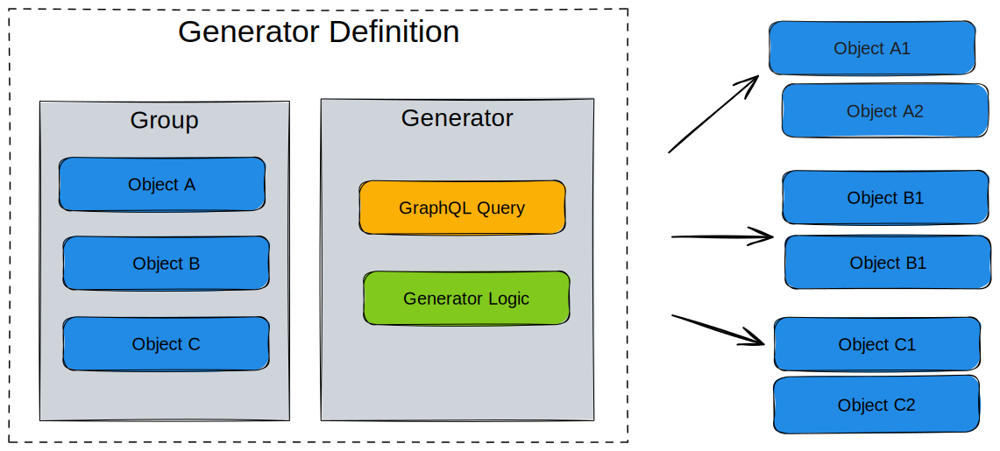

import ReactPlayer from 'react-player/youtube'

# Generator

A `Generator` is a generic plugin that queries data and creates new nodes and relationships based on the result.

:::success Examples

- Within your [schema](schema) you could create an abstract service object that through a Generator creates other nodes.
- Want to read how Generators can be used to create a service catalog? See our blog post on [How to Turn Your Source of Truth into a Service Factory](https://www.opsmill.com/how-to-turn-your-source-of-truth-into-a-service-factory/).
:::

## High level design

Generators are defined as a **generator definition** within an [.infrahub.yml](infrahub-yml) file. A Generator definition consists of a number of related objects.

- Group of targets
- Generator class
- GraphQL Query

Running an artifact definition will create new nodes as defined by the generator, or remove old ones that are no longer required. The removal of obsolete objects is handled using the [SDK tracking feature]($(local_base_url_1)python-sdk/topics/tracking)

The targets point to a group that will consist of objects that are impacted by the generator. The members of this group can be any type of object within your schema, service objects, devices, contracts or anything you want the generator to act upon.

The [GraphQL query](graphql) defines the data that will be collected when running the generator. Any object identified in this step is added as a member to a GraphQL query group. The membership in these groups are then used to determine which generators need to be executed as part of a proposed change during the pipeline run.

The Generator itself is a Python class that is based on the `InfrahubGenerator` class from the SDK. Just like [transforms](transformation) and [checks](check), the Generators are user defined.

## Video guides

In this video series we’re diving into the concept of generators and services, exploring their significance, structure, and how they can streamline processes for teams. Whether you’re a developer or just curious about automation in IT, this guide will provide you with a comprehensive understanding of generators and their applications.

The first video will highlight what generators are and how they can be used to deliver services.

  <ReactPlayer url='https://www.youtube.com/watch?v=TSqY0caGb0A' light />
     

In the second video we will will look at how to plan a generator from coming up with a use case and then finally what the workflow may look like in pseudocode.

  <ReactPlayer url='https://www.youtube.com/watch?v=7oM2W8Kn2-U' light />
   

In the third video we will look at how a generator can be created and run in Infrahub. Looking at the `.infrahub.yml` file the GraphQL query the generator will run against and finally the logic that will be run against Infrahub to create objects and bring the service to life.

  <ReactPlayer url='https://www.youtube.com/watch?v=HSUVWm3Se28' light />

## Known limitations

- [3289](https://github.com/opsmill/infrahub/issues/3289) deleting a generator target object should delete the created objects of that target
