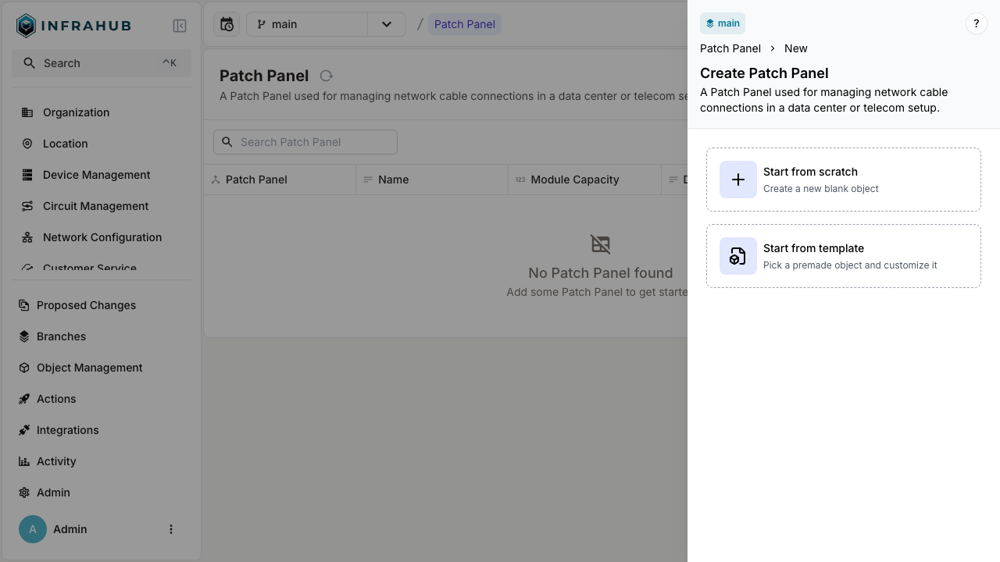

In many infrastructures, multiple instances of objects share a common structure. Consider network devices: we know in advance the port setup for a given model. When documenting this in our source of truth, repeatedly entering the same port details is both inefficient and error-prone. The Object Template feature allows you to create a reusable blueprint for any object. This blueprint can be used to generate multiple instances that adhere to the predefined structure, ensuring uniformity while reducing manual effort.

Within a template, you can define:

- **Node attributes** - Standard properties and characteristics of the object.
- **Relationships** - Connections to other nodes in the infrastructure.
- **Components** - Sub-elements or modules that belong to the object.

When creating a new object instance, users can optionally select a template. If chosen, Infrahub automatically applies the corresponding template. Users can then customize each instance by overriding specific attributes or relationships, ensuring both flexibility and consistency.

See the [object-template guide](../guides/object-template.mdx) for more information.

## Integration with profiles

When both `generate_template` and `generate_profile` are configured on a schema node, profiles can be assigned to templates. This integration enables powerful configuration management workflows:

- **Bulk configuration**: Assign profiles to templates to define common configuration that applies to all objects created from that template
- **Automatic inheritance**: Objects created from a template automatically inherit the profiles assigned to that template
- **Value precedence**: Template values (when explicitly configured) take precedence over profile values, while profiles provide values for attributes not set on the template
- **Multiple profiles**: Templates support multiple profile assignments with proper priority handling

This combination allows you to use templates for structural definition (which ports exist) while profiles handle configuration values (port settings), enabling updates to values in bulk by modifying the profile rather than individual objects. Templates can still override specific profile values when needed.

For more details, see the [Creating and assigning profiles guide](../guides/profiles.mdx).

## Component relationship

When enabling template generation on a given schema node, Infrahub automatically detects whether the object has any component relationships. If it does, Infrahub will generate corresponding templates for those related objects as well.

## Limitations

- Templates are created only for component relationships. Other types of relationships will continue to reference actual objects in the database rather than templates.
- Modifications to a template will not retroactively update objects that were previously created using that template.
