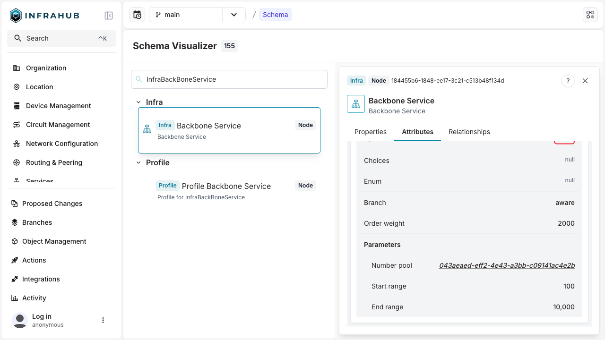

The `NumberPool` attribute kind enables the dynamic creation of a `CoreNumberPool` for the specific schema node and attribute rather than requiring users to define this after the schema is loaded.

:::info Resource pool initial creation

`NumberPool` kind creates the `CoreNumberPool` resource manager during schema initialization.

:::

## Defining a `NumberPool` attribute {#define-number-pool}

When defining a `NumberPool` attribute, you'll have to define extra `parameters` on the attribute to define the `start_range` and `end_range` for the `CoreNumberPool` resource manager.

We'll define a generic service schema that nodes will inherit from to provide a global service identifier among different schema node services.

```yaml
# yaml-language-server: $schema=https://schema.infrahub.app/infrahub/schema/latest.json
---
version: "1.0"
generics:
  - name: Service
    namespace: Infra
    description: "Services"
    human_friendly_id: ["name__value"]
    order_by:
      - name__value
    display_label: "{{ name__value }}"
    attributes:
      - name: name
        kind: Text
        label: Name
        optional: false
        order_weight: 1
      - name: service_identifier
        kind: NumberPool
        read_only: true # Required
        parameters:
          start_range: 100
          end_range: 10000
nodes:
  - name: BackBoneService
    namespace: Infra
    description: "Backbone Service"
    label: "Backbone Service"
    icon: "carbon:container-services"
    inherit_from:
      - InfraService
    uniqueness_constraints:
      - ["circuit_id__value", "internal_circuit_id__value"]
    attributes:
      - name: circuit_id
        kind: Text
        label: Circuit ID
        optional: false
        order_weight: 3
      - name: internal_circuit_id
        kind: Text
        label: Internal Circuit ID
        optional: false
        order_weight: 2
    relationships:
      - name: provider
        cardinality: one
        peer: OrganizationProvider
        optional: false
        kind: Attribute
      - name: site_a
        label: Site A
        cardinality: one
        peer: LocationSite
        optional: false
        identifier: infrabackboneservice__location_site_a
        kind: Attribute
        order_weight: 4
      - name: site_b
        label: Site B
        cardinality: one
        peer: LocationSite
        optional: false
        identifier: infrabackboneservice__location_site_b
        kind: Attribute
        order_weight: 5
```

We can view the schema in the **Schema Visualizer**.



## Viewing the resource manager

Once we create an initial `InfraBackBoneService`, we can navigate to the resource manager page and view the details of the created resource manager.

The naming of the resource manager will be `Kind.attribute_name [uuid]`.


:::info Updating Parameters (Start/End Range)

To update the **parameters** of a `NumberPool` attribute requires performing a schema update.

:::

## Deleting the resource manager

To remove the resource manager, the attribute must be removed by defining `state: absent` on the attribute in the schema. The resource manager will then be removed during the schema loading.

```yaml
# yaml-language-server: $schema=https://schema.infrahub.app/infrahub/schema/latest.json
---
version: "1.0"
generics:
  - name: Service
    namespace: Infra
    description: "Services"
    human_friendly_id: ["name__value"]
    order_by:
      - name__value
    display_label: "{{ name__value }}"
    attributes:
      - name: name
        kind: Text
        label: Name
        optional: false
        order_weight: 1
      - name: service_identifier
        state: absent
        kind: NumberPool
        read_only: true # Required
        parameters:
          start_range: 100
          end_range: 10000
```
