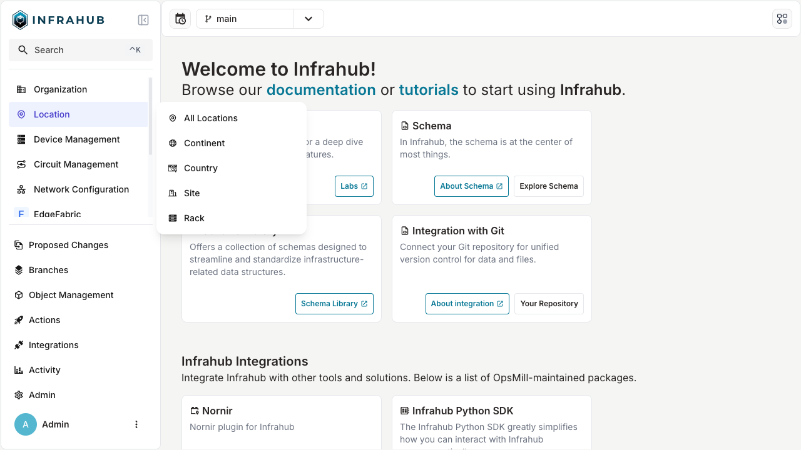

import VideoPlayer from '../../src/components/VideoPlayer';
import Tabs from '@theme/Tabs';
import TabItem from '@theme/TabItem';
import ReferenceLink from "../../src/components/Card";
import SnippetAttributeKindParams from "../snippets/attribute-kind-params.mdx"

# Schema

In Infrahub, the schema is at the center of most things and our goal is to provide as much flexibility as possible to allow users to extend and customize the schema.

Out of the box, Infrahub doesn't have a schema for most things and it's up to users to load a schema that fits their needs. Over time we plan to maintain different schemas for the common types of use cases, but for now, we are providing one example schema to model a basic network with objects like Device, Interface, IPAddress, etc.

Unlike traditional databases that can only have one schema at a time, in Infrahub it is possible to have a different schema per branch. This is possible because the schema itself is stored in the database like any other object.

There are several ways to [load a new schema](../guides/import-schema).

:::info Editor validation

To help with the development process of a schema definition file, you can leverage the schemas we publish for validation within your [editor](../reference/schema-validation)

:::

## Exploring the Infrahub Schema video

A recording of a livestream that covers:

- What the Infrahub schema actually is
- Why we built it this way (and what we rejected)
- How it compares to other source of truth tools
- Best practices for customizing the schema to your environment

<center>
  <VideoPlayer url='https://www.youtube.com/live/0Z_SBoPmGws' light />
</center>

## Schema definition

### Node, Attributes, Relationships, and Generics

The schema is composed of 4 primary types of objects: `Nodes`- that are themselves composed of `Attributes` and `Relationships` and finally `Generics`.

- A `Node` in Infrahub represents a `Model`. Nodes are instances of a specific object within your infrastructure. Nodes have attributes that define specific values, such as text or numbers, and relationships that link them to other nodes.
- An `Attribute` represents a direct value associated with a `Node` like a `Text`, a `Number` etc ...
- A `Relationship` represents a link between 2 `Node`, a `Relationship` can be of cardinality `one` or `many`.
- A `Generic` can be used to share attributes and relationships between different types of `Node`s. They can connect multiple types of nodes to the same relationship or define attributes and relationships on a specific list of nodes. Generics are similar to class inheritance in programming languages like Java or Python.

:::info Reserved Namespaces & Attributes Names

Some namespace like `Core`, `Infrahub`, `Profile`, and `Builtin` are reserved and can't be used by users to defined new Nodes and Generics.

In a similar fashion, some attributes name can't be used, like `attribute` or `relationship`.

<ReferenceLink
  title="See the file in GitHub"
  url="https://github.com/opsmill/infrahub/blob/stable/backend/infrahub/core/constants/__init__.py"
  openInNewTab />

:::

### Nodes vs. Generics

Use a `Node` when you need to represent a concrete object in your infrastructure model with specific attributes and relationships.

Use a `Generic` when you want to share common attributes or relationships across multiple node types. This helps to avoid redundancy and ensures consistency across your schema. For example, if you have different types of network interfaces (physical, logical) that share common attributes like name and description, you can define a `Generic` interface with these attributes and have the specific interface types inherit from it.

`Generic`s can also be used to connect multiple types of Nodes to the same relationship.

:::info Instantiation Requirement
A `Generic` cannot exist independently; it must be instantiated by at least one `Node`.
:::

:::warning Limitations

Two limitations could have an impact on your choice of node vs generic :

- computed attributes can only be used on Nodes, see [computed attribute topic](./computed-attributes) for more information.
- Generic's properties are propagated to Nodes only during the first import see the section [Inherited properties](./schema#inherited-properties) below.

:::

### Node example

In the example below, the node `Person` has 2 attributes (`name` and `description`) and the node `Car` has 1 attribute (`model`) and 1 relationship to `Person`, identified by `owner`.

```yaml showLineNumbers
nodes:
  - name: Person
    namespace: Example1
    attributes:
      - name: name
        kind: Text
        unique: true
      - name: description
        kind: Text
        optional: true
  - name: Car
    namespace: Example1
    attributes:
      - name: model
        kind: Text
    relationships:
      - name: owner
        peer: Example1Person
        optional: false
        cardinality: one
        kind: Attribute
```

`Node`, `Attribute`, and `Relationship` are defined by their `kind`. While the name and the namespace of the node are up to the creator of the schema, the kinds for the attributes and the relationships are coming from Infrahub. The `kind` of an attribute, or a relationship, is important because it defines how each element is represented in GraphQL and the UI.

:::info

The `kind` of a model is generated by concatenating the `namespace` and the `name`.

:::

#### Attribute kinds

- `Text`: Standard Text
- `Number`: Standard Number
- `NumberPool`: Standard Number that creates a `CoreNumberPool` resource manager tied to the attribute
- `TextArea`: Long-form Text that can span multiple lines
- `DateTime`: A Date and a Time
- `Dropdown`: A list of choices, each choice can have a color and description
- `Email`: Email address
- `Password`: A Text String that should be obfuscated but which can be read with enough right in the UI
- `HashedPassword`: Similar to Password but it will not be shown in the UI and can't be re-read.
- `URL`: An URL to a website or a resource over HTTP
- `File`: Path to a file on the filesystem
- `MacAddress`: Mac Address following the format (XX:XX:XX:XX:XX:XX)
- `Color`: An HTML color
- `Boolean`: Flag that can be either True or False
- `Bandwidth`: Bandwidth in kbps
- `IPHost`: IP Address in either IPV4 or IPv6 format
- `IPNetwork`: IP Network in either IPV4 or IPv6 format
- `Checkbox`: Duplicate of `Boolean`
- `List`: List of any value
- `JSON`: Any data structure compatible with JSON
- `Any`: Can be anything

<details>
  <summary>Attribute kinds behavior in the UI</summary>

  | Kind         | Display in  List View | Display in  Detailed View |
  | ------------ | --------------------- | ------------------------- |
  | `ID`         | No                    | Yes                       |
  | `Text`       | Yes                   | Yes                       |
  | `Number`     | Yes                   | Yes                       |
  | `NumberPool` | Yes                   | Yes                       |
  | `Boolean`    | Yes                   | Yes                       |
  | `Dropdown`   | Yes                   | Yes                       |
  | `TextArea`   | No                    | Yes                       |
  | `DateTime`   | No                    | Yes                       |
  | `Email`      | Yes                   | Yes                       |
  | `Password`   | No                    | Yes                       |
  | `URL`        | Yes                   | Yes                       |
  | `File`       | Yes                   | Yes                       |
  | `MacAddress` | Yes                   | Yes                       |
  | `Color`      | Yes                   | Yes                       |
  | `Bandwidth`  | Yes                   | Yes                       |
  | `IPHost`     | Yes                   | Yes                       |
  | `IPNetwork`  | Yes                   | Yes                       |
  | `Checkbox`   | No                    | Yes                       |
  | `List`       | No                    | Yes                       |
  | `JSON`       | No                    | Yes                       |
  | `Any`        | No                    | Yes                       |

</details>

#### Attribute parameters

There are some attribute kinds that allow optional `parameters` to be defined to control the behavior of the attribute. Below are the attribute kinds and their accepted parameters.

<SnippetAttributeKindParams />

#### Relationship kinds

- `Generic`: A flexible relationship with no specific functional significance. It is commonly used when an entity doesn't fit into specialized categories like `Component` or `Parent`.
- `Attribute`: A relationship where related entities' attributes appear directly in the detailed view and list views. It's used for linking key information, like statuses or roles.
- `Component`: This relationship indicates that one entity is part of another and appears in a separate tab in the detailed view of a node in the UI. It represents a composition-like relationship where one node is a component of the current node.
- `Parent`: This relationship defines a hierarchical link, with the parent entity often serving as a container or owner of another node. **Parent relationships are mandatory** and allow filtering in the UI, such as showing all components for a given parent.
- `Group`: Defines a relationship where a node (inheriting from `CoreNode`) is a member or subscriber to a group (inheriting from `CoreGroup`). These relationships appear in the "Manage Groups" form.
- `Profile`: A special relationship where a node is assigned a profile (inheriting from `CoreProfile`), visible during creation or updates through a "select profile" dropdown.

<details>
  <summary>Relationship kinds behavior in the UI</summary>

  | ID                        | cardinality | Display in  List View | Display in  Detailed View | Display in Tab |
  | ------------------------- | ----------- | --------------------- | ------------------------- | -------------- |
  | `Generic`                 | `one`       | No                    | Yes                       | No             |
  | `Generic`                 | `many`      | No                    | No                        | Yes            |
  | `Attribute`               | `one`       | Yes                   | Yes                       | No             |
  | `Attribute`               | `many`      | Yes                   | Yes                       | No             |
  | `Component`               | `one`       | No                    | Yes                       | No             |
  | `Component`               | `many`      | No                    | No                        | Yes            |
  | `Hierarchical Parent`     | `one`       | Yes                   | Yes                       | No             |
  | `Hierarchical  Children`  | `many`      | No                    | No                        | Yes            |
  | `Parent`                  | `one`       | No                    | Yes                       | No             |

</details>

:::info Complementary relationship

Component and Parent typically belong together:
The `Component` relationship is typically paired with the `Parent` relationship.
This ensures a strong relationship in both directions, where the parent node can manage its components, and the component refers back to its parent.

:::

:::warning Cascade deletion

Relationships of kind `Component` include an implicit `on_delete: cascade`. This means that if you delete a node with a `Component` relationship, the related nodes connected by this relationship will also be deleted.

:::

:::info Internal Usage

Group and Profile are **internal** relationship:
The `Group` and `Profile` relationship kinds are internal types and should not be directly used by the user in their schema.
These are automatically handled by the system for managing memberships and configurations.

:::

:::info Object Template

Relationships of kind `Component` will automatically be covered by the template when enabling template generation on a given schema node. See the [object-template topic](../topics/object-template) for more information.

:::

To help you understand the relationship types better, here’s an example schema using a real-world model of **Car**, **Person** and **Wheel**.

```yaml
version: "1.0"

nodes:
  - name: Car
    namespace: Auto
    description: "A vehicle used for transportation."
    attributes:
      - name: model
        kind: Text
        description: "The model of the car."
      - name: year
        kind: Number
        description: "The manufacturing year of the car."
      - name: license_plate
        kind: Text
        unique: true
        description: "License plate number."
    relationships:
      - name: owner
        peer: AutoPerson
        kind: Attribute
        cardinality: one
        optional: false
      - name: wheels
        peer: AutoWheel
        kind: Component
        cardinality: many

  - name: Wheel
    namespace: Auto
    description: "A wheel of the car, a critical component for movement."
    attributes:
      - name: wheel_size
        kind: Number
        description: "Size of the wheel in inches."
      - name: type
        kind: Text
        description: "Type of the wheel (e.g., alloy, steel)."
    relationships:
      # A wheel must belong to a car, hence the Parent relationship is mandatory
      - name: car
        peer: AutoCar
        kind: Parent
        cardinality: one
        optional: false

  - name: Person
    namespace: Auto
    description: "A person who may own a car."
    attributes:
      - name: first_name
        kind: Text
        description: "First name of the person."
      - name: last_name
        kind: Text
        description: "Last name of the person."
      - name: driver_license_number
        kind: Text
        unique: true
        description: "Driver's license number."
    relationships:
      - name: cars
        peer: AutoCar
        kind: Component
        cardinality: many
        optional: true
```

- A `Car` node might have an `owner` attribute linking it to a `Person`. This relationship will be visible in the car's detailed view.
- A `Wheel` is a component of a `Car`, meaning wheels are an essential part of the car. The wheels will be displayed in a separate "Components" tab.
- A `Car` can have a `ProfileCar` selected during its creation or update. The insurance details appear in the form where you can pick or assign a profile for the car.

#### Direction and Identifier in relationships

Relationships in Infrahub schema connect nodes while defining how those connections behave and are traversed.
Direction and identifier both constitute critical qualities for good relationship management.

##### Direction

The **direction** attribute defines the flow of the relationship:

- **Bidirectional**: Supports traversal in both directions. This is the **default value** if no direction is indicated.
- **Outbound**: Defines a relationship that runs from the source node to the target node.
- **Inbound**: Defines a relationship that flows from the target node to the source node.

Even if a relationship is `bidirectional`, you still have to create it on both nodes to allow you to easily traverse them in both directions.

For detailed information, see the [Relationship Reference Guide](../reference/schema/relationship#direction)

##### Identifier

To maintain consistent traversal, the **identifier** serves as the relationship's unique key and must match on both ends.
If no identifier is provided, one will be generated automatically. It is encouraged to establish distinct ones for clarity and maintenance.

If no identifier is specified, one will be automatically generated in the format `<node_kind_a>__<node_kind_z>`.
Example: `infraautonomoussystem__organizationgeneric`

For detailed information, see the [Relationship Reference Guide](../reference/schema/relationship#identifier)

##### Examples

<details>
  <summary>Example 1: Bidirectional Relationship with `device__interfaces`</summary>

Here's an example schema that uses the identifier `device__interfaces` in a bidirectional connection to ensure that devices and interfaces can refer to each other seamlessly.

```yaml {6,15} showLineNumbers
  - name: Interface
    namespace: Infra
    relationships:
      - name: device
        peer: InfraDevice
        identifier: "device__interfaces"
        optional: false
        cardinality: one
        kind: Parent

  - name: Device
    namespace: Infra
    relationships:
      - name: interfaces
        peer: InfraInterface
        identifier: "device__interfaces"
        cardinality: many
        kind: Component
```

</details>

<details>
  <summary>Example 2: Relationships in InfraBGPGroup</summary>

`InfraBGPGroup` has two relationships with the same node, `InfraAutonomousSystem`. To avoid issues with the auto-generated identifiers, we should specifically specify the ones we want.
By including `bgppeergroup__local_as` and `bgppeergroup__remote_as`, we can clearly represent each relationship role.

```yaml {5-6,11-12} showLineNumbers
- name: BGPGroup
  namespace: Infra
  relationships:
    - name: local_as
      identifier: "bgppeergroup__local_as"
      peer: InfraAutonomousSystem
      optional: true
      cardinality: one
      kind: Attribute
    - name: remote_as
      identifier: "bgppeergroup__remote_as"
      peer: InfraAutonomousSystem
      optional: true
      cardinality: one
      kind: Attribute
```

</details>

<details>
  <summary>info Example 3: Reflexive Relationships in Employee</summary>

This example demonstrates how direction (`inbound` for `leader` and `outbound` for `team_members`) distinguishes connections within the same node type `OrganizationEmployee`.
The `employee_team_relationship` identifier connects the `leader` and `team_members` relationships while maintaining their distinct roles.
Since both sides of the relationship share the same `Kind`, we must avoid the default `bidrectional` assumption, therefore we have to specify a direction.

```yaml {15-16,24-25} showLineNumbers
nodes:
  - name: Employee
    namespace: Organization
    description: "An employee in the organization with leadership and team relationships."
    label: "Employee"
    attributes:
      - name: name
        kind: Text
        unique: true
        description: "Name of the employee."
    relationships:
      - name: leader
        label: Leader
        peer: OrganizationEmployee
        direction: inbound
        identifier: "employee_team_relationship"
        cardinality: one
        kind: Attribute
        optional: true
        description: "The leader guiding this team member."
      - name: team_members
        label: Team Members
        peer: OrganizationEmployee
        direction: outbound
        identifier: "employee_team_relationship"
        cardinality: many
        kind: Attribute
        optional: true
        description: "Employees who are part of this leader's team."
```

</details>

##### Generic node relationships

When creating relationships between generic nodes and their implementations, always explicitly define matching identifiers:

<details>
  <summary>Example: Generic Interface and Device Relationship</summary>

```yaml {7,16,27,36} showLineNumbers
generics:
  - name: Interface
    namespace: Test
    relationships:
      - name: device
        peer: TestDevice
        identifier: "device__interface"  # Must match on both sides
        optional: false
        cardinality: one
        kind: Parent

nodes:
  - name: Device
    namespace: Test
    relationships:
      - name: interfaces
        peer: TestInterface
        identifier: "device__interface"  # Must match generic's identifier
        cardinality: many
        kind: Component
        on_delete: cascade

  - name: NetworkInterface
    namespace: Infra
    inherit_from:
      - TestInterface
    # Inherits the device relationship with correct identifier

  - name: Router
    namespace: Infra
    inherit_from:
      - TestDevice
    # Inherits the interfaces relationship with correct identifier
```

In this example:

- The generic `TestInterface` and `TestDevice` define the relationship with explicit identifier `device__interface`
- Specific implementations (`InfraNetworkInterface`, `InfraRouter`) inherit these relationships with matching identifiers
- Cascade deletion will work correctly because identifiers match on both sides

</details>

### Uniqueness constraints

More complex uniqueness constraints, composed of multiple attributes and/or relationships can be defined at the Node or Generic level with the property `uniqueness_constraints`.
It's possible to define multiple uniqueness constraints and each of them will be evaluated individually.

In the example below, the node schema `ExampleCar`, `["owner", "model__value"]` guarantees that a car will be unique based on the `owner` and the `model` of the car.

`uniqueness_constraints` can be composed of a list of N number of attributes or relationships of cardinality one:

- For an attribute, the valid format is `<attributename>__value`. *Currently only value is supported but in the future, the plan is to allow additional metadata to be used as well.*
- For a relationship, only the name of the relationship should be provided `<relationshipname>`. *Only relationships of cardinality `one` are supported and the relationship must be mandatory.*

```yaml {10-11} showLineNumbers
nodes:
  - name: Person
    namespace: Example
    attributes:
      - name: name
        kind: Text
        unique: true
  - name: Car
    namespace: Example
    uniqueness_constraints:
      - ["owner", "model__value"]
    attributes:
      - name: model
        kind: Text
    relationships:
      - name: owner
        peer: ExamplePerson
        optional: false
        cardinality: one
```

#### Optimizing uniqueness constraints

When defining uniqueness constraints, the order of the elements in each constraint array can significantly impact performance. The uniqueness checker processes constraints from left to right, so listing the most selective elements first can dramatically improve performance.

:::info How It Works

The uniqueness checker runs Cypher queries to validate constraints. When elements are ordered from most to least selective, the database can quickly eliminate non-matching candidates earlier in the query execution.

:::

For example, consider an IP address model with a uniqueness constraint:

```yaml
uniqueness_constraints:
  - ["ip_namespace", "address__value"]
```

If many IP addresses share the same namespace but few share the same address value, this constraint would require checking all nodes with the same namespace before filtering by address. A more efficient ordering would be:

```yaml
uniqueness_constraints:
  - ["address__value", "ip_namespace"]
```

This allows the system to first filter by the more selective address value, resulting in fewer nodes to check against the namespace constraint.

:::success Best Practice

Order uniqueness constraint elements from most selective (returning fewer matches) to least selective (returning more matches) to optimize database query performance.

:::

### Human friendly identifier (hfid)

In addition to the internal ID automatically generated for each object (UUID), Infrahub provide a way to define a set of fields that will constitute a human friendly identifier (HFID).

:::success Use Case

The `hfid` is meant to be used to reference objects uniquely across systems, or even before an object has been created in Infrahub.
Having a human friendly way to identify an object is very important to build robust data synchronization between systems and to provide true idempotent script.

In the network industry:

- The `hfid` of a device could be its `name` : `atl1-edge01`
- The `hfid` of an interface could be the combination of the name of the device and the name of the interface: (`atl1-edge01`, `Ethernet1`)

:::

In the example below, each `ExamplePerson`, will have a `hfid` composed of his/her `lastname` and `firstname`.

`human_friendly_id` can be composed of N number of attributes or relationships of cardinality one:

- For an attribute, the valid format is `<attributename>__value`. *Currently only value is supported but in the future, the plan is to allow additional metadata to be used as well.*
- For a relationship, the name of the relationship and the name of a unique attribute must be provided `<relationshipname>__<attributename>__value`. *Only relationships of cardinality `one` are supported and the relationship must be mandatory.*

```yaml {4} showLineNumbers
nodes:
  - name: Person
    namespace: Example
    human_friendly_id: ["lastname__value", "firstname__value"]
    attributes:
      - name: firstname
        kind: Text
      - name: lastname
        kind: Text
```

:::info

If a `human_friendly_id` is defined on a node but no `uniqueness_constraints` are present, a uniqueness constraints matching the `human_friendly_id` will be automatically created.

If at least one attribute is marked as unique, and `human_friendly_id` hasn't been defined, `human_friendly_id` will be automatically created.

:::

#### `hfid` support in GraphQL

`hfid` can be used as a alternative to `id` in most places in GraphQL, including :

- Update Mutation
- Upsert Mutation
- Delete Mutation
- Related Node in all Mutations

### Generics

A generic can be used to:

- Share multiple attributes or relationships between different types of nodes.
- Connect multiple types of Node to the same relationship.
- Define Attribute and Relationship on a specific list of nodes and avoid creating attributes for everything

In the example below, we took the schema that we used previously and refactored it using a generic
Now `Car` is a generic with 2 attributes and 1 relationship and 2 models. `ElectricCar` and `GazCar` are referencing it.
In the GraphQL schema, `ElectricCar` and `GazCar` will have all the attributes and the relationships of `Car` in addition to the one defined under their respective section.

```yaml showLineNumbers
generics:
  - name: Car
    namespace: Example1
    attributes:
      - kind: Text
        name: name
        unique: true
      - name: color
        kind: Color
    relationships:
      - cardinality: one
        identifier: person__car
        name: owner
        optional: false
        peer: Example1Person
nodes:
  - name: ElectricCar
    namespace: Example1
    attributes:
      - kind: Number
        name: nbr_engine
    inherit_from: [ Example1Car ]
  - name: GazCar
    namespace: Example1
    attributes:
      - kind: Number
        name: mpg
    inherit_from: [ Example1Car ]
  - name: Person
    namespace: Example1
    attributes:
      - kind: Text
        name: name
        unique: true
      - kind: Number
        name: height
        optional: true
    relationships:
      - cardinality: many
        identifier: person__car
        name: cars
        peer: Example1Car
```

### Inheritance between generics and nodes

#### Basic inheritance

Inheritance allows Nodes to derive properties from Generics. This relationship ensures that Nodes maintain a consistent set of attributes defined at the Generic level, reducing redundancy and simplifying updates.

#### Single generic inheritance

When a Node is derived from a single Generic, it inherits all properties defined in that Generic unless overridden at the Node level.

```yaml
generics:
  - name: GenericDevice
    namespace: Infra
    description: "Generic Device object."
    label: "Device"
    icon: "mdi:server"
    default_filter: name__value
    order_by:
      - name__value
    display_labels:
      - name__value
    attributes:
      - name: name
        kind: Text
        unique: true
        order_weight: 1000
      - name: description
        kind: Text
        optional: true
        order_weight: 1100

nodes:
  - name: Device
    namespace: Infra
    inherit_from:
      - "GenericDevice"
    attributes:
      - name: role
        kind: Dropdown
        optional: true
        choices:
          - name: core
            label: Core Router
            description: Central part of the network.
            color: "#7f7fff"
          - name: spine
            label: Spine Router
            description: "Aggregation router part of a Fabric."
            color: "#aeeeee"
          - name: leaf
            label: Leaf Switch
            description: "Top of Rack part of a Fabric."
            color: "#e6e6fa"
        order_weight: 1400
```

#### Multiple generics inheritance

When multiple Generics are involved, determining which properties to inherit can be challenging. The implemented solution prioritizes the first Generic listed in the `inherited_from` array.

:::info First Generic Preference

Properties will be inherited from the first Generic in the `inherited_from` list if not explicitly defined at the Node level. This approach simplifies conflict resolution.

:::

```yaml
generics:
  - name: GenericDevice
    namespace: Infra
    icon: "mdi:router"
    default_filter: "name__value"
    attributes:
      - name: name
        kind: Text
        unique: true
        order_weight: 1000

  - name: Asset
    namespace: Infra
    icon: "mdi:server"
    attributes:
      - name: asset_tag
        label: Asset Tag
        kind: Text
        unique: true
        order_weight: 1000

nodes:
  - name: Device
    namespace: Infra
    inherit_from:
      - "InfraGenericDevice"
      - "InfraAsset"
```

### Inherited properties

#### List of inheritable properties

- **human_friendly_id**: A user-friendly identifier for the entity.
- **display_labels**: Labels used for display purposes.
- **default_filter**: The default filter applied to the entity.
- **menu_placement**: Defines where the entity appears in menus.
- **uniqueness_constraints**: Constraints ensuring unique values for certain attributes.
- **icon**: The icon representing the entity.
- **order_by**: The default order in which entities are listed.

:::warning Limitations and Considerations
Inheritance of properties occurs only during the first import. If a Generic's properties are updated after the Node has been created, these updates will not be propagated to the Node. Users must manually update Nodes if they want to reflect changes made to Generics.
:::

### Branch support

By default, all models defined in the schema will be **branch-aware** which means that any changes to an object based on a **branch-aware** model will be local to the branch and will not affect the other branches.

A model can also be configured as:

- **branch agnostic**: All changes to an object based on a **branch agnostic** model will automatically be available in all branches.
- **branch local**:  All changes will stay local to the branch. A model in **branch local** mode will not be affected by the Diff and the Merge.

#### Summary

| Branch Support | Description                                                                          | Diff | Merge | Rebase |
| -------------- | ------------------------------------------------------------------------------------ | ---- | ----- | ------ |
| **Aware**      | All changes will be local to the branch and can be merged back into the main branch. | Yes  | Yes   | Yes    |
| **Agnostic**   | All changes will automatically be available in all branches                          | No   | No    | No     |
| **Local**      | All changes will be local to the branch and will not be merged to other branches.    | No   | No    | Yes    |

#### Branch agnostic

In the frontend, the API, or the GraphQL endpoint **branch-agnostic** objects can be modified on any branch—no restrictions apply.

To configure a model as **branch-agnostic** you need to set the option `branch` to `agnostic` in the schema

```yaml {4} showLineNumbers
nodes:
  - name: Fruit
    namespace: Example
    branch: "agnostic"
    attributes:
      - kind: Text
        name: name
```

#### Attributes and relationships

Attributes and relationships can be configured as **branch-aware**, **branch-agnostic**, or **branch-local** too, independently of the configuration of the model itself using the parameter `branch`.

```yaml {8} showLineNumbers
nodes:
  - name: Fruit
    namespace: Example
    branch: "agnostic"
    attributes:
      - kind: Text
        name: name
        branch: "aware"
```

By default, if a specific value is not defined:

- **attributes** will inherit the configuration of their parent model.
- **relationships** will become:
  - **branch-agnostic** only if both models on each end of the relationship are **branch-agnostic**. If either model is **branch-aware** the relationship will be set as **branch-aware**.
  - **branch-local** if either model, on each end of the relationship, is **branch-local**.

### Hierarchical mode

It's possible to organize some nodes of similar types in a hierarchy or a tree, to enable additional capabilities.

:::success Examples

- `Groups` can be organized in a hierarchy by default which makes it possible to query the members of all sub-groups at once.
- Assuming we have defined a `Person` object connected to a `City` object, which itself is part of a hierarchy of `Location` (`Region` > `Country` > `City`) , it will be possible to query all `Person` per `Country` or per `Region` natively without having a direct relationship between `Person` and `Country`

:::

A hierarchy must be defined around a specific `Generic` to ensure that all nodes that are part of a given hierarchy share some attributes.
In the schema the attribute `hierarchical: true` on a `Generic` activate the hierarchical mode.

> All nodes inheriting from this main `Generic` will automatically have the hierarchical mode enabled as well.
> Each node can only inherit from one `Generic` with hierarchical mode at the same time.

All nodes with hierarchical support will automatically have 2 new relationships:

- `parent` of cardinality one
- `children` of cardinality many

#### Specify the structure of the hierarchy

By default, any node inheriting from the main `Generic` can be a parent or a children, which might not be always desirable. It's possible to limit which type of models are valid `parent` or `children` in the schema with the attributes `parent` & `children` at the node level.

In the example below, we are defining a hierarchy of `Location` with `Region`, `Country` and `City`.
Only `Country` can be defined as children of a `Region` and only `City` can be defined as children of a `Country`

```yaml showLineNumbers
version: '1.0'
generics:
  - name: Generic
    namespace: Location
    hierarchical: true
    attributes:
      - name: name
        kind: Text
nodes:
  - name: Region
    namespace: Location
    inherit_from: ["LocationGeneric"]
    parent: ""
    children: "LocationCountry"
  - name: Country
    namespace: Location
    inherit_from: ["LocationGeneric"]
    parent: "LocationRegion"
    children: "LocationCity"
  - name: City
    namespace: Location
    inherit_from: ["LocationGeneric"]
    parent: "LocationCountry"
    children: ""
```

#### Query data around a hierarchy in GraphQL

In GraphQL query , all nodes with hierarchical support will have 2 additional fields:

- `ancestors` to access all ancestors of a given nodes (parent of parents`)
- `descendants` to access all descendants of a given nodes (children of children)

:::info

`ancestors` and `descendants` are separated from `parent` and `children` to clearly indicate that we need to query the hierarchy and not the directly connected nodes.

:::

For all relationships of cardinality many, it's possible to query all the objects associated with `descendants` nodes as well by providing the `include_descendants` flag.

As an example, The GraphQL query below will query the members of all groups that are defined as children of `Group1`.
Assuming that `Group1` has 2 sub-groups defined `Group A` and `Group B` (AKA children), the query will return the members of `Group1`, `Group A` and `Group B` together.

```graphql showLineNumbers
query {
    CoreStandardGroup(name__value: "Group1") {
        edges {
            node {
                id
                display_label
                members(include_descendants: true) {
                    count
                    edges {
                        node {
                            id
                            display_label
                        }
                    }
                }
            }
        }
    }
}
```

### Common parent relationships

When defining relationships between nodes, you can ensure that related nodes share the same parent using the `common_parent` property.

This is particularly useful for components that must belong to the same parent entity.

```yaml {8} showLineNumbers
- name: LagInterfaceL3
  [...]
  relationships:
    - name: members
      peer: InfraInterfaceL3
      optional: true
      cardinality: many
      kind: Generic
      common_parent: device
    - name: device
      peer: InfraDevice
      kind: Parent
      optional: false
      cardinality: one
- name: InterfaceL3
  [...]
  relationships:
    - name: lag
      peer: InfraLagInterfaceL3
      optional: true
      cardinality: one
      kind: Generic
      common_parent: device
    - name: device
      peer: InfraDevice
      kind: Parent
      optional: false
      cardinality: one
```

:::info Important

You need to define it on the **two** sides of the relationship.

:::

In this example, the `common_parent: device` property ensures that all members of this relationship must have the same device as their parent.

This prevents users from adding interfaces from different devices to the same LAG interface group.

:::warning Limitations

- The parent relationship name must be the same on both sides of the relationship
- Only standard parent relationships are supported (hierarchical parent relationships are not supported)
- The parent relationship must be of kind `Parent` (and cardinality `one`)

:::

### Menu

The position of a model in the frontend sidebar menu, is controlled by the schema itself.
At the node (or generic) level, 3 attributes are available to control where a given model should be displayed in the menu and what icon it should have.

#### include_in_menu & menu_placement

`include_in_menu` is a Boolean to indicate if a given model should be displayed in the menu or not. By default, all models will be displayed directly under `Objects` in the frontend.

`menu_placement` makes it possible to create a nested structure within the menu to display a given model under another one.

You can read this [guide](../guides/menu) for a more detailed explanation of how to operate the menu.

#### Icon

`icon` can be used to indicate which icon should be displayed next to the model in the menu.
Any icon from the [Material Design Icons library / iconify.design](https://icon-sets.iconify.design/mdi/) can be used.

The full identifier of the icon must be used. Example `mdi:domain`

#### Menu rendering example

#### Menu schema

  ```yaml title="Schema" {6-7,11-12,17-18} showLineNumbers
  ---
  version: '1.0'
  nodes:
    - name: Region
      namespace: Location
      icon: "mdi:web"
      include_in_menu: true
      label: "Region"
    - name: Site
      namespace: Location
      icon: "mdi:domain"
      include_in_menu: true
      menu_placement: "LocationRegion"
      label: "Site"
    - name: Rack
      namespace: Location
      icon: "mdi:server-outline"
      include_in_menu: true
      menu_placement: "LocationRegion"
      label: "Rack"
  ```

#### Menu rendering



## Load a schema into Infrahub

Schema files can be loaded into Infrahub with the `infrahubctl` command or directly via the Git integration.

### infrahubctl command

The `infrahubctl` command can be used to check & load individual schema files or multiple files as part of a directory.

The `infrahub schema check` command will validate if a given schema is valid and it will return a summary of the changes
that will be applied to the schema if the schema was loaded.

```shell
infrahubctl schema check <path to schema file or a directory> <path to schema file or a directory> [--branch <branch_name>]
```

The `infrahub schema load` command will load the schemas into Infrahub into the specified branch.

```shell
infrahubctl schema load <path to schema file or a directory> <path to schema file or a directory> [--branch <branch_name>]
```

:::info

The `infrahubctl schema load` command can be used to both upload a new schema and update an existing one.

:::

### Git integration

You can defined a schema in an [external repository](../topics/repository).
The schemas that should be loaded must be declared in the ``.infrahub.yml`` file, under schemas.

Individual files and directory are both supported.

```yaml showLineNumbers
---
schemas:
  - schemas/demo_edge_fabric.yml
```

## Schema update and data migrations

Unlike most databases that support a single schema at a time, in Infrahub it is possible to have a different schema per branch.
This is possible because the schema itself is stored in the database like any other object.

For every update to the schema, Infrahub will automatically execute some data validations and/or migrations
to ensure that the data currently in the branch is compliant with the new schema.

The validations and the migrations will also be applied :

- As part of a Proposed Change
- During a branch rebase
- During a branch merge

:::info

While a new version of the schema can be directly loaded into the main branch,
the recommendation is to create a new branch and to integrate the changes into the main branch via a Proposed Change

:::

<center>
  <VideoPlayer url='https://www.youtube.com/watch?v=1ZWznJga1Tc' light />
</center>

### State: absent or present

The format of the schema is declarative and incremental to allow schema to be composed from multiple sources.

To remove an existing Node, Generic, Attribute or Relationship from the schema it is required to use the `state: absent` flag to explicitly indicate that this element must be deleted.
Without this flag the element will be ignored but it will not be removed.

```yaml {3} showLineNumbers
  - name: Rack
    namespace: Infra
    state: absent
    attributes:
      - name: name
        kind: Text
    [..]
```

:::info

The default value is `state: present` and doesn't have to be provided on all elements of the schema.

:::

### Remove existing text fields values

Removing an existing value for a text field of a schema node, like `description` or `default_filter`, can be performed by specifying
an empty string value for this field and re-loading the schema.

### Rename existing elements

All elements of the schema are identified by a human readable identifier that allow schema to be reused across environment:

- For Node and Generic, the identifier is the `Kind` which is composed of `namespace`+`name`
- For Attribute and Relationship the identifier is the `name`

Since `namespace` & `name` are used to identify the elements of the schema, if you need to update them after loading the schema an additional step will be required.

In order to update the human readable identifier, it's required to temporarily provide the internal identifier of the element directly in the configuration.
All Node, Generic, Attribute or Relationship have their unique identifier that can be find easily in the schema explorer in the frontend [http://localhost:8000/schema](http://localhost:8000/schema)
The internal identifier should be an UUID4, with 36 characters.

<Tabs>
<TabItem value="new" label="New Version">

```yaml {4-6} showLineNumbers
  - name: Rack
    namespace: Infra
    attributes:
      - id: 76df607c-883f-4cf6-9087-353dc2d863e5
        name: rack_name
        kind: Text
    [..]
```

</TabItem>
<TabItem value="previous" label="Previous Version">
```yaml {4-5} showLineNumbers
  - name: Rack
    namespace: Infra
    attributes:
      - name: name
        kind: Text
    [..]
```
</TabItem>
</Tabs>

### Restrictions

Most changes to an existing schema are supported but there are a few properties that can't be updated in the current release:

- Properties that can't be updated on a Node or a Generic: `branch`
- Properties that can't be updated on an Attribute: `branch`
- Properties that can't be updated on an Relationship: `branch`, `direction`, `hierarchical`
- Properties that can't be updated on an Attribute inherited from a Generic: `optional`

[A reference guide for validators and migrations is available](../reference/schema/validator-migration)

### Known limitations

- When updating the identifier on a relationship, the existing relationships won't be impacted or updated even if it was the last relationship using a given identifier. [ISSUE-2472](https://github.com/opsmill/infrahub/issues/2472)
- Updating Nodes when Generics are updated [ISSUE-5793](https://github.com/opsmill/infrahub/issues/5793)

## Schema strict mode

By default, Infrahub operates in schema strict mode. This means that all the schema validators will be run every time we make a schema change, or when the CI pipeline runs schema validation checks.

There are certain scenarios, where Infrahub introduces new schema validators in new versions. This may happen because new features are introduced or because we didn't have a validator in place for certain scenarios. This may mean that you have to make changes to the existing data or schema in your instance of Infrahub before you can upgrade to a newer version. In some situations it might not be possible to make these changes immediately.

For this reason we allow you to disable schema strict mode, using the `INFRAHUB_SCHEMA_STRICT_MODE` environment variable.

The following schema validators will be disabled when the environment variable `INFRAHUB_SCHEMA_STRICT_MODE` is set to `false`:

- relationships same parent constraint validator
- `min_length` less than `max_length` attribute parameter validator
- `min_value` less than `max_value` attribute parameter validator
- HFID uses only unique attribute validator
- `min_value`, `max_value`, `excluded_values` number attribute constraints validator

We recommend that you re-enable schema strict mode, after you were able to make the required schema or data changes.

:::info

Schema strict mode should only be disable temporarily to ease the process of upgrading when new schema validations have been introduced. We recommend that you re-enable schema strict mode as quickly as possible.

:::
