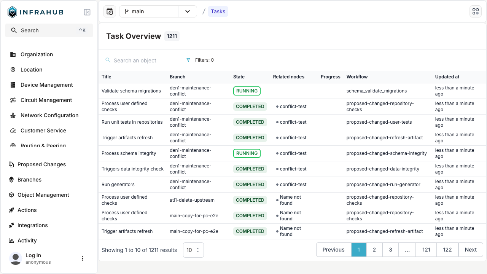

# Tasks

The **Tasks system** in Infrahub is designed to manage and control various backend operations with robust error reporting, improved supervision, and enhanced logging capabilities.

In Infrahub 1.0, we integrated Prefect as the task manager to orchestrate workflows. The task system is comprised of:

* A **Task manager** (based on Prefect) that orchestrates tasks.
* One or more **Task workers** (written in Python) that execute operations

In Infrahub 1.1, key backend tasks began to be migrated to this framework, and subsequent releases have further refined its functionality.

See the [Architecture](/topics/architecture) subject for further information about the Task manager and Task worker as well as the overall system design.

Key operations managed by the task system include:

* Jinja template rendering.
* Performing checks and Transform functions.
* Carrying out pull, merge, and diff Git operations.

More logging and oversight are made possible by these enhancements, which increase background task dependability and transparency.
The tasks indicator at the top right of the Infrahub window is a noticeable feature for users. It provides a quick access to examine both in-progress and finished tasks and changes color while a job is active.

