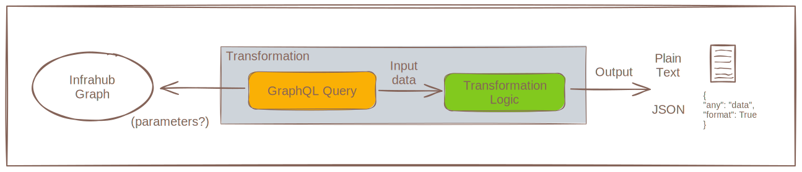

# Transformation

A `Transformation` is a generic plugin to transform a dataset into a different format to simplify it's ingestion by third-party systems.

The output of a Transformation can be either in JSON or any text-based format.
>*Currently Transformations must be written in Python or Jinja2, but in the future more languages could be supported.*

:::note Examples

- With the `Jinja Plugin` it's possible to generate any configuration files, in plain text format.
- With the `Python Plugin` it's possible to generate the payload expected by CloudFormation to configure a resource in AWS.

:::

## High level design

A Transformation is composed of 2 main components:

- A **GraphQL query** that will define what the input data is.
- A **Transformation logic** that will process the data and transform it.



The Transformation will automatically inherit the parameters (variables) defined by the GraphQL query. Depending on how the GraphQL query has been constructed, a Transformation can be static or work for multiple objects.

<details>
  <summary>Common parameters</summary>

  | Name            | Type                                  | Default | Required |
  | --------------- | ------------------------------------- | ------- | -------- |
  | **name**        | `Text`                                | -       | Yes      |
  | **label**       | `Text`                                | -       | No       |
  | **description** | `Text`                                | -       | No       |
  | **timeout**     | `Number`                              | 10      | No       |
  | **rebase**      | `Boolean`                             | False   | No       |
  | **query**       | `Relationship`<br /> CoreGraphQLQuery | -       | Yes      |
  | **repository**  | `Relationship`<br /> CoreRepository   | -       | Yes      |

</details>

## Available Transformations

| Namespace | Transformation      | Description                            | Language | Output Format |
| --------- | ------------------- | -------------------------------------- | -------- | ------------- |
| Core      | **TransformJinja2** | A file rendered from a Jinja2 template | Jinja2   | Plain Text    |
| Core      | **TransformPython** | A Transformation function written in Python | Python   | JSON          |

### Rendered file (Jinja2 plugin)

Infrahub can natively render any Jinja templates dynamically. Internally it's referred to as `TransformJinja2`. It can generate any file in plain text format and must be composed of 1 main Jinja2 template and 1 GraphQL query.

#### Create a Jinja rendered Transformation

Please refer to the guide [Creating a Jinja Rendered Transformation](../guides/jinja2-transform.mdx) for more information.

#### Render a Jinja2 Transformation

A Jinja2 Transformation can be rendered with 3 different methods:

- On demand via the REST API
- As part of an [artifact](./artifact.mdx)
- In CLI for development and troubleshooting [infrahubctl render]($(base_url)infrahubctl/infrahubctl-render)

### TransformPython (Python plugin)

A `TransformPython` is a Transformation plugin written in Python. It can generate any dataset in JSON format and must be composed of 1 main Python Class and 1 GraphQL Query.

#### Create a Python Transformation

A TransformPython must be written as a Python class that inherits from `InfrahubTransform` and it must implement one `transform` method. The transform method must accept a dict and return one.

Please refer to the guide [Creating a Python Transformation](../guides/python-transform.mdx) for more information.

##### Python Transformation accessing local files

There may be times that you want to access files that are stored within the Git repository such as Jinja2 templates.

This can be accomplished by using the `self.root_directory` that points to the root of the Git repository.

```python
    async def transform(self, data):
        templates_path = f"{self.root_directory}/templates"
```

#### Render a TransformPython

A TransformPython can be rendered with 2 different methods:

- On demand via the REST API
- As part of an [artifact](./artifact.mdx)
- Via the CLI for development and troubleshooting: [infrahubctl transform]($(base_url)infrahubctl/infrahubctl-transform)

## Using Transformations with groups

Transformations themselves are generic pieces of logic that process data and produce output. They become targeted to specific objects through [artifact definitions](./artifact.mdx) and [Generators](./generator.mdx), which combine a Transformation with a [group](./groups.mdx) of targets.

This design enables powerful patterns:

- **Reusable logic**: A single Transformation can be applied to different groups through multiple artifact definitions
- **Bulk processing**: Artifact definitions automatically apply the Transformation to all members of the target group
- **Dynamic targeting**: Adding or removing objects from groups automatically changes which objects the Transformation processes

The Transformation logic remains group-agnostic, while artifact definitions and Generators provide the targeting mechanism. See [organizing objects with groups](../guides/groups.mdx) for details on creating target groups.

## Unit testing for Transformations

Infrahub provide a framework to create unit tests for your Transformations with very minimal code/configuration.

The tests can be executed locally for development purpose and they will also be executed as part of the CI Pipeline when the platform identify a change that could potentially impact your Transformation.

For more information, please check out the [Resource Testing Framework](../topics/resources-testing-framework.mdx) page.
