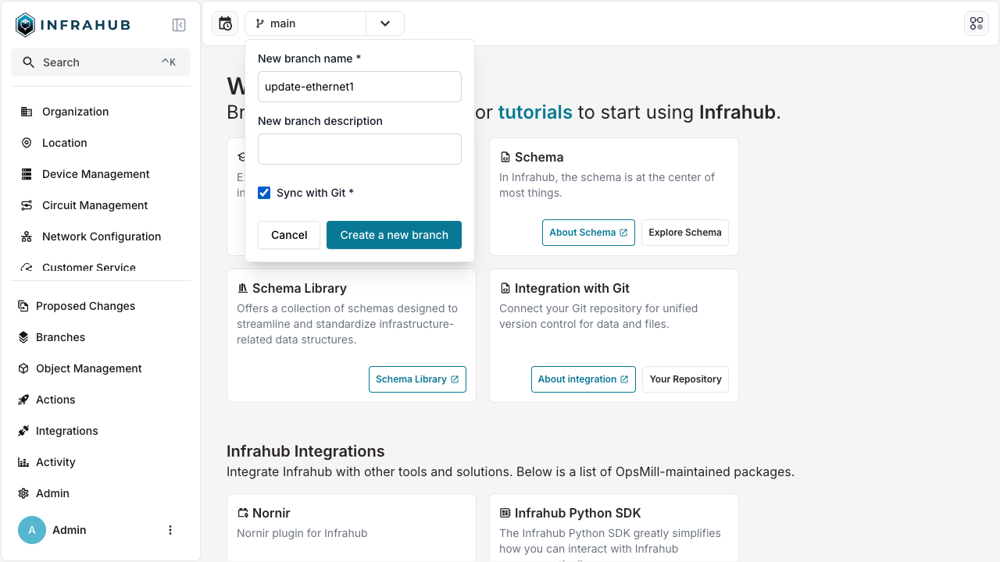
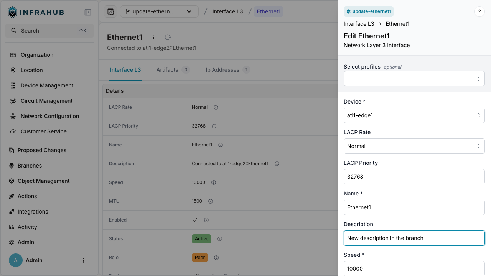

# Rendering configurations using transformations

Infrahub can render configurations from the data that it contains. In Infrahub this process is called a transformation. We transform data according to a certain schema in Infrahub to some other format. Examples of this are, a network device configuration file, an OpenConfig payload, inputs to a CloudFormation template, a configuration file for a Linux daemon.

Infrahub has 2 types of transformations:

- Jinja2 transformation
- Python transformation

Please refer to [Transformation topic](../../topics/transformation.mdx) to learn more about it.

## Generate the configuration of a device using Jinja2

From the `infrahub-demo-git` repository that we imported in the previous section of the tutorial, we imported 2 Jinja2 transformations. We can run the transformation by accessing them via the REST API under `/api/transform/jinja2/<transform_name>` followed by any additional parameters expected in the GraphQL query that the transformation uses.

The imported Jinja2 transform, `device_startup`, expects the name of the device as a parameter `/api/transform/jinja2/device_startup?device=<device_name>`. As an example, below is the URL for couple of devices:

- [Configuration for `ord1-edge1` (`/api/transform/jinja2/device_startup?device=ord1-edge1`)](http://localhost:8000/api/transform/jinja2/device_startup?device=ord1-edge1)
- [Configuration for `atl1-edge2` (`/api/transform/jinja2/device_startup?device=atl1-edge2`)](http://localhost:8000/api/transform/jinja2/device_startup?device=atl1-edge2)

## Create a new branch, then change the data AND the template

Next, we'll create a new branch and make modifications to both the data and the Jinja2 template to explore the integration between the Jinja2 Template Renderer and the storage engine.

### 1. Create a new branch `update-ethernet1`

From the frontend, create a new branch named `update-ethernet1` and make sure to check the toggle `Sync with Git`.



### 2. Update the interface Ethernet 1 for atl1-edge1

Now we'll make a data change in the branch `update-ethernet1` that will be reflected in the rendered template, like updating the description of a device interface.

1. Navigate to the device `atl1-edge1` in the frontend (Menu > Device Management > Network Device > Device)
2. Navigate to the list of its interfaces in the `Interfaces` Tab
3. Select the interface `Ethernet1`
4. Edit the interface `Ethernet`
5. Update its description to `New description in the branch`
6. Save your change



### 3. Update the Jinja2 template in GitHub

The final step is to modify the Jinja template directly from GitHub

In GitHub:

1. Navigate to your clone
2. Select the new branch in the branch menu dropdown
3. Select the file `templates` / `device_startup_config.tpl.j2`
4. Edit the file with the `pen` in the top right corner
5. Delete the lines 77 and 78 (i.e. the last two lines of `ip prefix-list BOGON-Prefixes`)
6. Commit your changes in the branch `update-ethernet1` directly from GitHub


:::success Validate that everything is correct

After making these changes, you should be able to render the transform for the branch `update-ethernet1` and see the changes made to the data AND to the schema at the same time at the address [`/api/transform/jinja2/device_startup?device=atl1-edge1&branch=update-ethernet1`](http://localhost:8000/api/transform/jinja2/device_startup?device=atl1-edge1&branch=update-ethernet1)

:::

### 4. Merge the Branch `update-ethernet1`

After merging the branch `update-ethernet1`, regenerate the configuration for `atl1-edge1` in `main` and validate that the 2 changes are now available in `main`.

## Generate other payloads using Python

As powerful as Jinja templates are, sometimes it’s both cleaner and simpler to work directly in code. An Infrahub Python Transformation lets you do exactly that. Where a Jinja2 Transform combines a GraphQL query together with a Jinja template, the Python Transformation combines a GraphQL query with code. You might use a Python Transform instead of a Jinja2 Transformation when you need to return structured data as opposed to a classic text-based configuration file.

From the repository `infrahub-demo-edge` we imported a Python Transformation to render a configuration in the OpenConfig format. In this example, we want to generate OpenConfig interface data.

We can access the Python Transformation through the REST API on the following URL:

```txt
http://localhost:8000/api/transform/python/OCInterfaces?device=ord1-edge1&branch=main
```

Breaking this URL down into components gives us:

- `http://localhost:8000/api/transform/python`: the base URL of Infrahub together with the Python Transformation endpoint.
- `OCInterfaces`: the name of the Python Transformation.
- `?device=ord1-edge1&branch=main`: the query string that provides a list of arguments for the GraphQL query. In this case the name of the device. Together with `branch` to show that we want to run the Transform against a specific branch within Infrahub.

Render the OpenConfig interface payload by going to this URL (linked from the above example URL): [generate the OpenConfig Interface payload for `ord1-edge1` on the branch `main`](http://localhost:8000/api/transform/python/OCInterfaces?device=ord1-edge1&branch=main)
