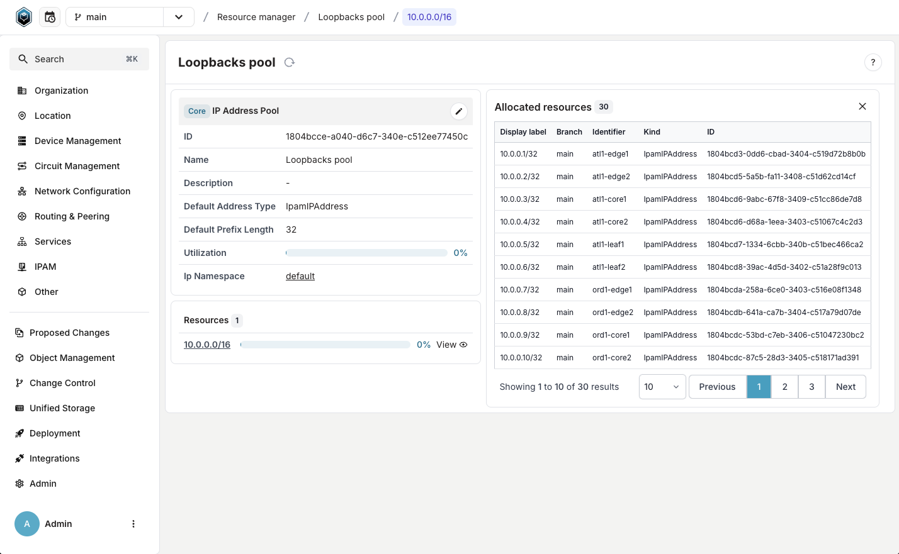
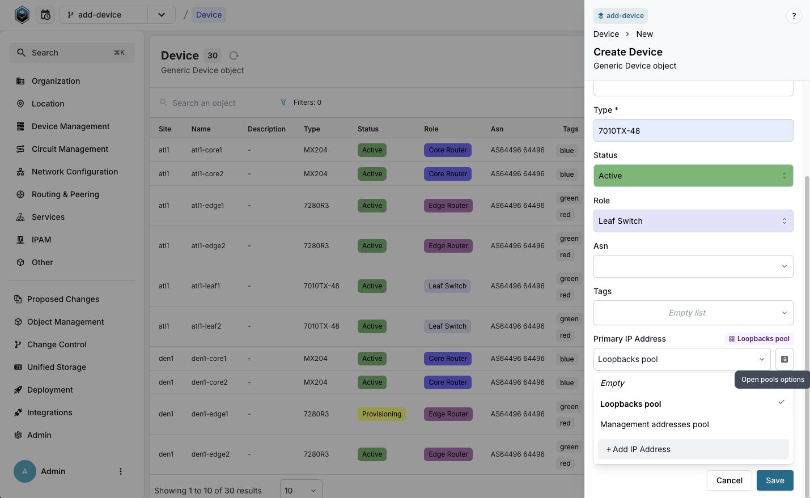

Learn how Infrahub's resource managers automate IP address allocation by exploring existing pools and creating your first automated device deployment. You'll discover how branch-agnostic allocation prevents conflicts when multiple teams work on infrastructure changes simultaneously.

By the end of this tutorial, you'll understand:

- How resource managers eliminate manual IP address tracking
- Why branch-agnostic allocation prevents conflicts across branches
- How to automatically allocate IP addresses during device creation
- How to verify and track resource allocations

## Prerequisites

- A running Infrahub instance with the demo schema loaded
- Basic familiarity with Infrahub's web interface and branch concepts
- Understanding of IP addressing fundamentals

## What you'll learn

Resource managers solve a common infrastructure challenge: keeping track of which IP addresses, VLAN IDs, and other resources are already in use. Instead of maintaining spreadsheets or manual tracking systems, you define pools of available resources and let Infrahub automatically allocate them when creating infrastructure objects.

The key innovation is branch-agnostic allocation. When you allocate a resource in any branch, it's immediately reserved across all branches. This prevents conflicts when multiple teams work in parallel branches that will eventually be merged.

## Step 1: Explore existing resource pools

Let's start by understanding what resource pools look like and how they organize available resources.

Navigate to the Resource Manager in the web interface:
**Object Management** → **Resource Manager**

You'll see an overview of available resource pools. Each pool has a specific purpose and contains resources of a particular type. Let's examine the `Loopbacks pool` by clicking on it.

This view shows you the pool's configuration:

- **Name**: A descriptive identifier for the pool
- **Resources**: The IP prefixes or number ranges this pool can allocate from
- **Default settings**: Configuration that determines how resources are allocated

Click the **View** button next to any resource to see which IP addresses have already been allocated. This gives you visibility into resource utilization across your entire infrastructure.

**Key insight**: Notice how you can see all allocations in one place, regardless of which branch they were created in.

## Step 2: Experience automatic resource allocation

Now let's see resource managers in action by creating a new device that automatically receives an IP address from the pool.

We'll work in a separate branch to demonstrate the branch-agnostic behavior you learned about earlier.

### Create a working branch

First, create a new branch for your work:

1. Create a new branch called `add-device`
2. Ensure you're working in this branch (check the branch indicator in the UI)

### Add a device with automatic IP allocation

Navigate to the devices section:
**Device Management** → **Network Device** → **Device**

Click the **Add Device** button and fill in these details:

- **Site**: atl1
- **Name**: atl1-leaf99
- **Type**: 7010TX-48
- **Status**: Active
- **Role**: Leaf Switch
- **Platform**: Arista EOS

Here's where the magic happens: Instead of manually selecting an IP address for the **Primary IP Address** field, click the **Open pools options** button (it looks like a small pool icon) and select `Loopbacks pool`.

Click **Save** to create the device.

**What just happened**: Infrahub automatically selected the next available IP address from the Loopbacks pool and assigned it to your device. You didn't need to check what addresses were available or worry about conflicts.

## Step 3: Examine the allocated resource

Let's explore what was allocated and understand the allocation details.

Click on the `atl1-leaf99` device you just created to view its details.

In the device view, notice the **Primary IP Address** field now contains an IP address that was automatically allocated from the pool. This address is now permanently associated with this device.

**Key insight**: The allocation happened atomically with device creation. There's no gap where the device exists without an IP address, eliminating potential consistency issues.

## Step 4: Verify branch-agnostic allocation

This step demonstrates the most powerful feature of Infrahub's resource managers: allocations are visible and reserved across all branches, even before merging.

Switch back to the **main** branch using the branch selector in the UI.

Navigate to **Object Management** → **Resource Manager** and click on the `Loopbacks pool`.

Click **View** next to the resource `10.0.0.0/16` to see all allocated addresses.

Navigate to the last page of the Allocated resources table (or search for your device name).

**Important observation**: You'll find the IP address allocated to `atl1-leaf99` in this list, even though:

- You're viewing from the main branch
- The device was created in the `add-device` branch
- The branches haven't been merged yet

This proves that resource allocation is branch-agnostic. The IP address is reserved across all branches, preventing conflicts when teams work in parallel.

## What you've learned

Through this hands-on exploration, you've discovered:

- **Automated allocation**: Resource managers eliminate manual IP address tracking by automatically assigning the next available resource
- **Branch-agnostic reservations**: Resources allocated in any branch are immediately reserved across all branches, preventing conflicts
- **Atomic operations**: Resources are allocated during object creation, ensuring consistency
- **Centralized visibility**: All allocations are visible in one place, regardless of which branch created them
- **Conflict prevention**: Multiple teams can work in parallel without worrying about duplicate resource assignments

## Real-world impact

These capabilities solve critical infrastructure challenges:

- **No more spreadsheet tracking**: Teams don't need to maintain separate IP address management systems
- **Parallel development**: Multiple teams can provision infrastructure simultaneously without coordination overhead
- **Merge confidence**: Branch merges never fail due to resource conflicts
- **Audit trail**: Complete visibility into resource utilization across the infrastructure

## Try it yourself

Now that you understand the core concepts, experiment with these scenarios:

1. **Create another device** in a different branch and notice how it gets the next available IP
2. **Switch between branches** and observe how allocations remain consistent
3. **Explore other pool types** like number pools for VLAN IDs or prefix pools for subnet allocation

## Next steps

Ready to dive deeper into resource management?

- [Resource Manager Guide](../../guides/resource-manager.mdx) - Learn to create and configure all types of resource pools
- [Resource Manager Concepts](../../topics/resource-manager.mdx) - Understand advanced features like weighted allocation and pool composition
- [Generators Concepts](../../topics/generator.mdx) - Combine resource managers with automated configuration generation
