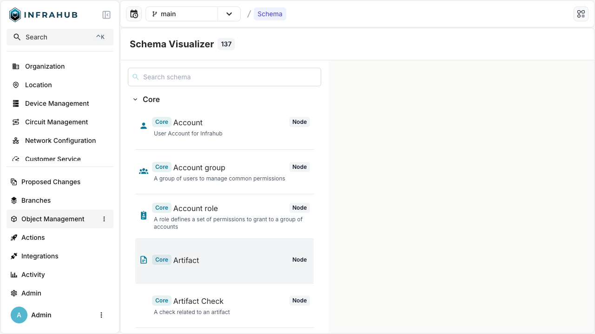
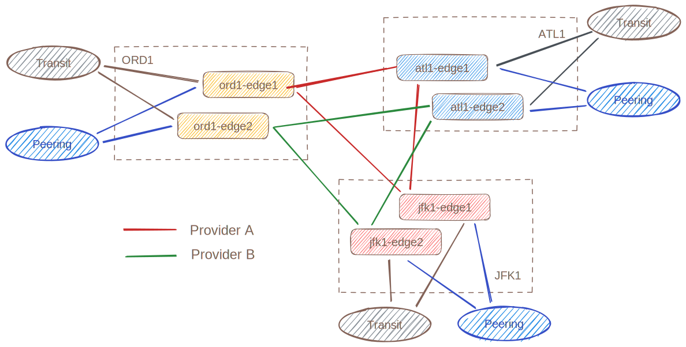

import CodeBlock from '@theme/CodeBlock';
import import_dcimYaml from '!!raw-loader!../../../../models/base/dcim.yml';
import import_ipamYaml from '!!raw-loader!../../../../models/base/ipam.yml';
import import_locationYaml from '!!raw-loader!../../../../models/base/location.yml';
import import_organizationYaml from '!!raw-loader!../../../../models/base/organization.yml';
import import_routingYaml from '!!raw-loader!../../../../models/base/routing.yml';

import ReferenceLink from "../../../src/components/Card";

# Extend the schema

Infrahub can be extended by providing your own schema (or models).

## Default schema

The version of Infrahub we currently use for the demo only included a default schema, composed of 25+ models that are either mandatory for Infrahub to function like `Account`, `StandardGroup`, `Repository` or that are very generic like `Tag`.

## Visualize the active schema

You can explore the current schema by visiting the schema page, you can find it in the left menu under the `Object Management` section.

<ReferenceLink title="Explore the current schema" url="http://localhost:8000/schema" openInNewTab />



The schema page offers two complementary ways to explore your models. Use the toggle in the top-right corner of the page to switch between them:

- **List view** (default): Browse all nodes, generics, profiles, and templates in a paginated list. Selecting an entry opens a detail panel with its attributes, relationships, and metadata. This view is best for inspecting the precise definition of an individual model.
- **Graph view**: Renders the schema as an interactive graph where each node represents a model and edges represent the relationships between them. You can pan, zoom, and highlight a model to quickly understand how your data types connect to one another. This view is best for getting a high-level picture of the schema and discovering how models relate.

<ReferenceLink title="Check the schema documentation for more information" url="../../reference/schema" />

## Extend the schema with some network related models

In order to model a network, we need to extend the current models to capture more information like: `Device`, `Interface`, `IPAddress`, `BGPSession`, `Location`, `Role`, `Status` etc.

A "base" schema with these types of models and more is available in the `models/base` directory

<details>
  <summary>Infrastructure Base Schema</summary>
  <CodeBlock language="yaml" title="DCIM Base Schema">{import_dcimYaml}</CodeBlock>
  <CodeBlock language="yaml" title="IPAM Base Schema">{import_ipamYaml}</CodeBlock>
  <CodeBlock language="yaml" title="Location Base Schema">{import_locationYaml}</CodeBlock>
  <CodeBlock language="yaml" title="Organization Base Schema">{import_organizationYaml}</CodeBlock>
  <CodeBlock language="yaml" title="Routing Base Schema">{import_routingYaml}</CodeBlock>
</details>

Use the following command to load these new models into Infrahub

```shell
invoke demo.load-infra-schema
```

:::tip Find these schemas on the Marketplace

The schemas loaded above (`dcim`, `ipam`, `location`, `organization`, `routing`) are also available on the [Infrahub Marketplace](https://marketplace.infrahub.app) as `infrahub/dcim`, `infrahub/ipam`, and so on.
When starting a new Infrahub project outside of this demo, you can fetch them directly with `infrahubctl marketplace get infrahub/dcim` instead of using the demo command.
See [Infrahub Marketplace](../../schema/marketplace/) for the full workflow.

:::

<details>
  <summary>Expected Results</summary>
  ```shell
  > invoke demo.load-infra-schema
  --- abbreviated ---
  schema 'models/base/dcim.yml' loaded successfully
  schema 'models/base/ipam.yml' loaded successfully
  schema 'models/base/location.yml' loaded successfully
  schema 'models/base/organization.yml' loaded successfully
  schema 'models/base/routing.yml' loaded successfully
  5 schemas processed in 26.640 seconds.
  Waiting for schema to sync across all workers
  Schema updated on all workers.
  --- abbreviated ---
  [+] Restarting 1/1
  ✔ Container infrahub-infrahub-server-1  Started                                                                                                 1.5s
  ```
</details>

:::success Validate that everything is correct

**Reload the frontend** to see the new menu corresponding to the new models we added to the schema.

:::

## Load some real data into the database

In order to have more meaningful data to explore, we'll use a sample topology of 6 devices as presented below that is leveraging all the new models we added to the schema.



Use the following command to load these new models into Infrahub:

```shell
invoke demo.load-infra-data
```

<details>
  <summary>Expected Results</summary>
  ```shell
  > invoke demo.load-infra-data
  --- abbreviated ---
  [13:27:39] INFO     Create a new Branch and Change the IP addresses between edge1 and edge2 on the selected site            infrastructure_edge.py:648
  INFO     - Creating branch: 'jfk1-update-edge-ips'                                                               infrastructure_edge.py:649
  [13:27:43] INFO      - Replaced jfk1-edge1-Ethernet1 IP to 10.1.0.32/31                                                     infrastructure_edge.py:678
  INFO      - Replaced jfk1-edge2-Ethernet1 IP to 10.1.0.33/31                                                     infrastructure_edge.py:687
  INFO     Create a new Branch and Delete Colt Transit Circuit                                                     infrastructure_edge.py:694
  INFO     - Creating branch: 'atl1-delete-upstream'                                                               infrastructure_edge.py:699
  [13:27:47] INFO      - Deleted Colt [DUFF-cf3a6ed2d959]                                                                     infrastructure_edge.py:752
  INFO      - Deleted Colt [DUFF-4141a7be1f9a]                                                                     infrastructure_edge.py:752
  INFO     Create a new Branch and introduce some conflicts                                                        infrastructure_edge.py:759
  INFO     - Creating branch: 'den1-maintenance-conflict'                                                          infrastructure_edge.py:769
  [13:27:53] INFO     Create a new Branch and introduce some conflicts on the platforms for node ADD and DELETE               infrastructure_edge.py:802
  INFO     - Creating branch: 'platform-conflict'                                                                  infrastructure_edge.py:809
  ```
</details>

:::tip Validate that everything is correct

You should now be able to see 10 devices when you visit the list of devices at [http://localhost:8000/objects/InfraDevice](http://localhost:8000/objects/InfraDevice)

:::
