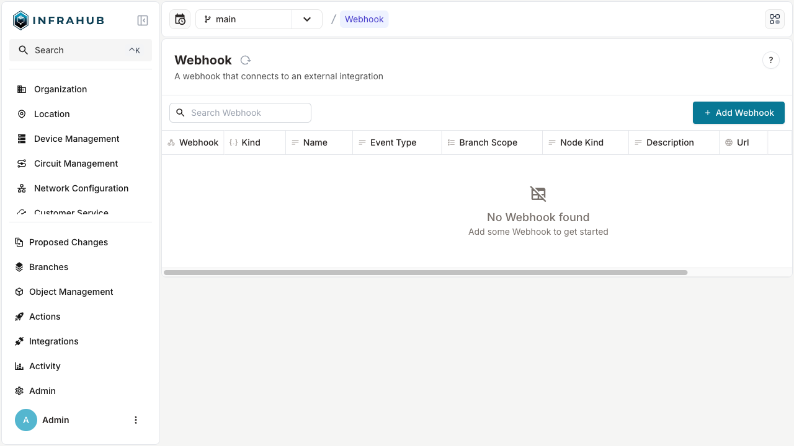
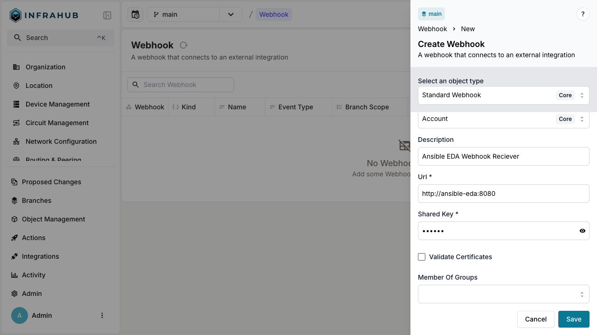
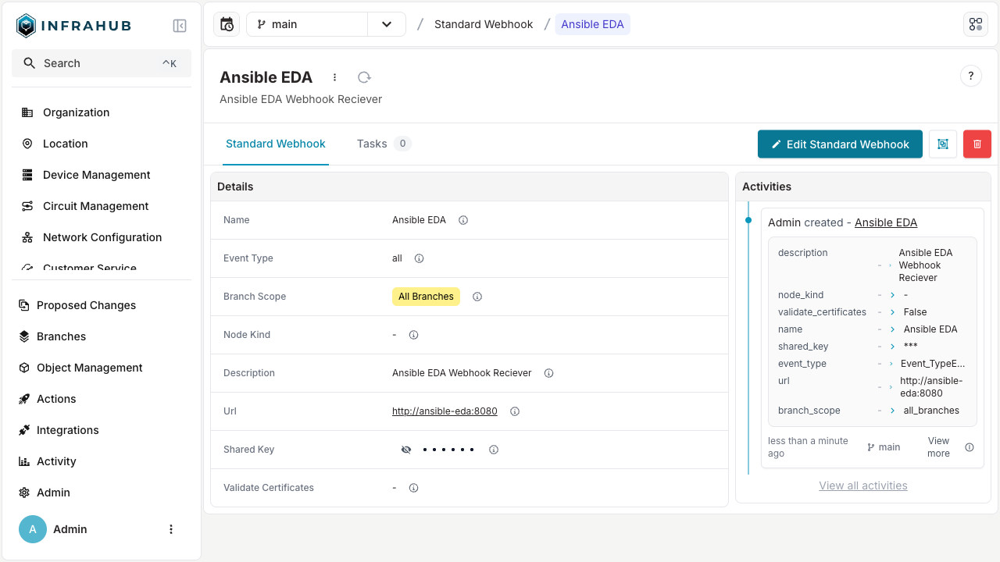

import Tabs from '@theme/Tabs';
import TabItem from '@theme/TabItem';

# Create a webhook

<Tabs groupId="method" queryString>
  <TabItem value="web" label="Via the Web Interface" default>

1. Login to Infrahub's web interface as an administrator.
2. Select `Integrations` -> `Webhooks`.

3. Click **+ Add Webhook**.

4. Fill in the details, select an event type, branch scope, node kind and click **Save**.

  </TabItem>

  <TabItem value="graphql" label="Via the GraphQL Interface">

In the GraphQL sandbox, execute the following mutation, edit values to be appropriate for your use case:

```graphql
mutation {
  CoreStandardWebhookCreate(
    data: {
      name: {value: "Ansible EDA"},
      description: {value: "Ansible Webhook Receiver"},
      branch_scope: {value: "all_branches"},
      url: {value: "http://ansible-eda:8080"},
      event_type: {value: "infrahub.node.created"}
      node_kind: {value: "InfraDevice"}
      shared_key: {value: "supersecret"}
    }) {
    object {
      display_label
    }
  }
}
```

  </TabItem>
</Tabs>
